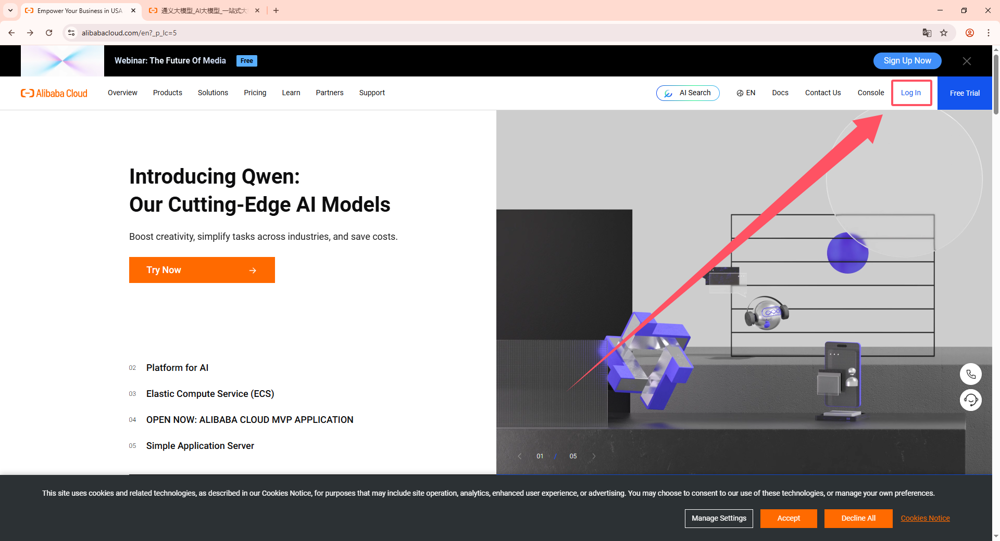
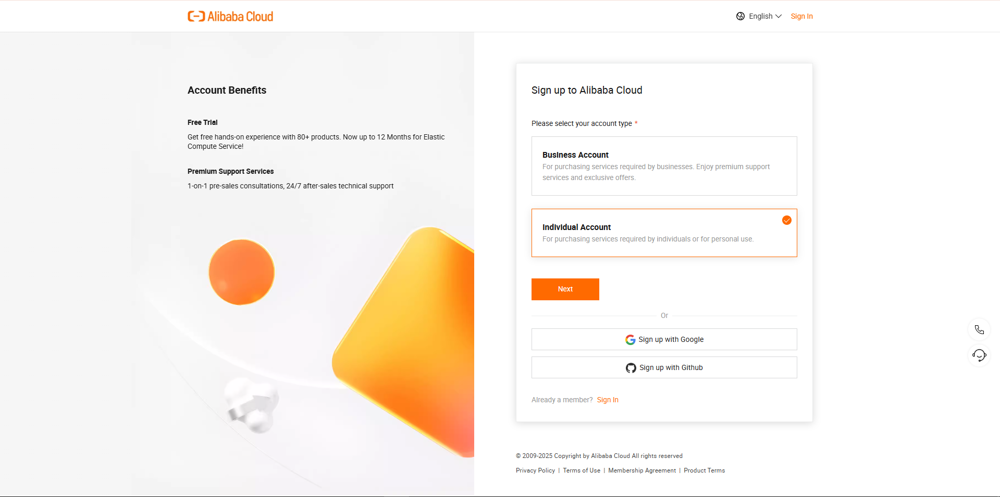
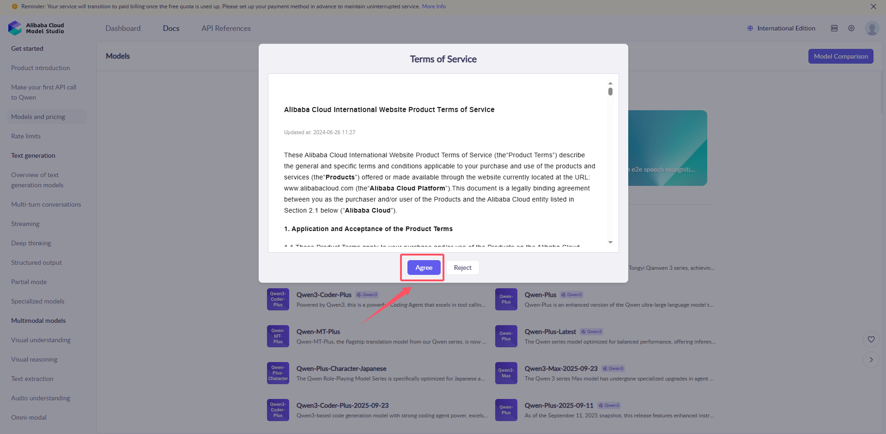
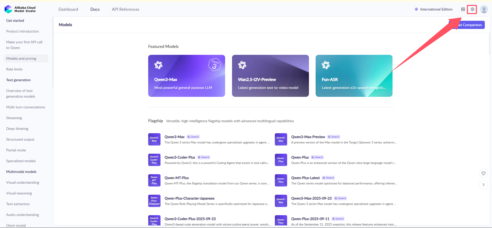
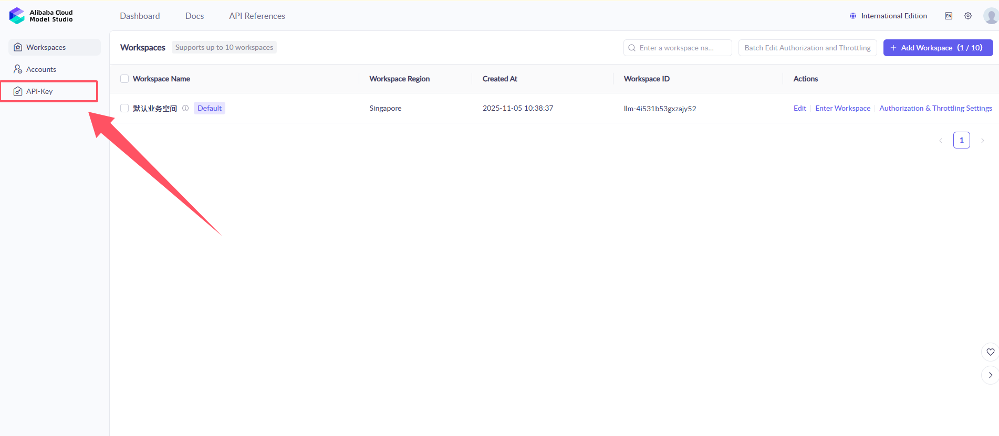
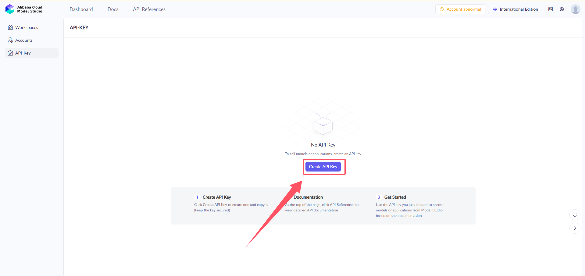
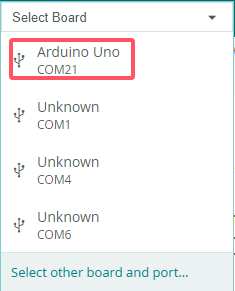

# 2. Advanced Course

## 2.1 WonderLLM Underlying Communication
<p id = "anther2.1"></p>

### 2.1.1 Large Speech Model Deployment

> [!note]
>
>* **The WonderLLM module has a "Voice Large Model TTS (Text-to-Speech)" feature for developers to expand. This section introduces this feature and explains the deployment of the large speech model on the cloud platform.**
>* **If there is no need for voice synthesis functionality, this section can be skipped.**
>* **The WonderMind module supports voice large model calls for the  “Aliyun” platforms. This tutorial only shows the TTS (Text-to-Speech) functionality of the international version of the “Aliyun” voice large model.**


* #### Alibaba Cloud Large Speech Model Deployment

1. **Register Account** 

(1) Copy the URL: [https://www.alibabacloud.com/](https://www.alibabacloud.com/), open the Tongyi large model webpage, and click **Sign In** in the top-right corner.



(2) Then click the **Sign up** button in the top-right corner.


(3) Select the appropriate registration type and complete the account registration. The specific details are omitted here.



(4) Account types are divided into **Individual Authentication** and **Corporate Authentication**. Choose the appropriate authentication method based on the actual situation.


(4) Fill in the **Payment Information** sequentially according to the prompts.


(5) Select the binding method and fill in the corresponding bank card information to bind the bank card.


2. **Online Large Model Deployment**

(1) After registration is complete, click **Activate**.


(2) Agree to the terms of service.



(3) Click the settings button in the top-right corner to create an API-KEY.



(4) Click on the API-Key Management on the right, then click **Create API-Key**.



(5) Click **Create** to generate the **API-Key**.



(6) The **API KEY** is the key for program calls. Click to view and copy it. This key will be required for future calls to the platform model. It is recommended to save it locally for backup.


(10) Now, the setup for creating and deploying the large model is complete.


<p id ="anther2.1.2"></p>

### 2.1.2 I2C Communication Protocol and Interface

* #### Overview

This document describes the communication protocol and command interface between the master controller (MCU) and the module (I2C slave address `0x55`).
The communication uses the **I2C bus**, with a rate of `400 kHz`. The transmission format is **JSON text**, encoded in **UTF-8**, and includes a **checksum**.

The protocol supports:

1. Send control commands, such as movement, action execution, and status retrieval

2. Receive robot status and sensor data

3. Bidirectional asynchronous communication, with messages processed via a priority queue

4. Thread-safe transmission and reception mechanism

5. Fragmented data transmission, supporting large data packet transfer

6. Speech synthesis functionality, supporting multiple voice tones and TTS models


* #### Hardware and Bus Parameters

| Parameter         | Value                                                           |
| ------------ | ------------------------------------------------------------ |
| Bus Protocol     | I2C                                                          |
| Operating Mode     | Master (MCU) and Slave                                          |
| Slave Address     | `0x55`                                                       |
| Rate         | 400 kHz                                                      |
| Data Encoding     | UTF-8 JSON                                                   |
| Maximum Data Length | 1024 bytes (send), 1024 bytes (receive) — referring to the actual data length, including frame header and checksum. |


* #### Built-in Commands and Interface

1. Command Format

All commands are in JSON format with the following unified structure:

```json
{
  "command": "Command Name",
  "params": Parameter Value (string / number / list)
}
```

2. Basic System Commands

| Command Name    | Parameter Type | Description           |
| --------------- | -------- | ------------------------------------------------ |
| `sleep`      | `"true"`       | Puts the large model module into standby/sleep mode                       |
| `abort`      | `"true"`       | Interrupts the current operation being executed by the large model module |
| `vision`     | `string`       | Describes the vision recognition task (natural language)                  |
| `tts`        | `string`       | Text-to-speech, converts text into speech output                          |
| `tts_model`  | `string`       | Sets the TTS model, supports "aliyun"                    |
| `voice`         | `string`       | Sets the voice tone, using the tone name as a parameter                                      |
| `status`        | `list`         | Returns status data (2D array)                                                               |
| `action_finish` | `"true"`       | Notifies that the large model's action has been completed                                    |
| `mcp_setting`   | `"true"`       | Confirms that MCP configuration is complete                                                  |
| `app_id`        | `string`       | Sets the application ID for TTS service authentication                                       |

3. Status Code List

(1) After powering on, WonderLLM will be in different operational states based on program scheduling. These states can be read by the host via the I2C bus to coordinate with the host for custom operations. 
The most common operational states are: **① "idle"** : module in sleep mode, waiting to be awakened.
**② "listening"** : module awake, listening for the speech.
**③ "speaking"**: module awake, speaking the response.

(2) The system defines the following status codes:

| Status Code | Status Name   | Description   |
| ------ | --------------- | ---------- |
| 0           | `unknown`     | Unknown state |
| 1           | `starting`    | Starting up   |
| 2           | `configuring` | Configuring   |
| 3           | `idle`        | Idle          |
| 4           | `connecting`    | Connecting    |
| 5           | `listening`     | Listening     |
| 6           | `speaking`      | Speaking      |
| 7           | `upgrading`     | Upgrading     |
| 8           | `activating`    | Activating    |
| 9           | `audio_testing` | Audio Testing |
| 10          | `fatal_error`   | Fatal Error   |
| 11          | `invalid_state` | Invalid State |

4. Voice Tone List

The system supports the following voice tones (only a partial list is provided):

| Voice Tone Name | Voice Tone ID | Supported Platforms | Language Support  |
| ---------- | --------------------------------------------- | -------- | ---------- |
| `Korean Female`           | `loongkyong_v2`  | Aliyun              | Korean             |
| `Japanese Female`           | `loongtomoka_v2` | Aliyun              | Japanese           |
| `Cantonese-English Female`           | `longjiayi_v2`   | Aliyun              | Cantonese, English |


5. Example

(1) Vision Recognition

> [!note]
> **This feature is inactive before the module completes network configuration (when the white progress bar disappears and the expression interface appears).**

```json
{
    "command": "vision",
    "params": "Check if there is a person in the recognized scene. Return true if there is, otherwise return false. Your return should only be true or false, without any explanations or details."
}
```

`params`: The visual task to be performed by the large model. The description should be clear, and the return will be in the format **{"vision": "text"}** when available.


(2) Speech Synthesis

```json
{
    "command": "tts",
    "params": "Hello, how can I assist you?"
}
```

`params`: The text content to be converted into speech.


(3) TTS Model Setting

```json
{
    "command": "tts_model",
    "params": "aliyun", 
}
```

`params`: The TTS model name, supports **aliyun**, but cannot be used simultaneously.


(4) Voice Tone Setting

```json
{
    "command": "voice",
    `params`: "`Cantonese-English Female`"
}
```

① `params`: Voice tone name, using the names from the voice tone list.

② For a detailed voice tone list of Alibaba Cloud (cosyvoice-v2), refer to: [Alibaba Cloud Voice Tone List](https://help.aliyun.com/zh/model-studio/cosyvoice-python-sdk?spm=a2c4g.11186623.0.0.16eb575eYDAV7s#dc692b9b51p27)


* #### **Introduction to MCP Tools**

1. **MCP (Model Context Protocol)** is an **open protocol** that allows AI models (such as XiaoZhi AI) to securely and standardly interact with external tools, data sources, and services. It enables AI to go beyond its own knowledge base limitations and interact with the outside world in real-time.

2. Specifically, MCP tools are user-defined and include the following: **① Usage scenario (when the large model can call it)**, **② Tool name**, **③ Parameters (the return content when the tool is called by both the large model and the user)**, and are registered with the large model. Essentially, it opens the calling interface of some host functions to the large model.

3. For example, when WonderLLM is used with the robot controller, register functionalities such as querying battery level, controlling movement, switching lights and MCP tools to the XiaoZhi AI platform's large model. During interaction, when a relevant command is issued, the large model will automatically match the registered MCP tools after understanding the command. If a match is found, it will return the string in the format specified by the MCP tool. The module will then forward this string via the I2C bus to the robot controller, which will complete the corresponding function upon receiving the command.

4. In WonderLLM, all MCP commands are transmitted in **JSON** format.

   

* #### MCP Tool Interface

1. To register a custom MCP tool in the large model, the tool interface must be formatted into the specified **JSON string format** and sent to the WonderLLM module before the module is officially connected to the network. Once the module successfully connects, it will upload the received MCP tool interface string to the large model platform for registration.

> [!note]
> **After powering on the WonderLLM module:**
>
> * **The MCP tool interface must be sent in JSON format to the module before the white progress bar finishes loading, that is, before the network configuration is completed. Once the network connection is established, any MCP instructions registered after this will be invalid.**
> * **After the WonderLLM is powered on, it requires some time for internal configuration. It is not recommended to send the registration immediately after power-on, as it may cause registration failure. Wait for 1-2 seconds after the system is fully powered on before sending the registration.**


2. The specific format of the MCP tool interface JSON string is as follows:

```json
{
    "tool_name": string,
    "command": string,
    "params": list,
    "block": bool,
    "return": bool
}
```

(1) `tool_name`: Tool name, should start with **self** followed by a name related to the tool’s functionality.

(2) `command`: Description of the tool called by **mcp**, which should be clear and specific. This description helps the large model determine whether the tool needs to be invoked.

(3) `params`: When the conversation triggers the **mcp** call, it will return data in **params** format. **params** is a list where **int** indicates the data type, with three possible types: **int, string, bool**. When the type is **int**, a range can be specified, such as **-20 to 20**.

(4) `block`: Specifies whether the large model should wait for the action to complete before continuing. After execution, **action_finish** must be called to notify completion. Note that when **return** is **true**, the **block** setting will not take effect because **return** itself is blocking.

(5) `return`: Set to **true** when data is expected to be returned to the large model, such as from a sensor.
> [!note]
> **The total length of all parameters cannot exceed 1024 bytes. Any excess will be truncated. After all settings are completed, the basic system command `mcp_setting` must be called to inform the large model that the MCP setup is complete.**


3. Example 1: Action Execution

```json
{
    "tool_name": "self.robot.run_action",
    "command": "Call this tool when you need to perform an action. Available actions are: 'sit_down': Sit down, 'go_prone': Lie down, 'stand': Stand at attention."
    "params": [["run_action", "string"]],
    "block": "true",
    "return": "false"
}
```


4. Example 2: Motion Control

```json
{
    "tool_name": "self.robot.move",
    "command": "Call this tool when you need to move. It can control movement such as moving forward, moving backward, turning left, and turning right.
The default forward step is 20 mm, the default backward step is -20 mm. The default left turn step is 20 degrees, the default right turn step is -20",
    "params": [["go", "int", "-20", "20"], ["turn", "int", "-20", "20"], ["duration", "int"]],
    "block": "true",
    "return": "false"
}
```


5. Example 3: Status Query

```json
{
    "tool_name": "self.robot.get_status",
    "command": "Call this tool when you need to retrieve the robot's real-time status or sensor data. This includes battery, pose, touch_sensor, light_sensor. The posture tends to 0 when standing and -90 when sitting."
    "params": [["get_status", "string"]],
    "block": "true",
    "return": "true"
}
```

(1) `params`: When calling **mcp**, it triggers the large model to return data in **params** format. The **string** will be provided by the large model, based on the dialogue between you and the model. For example, a request for the current posture may return **["get_status", "pose"]**. Note that the **command** should clearly describe all available return options.

(2) `return`: When set to **true**, return **status**-formatted data. It is a list, such as **{ "command": "status", "params": [["pose", "0"], ["battery", 8000]] }**. The large model will receive this and make judgments or perform speech synthesis based on the data.


* #### Sending Data from Host to WonderLLM

When sending data from the host to WonderLLM, there are no specific format requirements. Simply construct the data as a JSON string, encode it in UTF-8 format, and send it out.

1. **Sent Content Explanation**

During interaction, the data sent from the host to WonderLLM mainly consists of the following two types of information:

**(1) MCP Tool Interface**  

**(2) Basic System Command**


* #### Data Read from WonderLLM by Host

1. **Fragmentation Transmission Mechanism**

When the data packet sent to the host is large, the module will automatically fragment the transmission:

(1) **Single Fragment Data**: Fragment ID equals 1, total fragments equals 1.

(2) **Multi-fragment Data**: Fragment ID starts from 1 and increments, with **TOTAL_FRAGMENTS** representing the total number of fragments.

(3) **Fragment Group Identification**: Each fragmented data packet contains a **group_id**, which uses a millisecond-level timestamp to distinguish different data groups.

(4) **Fragment Reassembly**: The receiving end will automatically reassemble the data based on the fragment ID and group_id.

(5) **Timeout Handling**: The timeout for fragmented transmission is 2 seconds. After this period, the fragment cache will be cleared.


2. **Frame Format**

When WonderLLM sends data to the host, the data is fragmented and sent sequentially. Each data fragment consists of two parts: **Frame Header** and **Data + Checksum**.

> [!note]
>
> * **After receiving the "Frame Header" and "Data + Checksum" parts, the host must generate a stop bit before the subsequent data can be sent properly.**
> * **The overall module data reading process is as follows: receive the first 8-byte "Frame Header" (generate stop bit) → receive the first "Data + Checksum" (generate stop bit) → ... → receive the last 8-byte "Frame Header" (generate stop bit) → receive the last "Data + Checksum" (generate stop bit).**


3. **Frame Header**

<table border="1">
<tr><td>Field</td><td>Length (bytes)</td><td>Description</td></tr>  
<tr><td>FLAG1</td><td>1</td><td>0xAA, fixed value</td></tr>  
<tr><td>FLAG2</td><td>1</td><td>0x55, fixed value</td></tr>
<tr><td>LEN_H</td><td>1</td><td>High byte of the data length (excluding checksum byte)</td></tr>  
<tr><td>LEN_L</td><td>1</td><td>Low byte of the data length (excluding checksum byte)</td></tr>  
<tr><td>PART_ID_L</td><td>1</td><td>Low 8 bits of fragment ID</td></tr>  
<tr><td>PART_ID_H</td><td>1</td><td>High 8 bits of fragment ID</td></tr>  
<tr><td>PART_NUM_L</td><td>1</td><td>Low 8 bits of total number of fragments</td></tr>  
<tr><td>PART_NUM_H</td><td>1</td><td>High 8 bits of total number of fragments</td></tr>
</table>

> [!note]
>
> * **Fragment ID starts from 1.**
>
> * **The data length in each frame header corresponds to the length of the specific fragment, not the total length. The maximum length is 31.**


4. **Data + Checksum**

<table border="1">
<tr><td>Field</td><td>Length (bytes)</td><td>Description</td></tr>
<tr><td>DATA</td><td>LEN</td><td>UTF-8 encoded JSON text</td></tr>  
<tr><td>CHECKSUM</td><td>1</td><td>Checksum for the fragment data, calculated using byte-wise XOR sum, see the checksum algorithm below</td></tr>
</table>


5. **Checksum Algorithm**

```
def calculate_checksum(data):
    checksum = 0
    for byte in data:
        checksum ^= byte
    return checksum & 0xFF
```


6. **Content Read Explanation**

After the host sends a read request, which is the read address, WonderLLM may respond with two types of information:

(1) **Content returned to the module by the platform's large model**, such as responses in human-machine interaction, including the returned MCP tool JSON string.  

(2) **The current working status code of WonderLLM. It is 1 byte in length, excluding the checksum byte. This type of content is returned when human-machine interaction has not yet occurred.**


> [!note]
>
> **Both types of messages are fragmented by length before being sent. They are encoded in UTF-8 format and encapsulated in multiple "Frame Header" and "Data + Checksum" fragments, which are then sent sequentially to the host.**


* #### **Communication Process**

> [!note]
>
> * **The following communication process is explained using a host with multi-threading capability or running RTOS as an example.**
>
> * **If the host being used only supports single-threaded operation, only steps 1-5 need to be followed. After completing the first three steps, the main loop should poll and continuously execute steps (3)-(5) of step 4 to read the I2C interface. If valid data is read and checksum and reassembly are completed, the corresponding logic should be executed in the main loop according to step 5.**

1. Initial Stage
   

(1) The host scans the **I2C** bus and confirms the presence of address **0x55**.

(2) Wait for the slave to be ready, with an approximately 100ms delay.


2. **MCP Tool Registration**

(1) Send the **MCP** tool registration command such as **move, run_action, get_status**.

(2) Note: After scanning for **I2C** devices, immediately send the **MCP** tool registration command, as the large model will not be able to call the **MCP** tool otherwise.


3. **TTS Service Configuration**

(1) Set the TTS model, either aliyun. They cannot be used simultaneously.

(2) Set the application ID and access token for TTS service authentication.

(3) Supports multilingual TTS functionality, including Cantonese, Japanese, and Korean.


4. **Data Transmission and Reception Loop**

(1) The child thread executes the callback function every 20ms.

(2) The callback function processes data in the send queue.

(3) Read the data frame header (8 bytes: frame header + data length + fragment ID + total number of fragments).

(4) Read the data based on fragment information and perform checksum validation.

(5) Process fragment data reassembly, supporting multi-fragment transmission.

(6) Place the received data into the receive queue.


5. **Main Loop Processing**  

(1) The main thread retrieves data from the receive queue for parsing.

(2) Based on the parsing result, the following operations are executed:

① Execute action: `run_action`.

② Control movement: `go`, `turn`, `duration`.

③ Read sensor data: `get_status`.

④ Process visual recognition results: `vision`.

⑤ Handle TTS completion notification: `tts_finish`.

⑥ Process model reply: `reply`.

After execution, call `action_finish` or `status` to return the result.


6. Priority Queue Management

(1) Both the send and receive queues are managed using a priority queue.

(2) The maximum queue length is limited to 10, set through the `max_heap_size` attribute, to prevent memory overflow.

(3) The `_thread` locking mechanism is used to ensure multi-threading safety.


7. **Garbage Collection**

(1) In the callback function, garbage collection is executed every 100 iterations.

(2) In the main loop, garbage collection is executed every 1000 iterations.


## 2.2 MicroPython Development

### 2.2.1 MicroPython Program Explanation

* **Preparation**
> [!note]
> **Before learning this section's example, please ensure that you have completed studying [“2.1.2 I2C Communication Protocol and Interface ”](#anther2.1.2).**


* **Wiring Instructions**

> [!note]
> **MicroPython code can run on any microcontroller that supports MicroPython programming. This section uses Hiwonder ESP32 core board as an example.**

1. When wiring, connect the WonderLLM's 5V, GND, SCL, and SDA pins to the ESP32 core board as shown in the diagram below:


2. The ESP32 core board can be used in combination with Hiwonder open-source 6-channel servo controller, and the wiring to WonderLLM is shown in the diagram below:


> [!note]
>**Before powering on, ensure that no metal objects are touching the controller. Otherwise, the exposed pins at the bottom of the board may cause a short circuit and damage the controller.**


* **Preparation**

Open "**[Appendix\01 MicroPython Program Files\main.py](https://drive.google.com/drive/u/0/folders/1lIVHy6ihopHeSosu3leO1nlDbrMV-rfL)**", and enter the user information obtained from configuring the online speech model platform in the code below. Then click save and close.

```python
if use_aliyun:
  control.set_tts_model("aliyun")
  control.send_message({"command":"app_id","params":""})         
  # Enter the API_KEY created on the Alibaba Cloud platform here.
```


* **Program Download**

> [!note]
>
> * **MicroPython supports multiple IDEs for downloading, such as Thonny and VScode. Relevant plugins need to be installed, and the specific operations should be searched independently. This example uses the "Hiwonder Python Editor" for downloading the program without installation.**
> * **If using ESP32, make sure that the MicroPython firmware is already installed on the ESP32 before downloading MicroPython. For firmware downloads, please visit the MicroPython official website. If using Hiwonder ESP32 core board, flash the firmware file provided by Hiwonder which located in "[Appendix\03 ESP32 Core Board Firmware and Flashing Tool\02 ESP32 Firmware Flashing Tool](https://drive.google.com/drive/u/0/folders/1RNE6zbiYoPGZ6WH_1pAVhFYykR1SQ5Qw)". For flashing instructions, please refer to the document in the same path.**

1. Open the **Hiwonder Python Editor** software  which located in "**[Appendix\02 Hiwonder Python Editor](https://drive.google.com/drive/u/0/folders/1bcdcVtVkb6QqQRYPXrOtnC8bDEAzFdiG)**".

Drag the “**[Appendix\01 MicroPython Program Files\main.py](https://drive.google.com/drive/u/0/folders/1lIVHy6ihopHeSosu3leO1nlDbrMV-rfL)**” file, located in the same directory as this document, into the Hiwonder Python Editor. Ensure it is dragged into the red-framed area for it to take effect.


3. Click the connect button in the menu bar  . After a successful connection, the icon will turn green. 

4. After the connection is successful, click the download button in the menu bar  to download the program to the ESP32. Wait for the download completion message in the information interaction box below.


* **2. Test Case**

1. Phrase 1

Call the voice model from Alibaba Cloud platform and synthesize the announcement of "Hello, how can I assist you?" in various language versions.

<table border="1">
<colgroup>
<col style="width: 6%" />
<col style="width: 12%" />
<col style="width: 52%" />
<col style="width: 28%" />
</colgroup>
<tbody>
<tr>
<td>Order</td>
<td>Platform</td>
<td>Voice ID</td>
<td>Language</td>
</tr>
<tr>
<td>1</td>
<td>Alibaba Cloud</td>
<td>longjiayi_v2</td>
<td>Cantonese</td>
</tr>
<tr>
<td>2</td>
<td>Alibaba Cloud</td>
<td>loongtomoka_v2</td>
<td>Japanese</td>
</tr>
<tr>
<td>3</td>
<td>Alibaba Cloud</td>
<td>loongkyong_v2</td>
<td>Korean</td>
</tr>
</tbody>
</table>


2. Phrase 2

Call the visual recognition function 3 times, enabling the module to respond to the 3 given prompt statements based on real-time captured images. The main control serial port will print the responses for viewing.

<table border="1">
<colgroup>
<col style="width: 20%" />
<col style="width: 80%" />
</colgroup>
<tbody>
<tr>
<td>Order</td>
<td>Prompt</td>
</tr>
<tr>
<td>1</td>
<td>Check if there is a person in the captured image. Return true if a person is detected, otherwise return false. The response should only be true or false, no explanations or descriptions.</td>
</tr>
<tr>
<td>2</td>
<td>Check if there is a person in the captured image. Return 'Someone' if a person is detected, otherwise return 'No one'. Your response should only be 'Someone' or 'No one', no explanations or descriptions.</td>
</tr>
<tr>
<td>3</td>
<td>Describe what you see in 20 words</td>
</tr>
</tbody>
</table>
3. Phrase 3

This example uses the WonderLLM AI module interaction solution. Beyond the basic human–machine interaction functions of WonderLLM, register custom MCP tools with the module to implement several control features. After WonderLLM enters chat mode, control the module to use the corresponding MCP features by following the examples below.

<table border="1">
<colgroup>
<col style="width: 6%" />
<col style="width: 12%" />
<col style="width: 52%" />
<col style="width: 28%" />
</colgroup>
<tbody>
<tr>
<td>Number</td>
<td> MCP Tool</td>
<td> Description</td>
<td>Call Example</td>
</tr>
<tr>
<td>1</td>
<td>Motion Control</td>
<td> Call this tool when you need to perform an action. Available actions are: 'sit_down': Sit down, 'go_prone': Lie down, 'stand': Stand at attention."
<td>Control the robot to stand at attention.</td>
</tr>
<tr>
<td>2</td>
<td>Movement Control</td>
<td>Call this tool when you want the robot to move. It can control movement such as moving forward, moving backward, turning left, and turning right.
The default forward step is 20 mm, the default backward step is -20 mm. The default left turn step is 20 degrees, the default right turn step is -20",</td>
<td><p>① Move forward for 1000 milliseconds</p>
<p>② Turn left with a 15mm step for 1000 milliseconds</p></td>
</tr>
<tr>
<td>3</td>
<td>Status Query</td>
<td>Call this tool when you need to retrieve the robot's real-time status or sensor data. This includes battery, pose, touch_sensor, light_sensor. The posture tends to 0 when standing and -90 when sitting."</td>
<td><p>① Query the robot's current movement pose</p>
<p>② Query the robot's current battery level</p></td>
</tr>
</tbody>
</table>


* **Program Analysis**

1. Import the library functions and instantiate the I2C interface object `i2c`. Bind it to IIC1 on the main controller and specify its pin number on the main controller. Start operating at a speed of 400K.

```python
import gc
import time
import heapq
import ujson
import struct
import _thread
from machine import Pin, I2C
print("Stopping...")
i2c = I2C(1, scl=Pin(13), sda=Pin(19), freq=400000)
```

2. Define the `mcp_move_dict` and other user-defined MCP tool string dictionaries. Follow the rules to fill in custom strings in keys such as `tool_name`. 

```python
# Example
mcp_move_dict = {
    "tool_name":   "self.robot.move",
    "command": "Call this tool when you need to move." It can control movement such as moving forward, moving backward, turning left, and turning right.
The default forward step is 20 mm, the default backward step is -20 mm. The default left turn step is 20 degrees, the default right turn step is -20",
    "params":      [["go", "int", "-20", "20"], ["turn", "int", "-20", "20"], ["duration", "int"]],
    "block":       "true",
    "return":      "false", 
}   

mcp_run_action_dict = {
    "tool_name":   "self.robot.run_action",
    "command": "Call this tool when you need to perform an action. Available actions are: 'sit_down': Sit down, 'go_prone': Lie down, 'stand': Stand at attention."
    "params":      [["run_action", "string"]],
    "block": "true", # Whether to wait for the large model or other actions to finish before proceeding. Note that when return is true, the block setting will not take effect, as return itself is blocking.
    "return":      "false",
}

# Set up MCP. When calling MCP, it will trigger the slave to return data in the `params` format. The string will be provided by the large model, based on your conversation with the model. For example, a request for the current pose may return the response "pose".
# Note that the `command` should clearly describe all possible return options. The `return` flag indicates whether data needs to be returned to the slave. If data is required, it should follow the `send_status` format, which is a list.
# For example: `[["pose", "0"], ["battery", 8000]]`. After receiving this, the slave will return the data to the large model for further processing or announcement.
mcp_status_dict = {
    "tool_name":   "self.robot.get_status",
    "command": "Call this tool when you need to retrieve the robot's real-time status or sensor data. This includes battery, pose, touch_sensor, light_sensor. The posture tends to 0 when standing and -90 when sitting."
    "params":      [["get_status", "string"]],
    "block":       "true",
    "return":      "true",
}
```

3. Instantiate the `Controller` class (used for interacting with WonderLLM) object `control`, and bind it with the physical interface object `i2c`. 
Internally, it initializes the send queue, receive queue, and thread lock. It then continuously scans for WonderLLM (device address 0x55) on the I2C bus. 
Once the module is connected to the main controller I2C interface and is detected, subsequent operations can proceed.

```python
control = Controller(i2c)
```

4. Call the `control.send_message` function to encapsulate user-defined MCP tool strings, such as `mcp_move_dict`, in JSON format. This data is then transmitted to WonderLLM via I2C, completing the MCP tool registration.

> [!note]
>
* **The registration must be completed before the module's white progress bar finishes loading, i.e., before the network configuration is completed. Any MCP commands registered after the network connection is established will be invalid, so this function should not be executed too late.**
* **After powering on WonderLLM, the internal configuration also requires some time. It is not recommended to immediately send the JSON string to register MCP tools after power-on, as this may cause registration failure. It is advised to wait 1-2 seconds after the system has fully powered on before sending the registration request.**

```python
control.send_message(mcp_move_dict)
control.send_message(mcp_run_action_dict)
control.send_message(mcp_status_dict)
```

5. Proceed to call `control.start()`. Inside, it will call the `send_message` function to transmit the system's MCP tool string `mcp_finish_setting_dict` to the module, informing the module that all custom MCP tools have been sent. 
It will also call `start_new_thread` to create a new thread, within which the `callback` function runs. This function is responsible for receiving and sending module I2C data and parsing the received data. Once the initialization actions are completed, the flag for the execution completion of the action group will be set to `true`.

```python
control.start()
action_finish = True
```

6. Set the program's testing phase variable **status** to **tts_test**. The program will then start executing from the voice test phase. Set the voice model **use_aliyun** to **True**. In the subsequent steps, the user parameters related to Alibaba Cloud will be sent to the module, and three voice models from Alibaba Cloud will be used for speech synthesis testing.

```python
status = 'tts_test'
use_aliyun = True  # Set to True to use the Aliyun TTS model (True - Aliyun)

if use_aliyun:
  control.set_tts_model("aliyun")
  control.send_message({"command": "app_id", "params": ""})  # Insert the app_id created on the Aliyun platform here
```

7. Set the voice synthesis test phase variable **tts_status** to 0. The tests will start with the first voice model, and set **tts_finish** to **true**, which indicates that the current speech broadcast is complete or the module is not broadcasting.

```python
tts_status = 0    # Voice synthesis test content selection (0-2), will execute sequentially
tts_finish = True # Voice synthesis completion flag (True - current round of speech synthesis completed, False - currently synthesizing or broadcasting speech)
```

8. Define the function `tts_test()` for testing the TTS (Text-to-Speech) synthesis functionality. Upon entering the function, first check **tts_finish** (whether the speech synthesis is finished). Only if it is `True` will the internal content execute, preventing the new TTS command sent by the main controller from interrupting the current speech broadcast.

```c
def tts_test():
  global tts_status, status, tts_finish

  if tts_finish:
```

9. Taking the Aliyun model's voice as an example for testing, sequentially call a speech test statement for each voice model. After the last branch is executed, set the program's testing phase variable **status** to **vision_test**, and the program will then transition to phase 2 for visual recognition testing.

```c
    if use_aliyun:
      if tts_status == 0:      
        control.set_voice("Cantonese-English Female")
        control.tts("你好,有咩可以幫到你嘅?")  
        tts_status = 1
      elif tts_status == 1:     
        control.set_voice("Japanese Female")
        control.tts("こんにちは。何かご用でしょうか?")       
        tts_status = 2
      elif tts_status == 2:    
        control.set_voice("Korean Female")
        control.tts("안녕하세요. 무엇을 도와드릴까요?")   
        tts_status = 3
      elif tts_status == 3:
        tts_status = 4
        status = 'vision_test' 
```

10. Set the visual recognition test phase variable **vision_status** to 0. Tests will start with the first prompt. Set **vision_finish** to **true**, which indicates that the current visual recognition process is complete or the module is not performing image recognition.

```python
vision_status = 0    # Visual recognition function test content selection (0-2), will execute sequentially
vision_finish = True # Visual recognition completion flag (True - completed current round of recognition, False - recognition in progress)
```

11. Define the function `vision_test()` for testing the visual recognition functionality. Upon entering the function, first check the value of **vision_finish**, which indicates whether the visual recognition process has been completed. Only if it is `True` will the internal content execute, preventing the new visual recognition command sent by the main controller from interrupting the current image recognition. After all three visual recognition tests are completed, set the program's test phase variable **status** to **finish**.

```python
def vision_test():
  global vision_status, status, vision_finish
  if vision_finish:
    if vision_status == 0:
      control.vision("Check if there is a person in the captured image. Return true if a person is detected, otherwise return false. The response should only be true or false, no explanations or descriptions.")
      vision_status = 1
    elif vision_status == 1:
      control.vision("Check if there is a person in the captured image. Return 'Someone' if a person is detected, otherwise return 'No one'. Your response should only be 'Someone' or 'No one', no explanations or descriptions.")  
      vision_status = 2 
    elif vision_status == 2:
      control.vision("Describe what you see in 20 words")  
      vision_status = 3 
      status = 'finish'
    vision_finish = False 
```

12. In the loop, execute different content based on the program's test phase variable **status** in various `if` branches. When all voice model tests are completed, the `tts_test()` function will set **status** to the **vision_test** branch. 
When all visual recognition tests are completed, the `vision_test()` function will set **status** to the **finish** branch. This prevents the voice synthesis test function and the visual recognition test function from being executed multiple times.

```python
      if status == 'tts_test':
        tts_test()
	  After all test items in `tts_test()` are completed, **status** will be switched to `'vision_test'`.
      elif status == 'vision_test':
        vision_test()
```

13. In the main loop, use `loop_counter` to count the iterations. Call `gc.collect()` to consolidate memory every 1000 iterations. Each iteration has a 0.1s delay, with this operation running roughly once every 100 seconds. This helps prevent fragmentation of available space, ensuring it can be reused by the program.

```python
try:
    while True:
        loop_counter += 1
        # if test >= 0:
          # test += 1
        # if test == 10:
          # control.vision("Check if there is a person in the captured image. Return true if a person is detected, otherwise return false. The response should only be true or false, no explanations or descriptions.")
        # if test > 10:
          # test = 11
        # Periodic garbage collection in main loop too
        if loop_counter % 1000 == 0:
            gc.collect()
            # print(f"Main loop GC at iteration {loop_counter}")
```

14. In each loop iteration, call `control.get_message()` once to read and parse the I2C data sent by WonderLLM and store the returned value in `data`. Then validate `data`. If it's empty, no further action is taken. If not empty, proceed with further processing (explained in 6). After validation, introduce a 0.1s delay before entering the next loop iteration.

```python
        data = control.get_message()
        if data:
```

```python
        else:
          pass
          # print('wait')
            
        time.sleep(0.1)
```

15. Following the previous section, this step explains the further processing after receiving module I2C data:
First, check if the received data belongs to the module's regular status information. If it doesn't, then it is considered MCP tool string information.

> [!note]
> **When WonderLLM has not received the MCP tool message from the XiaoZhi AI platform, the data returned during communication with the module will represent the module's current working status (indicated by 1 byte). In contrast, when WonderLLM receives an MCP tool message, it directly forwards the received JSON-formatted message from the I2C bus to the main controller.**

   ```python
               if data not in control.status:
   ```

16. If the data belongs to the module's regular status information, further check if the current status is `listening` which indicates the module is listening for the next speech. Then, verify whether the action group execution completion flag is set to `true` to determine if the robot is moving. If the robot is moving, call `control.sleep()` to send the command to put WonderLLM into sleep mode, preventing the current action from being interrupted.

```python
            else:
                if 'listening' in data:
                  if not action_finish:
                    print('stop')
                    action_finish = True
                    control.sleep()   
```

17. If the data belongs to an MCP tool string, first print the received raw data. Then, match keywords one by one to identify the type of the current MCP command and execute the corresponding operation. The following provides examples of two types for explanation.

```python
            if data not in control.status:
                print("Received data from queue:", data)
                action_finish = False
                
                try:
                    if 'run_action' in data:
                        action_name = data.get('run_action', '')
                        print(action_name)
                        time.sleep(1)  # Ensure sufficient time for the action to complete   
                        control.send_action_finish("true")  # Inform the large model that the action is complete and it can proceed
                    elif 'go' in data or 'turn' in data:
                        go = data.get('go', 0)
                        turn = data.get('turn', 0)
                        duration = data.get('duration', 1000)
                        
                        print(go, turn)
                        time.sleep_ms(duration)
                        print('stop')# Manual stop
                        control.send_action_finish("true")      
                    elif 'get_status' in data:
                        status_request = data.get('get_status', '')
                        if 'pose' in status_request:
                            angle = 90  # Read the sensor data, here manually set the value
                            robot_status.append(["pose", str(angle)])
                        if 'battery' in status_request:
                            robot_status.append(["battery", "10V"])
                        if robot_status:
                            control.send_status(robot_status)
                            robot_status.clear()
                    elif 'vision' in data:
                      print(data['vision'])
                except Exception as e:
                    print(f"Action execution error: {e}")
```

18. If the received message is an MCP tool message for calling an action group, extract the action group name from the `run_action` field in the received data and print it. Finally, call `control.send_action_finish("true")` to notify the module that the command execution is complete.

> [!note]
>
> * **This type of MCP tool executes in a blocking manner (`block=true`). After execution, the `action_finish` system command must be called to reply to WonderLLM.**
> * **Here, the extracted action group name can be passed to a custom action execution function to perform the action group. For simplicity, this example only prints the action name.**
```python
                    if 'run_action' in data:
                        action_name = data.get('run_action', '')
                        print(action_name)
                        time.sleep(1)  # Ensure sufficient time for the action to complete   
                        control.send_action_finish("true")  # Inform the large model that the action is complete and it can proceed
```

19. If the message is for reading the battery voltage status using an MCP tool, you need to return the specified data to the module. The voltage data should be encapsulated in JSON format as a JSON string and then stored in `robot_status` using `append`. Another thread will retrieve this data and send it to the module via the I2C bus.

> [!note]
>**Response content can be defined as needed. Semantic understanding is handled by the large language model. The following requirements must be met:**
>
>**① Parameter names are clearly specified.**
>
>**② Values and units are explicitly indicated to prevent misinterpretation.**
>
>**③ The response follows valid JSON format.**

```python
                    elif 'get_status' in data:
                        status_request = data.get('get_status', '')
                        if 'pose' in status_request:
                            angle = 90  # Read the sensor data, here manually set the value
                            robot_status.append(["pose", str(angle)])
                        if 'battery' in status_request:
                            robot_status.append(["battery", "10V"])
                        if robot_status:
                            control.send_status(robot_status)
                            robot_status.clear()
```

20. The data processing logic for other types follows the same approach as described above, and will not be elaborated further here.


### 2.2.2 Program File

Click here to access to the **[Appendix\01 MicroPython Program Files\main.py](https://drive.google.com/drive/u/0/folders/1lIVHy6ihopHeSosu3leO1nlDbrMV-rfL)**.

### 2.2.3 Hiwonder Python Editor
<p id = "anther2.2.3"></p>

> [!note]
> **If the editor fails to open, rename the editor to a fully English name, such as "Hiwonder."**

* **Feature Introduction**

1. The current editor interface is divided into five parts, as shown in the image below:


2. Each area has a corresponding function, as shown in the table below:

<table border="1">
<tr><td>No.</td><td> Function</td></tr>
<tr><td>1</td><td>Menu Bar</td><td>Includes File, Edit, View, Connect, Run, Help. </td></tr>
<tr><td>2</td><td>Toolbar</td><td>Contains some commonly used shortcut keys, with the same functionality as some keys in the menu bar.</td></tr>
<tr><td>3</td><td>File List</td><td>Divided into multiple project files within the device and local machine. Allows viewing of project file contents (folders, source code, etc.). </td></tr>
<tr><td>4</td><td>Code Editor</td><td>Used for viewing and writing code. </td></tr>
<tr><td>5</td><td>Terminal</td><td>Displays message logs and debugging information. When no device is connected, only message logs are displayed. </td></tr>
</table>


* **Operating Instructions**

1. Import Local Project

(1) When importing a local project for the first time, left-click on **Local Projects** to open the file selection list. For subsequent imports, right-click on **"Local Project -> Switch Project Path"**.


(2) Select the folder where the MicroPython program is stored and click the **Select Folder** button.


(3) The files in the folder will be automatically added to the local project and can be viewed under **Local Project**.


> [!note]
>**Importing a local project means bringing files from your computer into the editor. It does not mean downloading them to the ESP32 Development Board.**


2. View Imported Files/Programs

Here, double-click the program file in the file list to view the detailed code. The example used here is **march_on_the_spot.py**:


Similarly, after downloading the program to the ESP32 board, you can double-click the file under the **Device** list to view it.


3. Code Writing and Saving

The code editing area on the right side of the interface supports creating, viewing, editing, modifying, and saving code. Before writing code, please read the following notes carefully:

(1) Direct file creation is not supported under the **Device** tab. Files in **Device** can only be saved by means of download. To back up a file, copy it to the **Local Project** first.

(2) Do not modify action group files with the **.rob** suffix in the editor, as this may lead to format errors. To edit action group files, use the upper computer software.

(3) Among the provided low-level files, main.py is the device’s main program. All robot functions must be launched via this file. Reset and startup operations both rely on it. If main.py crashes, no other functions can be executed. To add functions to main.py, it is safer to rename the file. Even if the program hangs, shortcuts like **Ctrl+C** or **Ctrl+D** don’t respond, you can reset the board and re-download the program. This will restore normal operation.


4 Program Download and Execution

Downloading the program is an interaction between the editor and the device. The example used here is **march_on_the_spot.py**:

(1) After selecting the **Hello.py** file under the **Local Projects** tab, click the icon in the toolbar , or right-click the file and select **Download and Run**.


(2) View the download progress and completion status in the terminal window. The previous step selected **Download and Run**, so the program's running effect can also be viewed.


(3) Once the download is complete, the program will appear in the file list under the **Device** tab.


(4) Finally, delete the original **main.py** file and rename the downloaded **change_speed.py** to **main.py**.


(5) Additionally, there are a few points to be aware of:

① Besides this download method, you can also rename the file to **main.py** before downloading it.

② The **Download and Run** function first resets the device (reboots), then downloads and runs the program, which helps improve program stability.

③ If the program does not need to be executed immediately, you can click the button , or right-click the target file and select **Download**. Before executing the program, press the  icon to reset the device, then execute the program.


5. **Terminal Usage (Debugging)**

(1) The terminal is a functional area that combines both the information window and debugging interface. However, it should be noted that if the device is not connected, the terminal area can only be used for viewing information and cannot be used for editing or debugging.

(2) Regarding information viewing, this has already been experienced in previous steps, so it will not be discussed further. This section focuses on explaining the debugging functions.

① The terminal supports inputting code. Enter the code `print(123)` in the terminal and press Enter. The result will be as follows:


②Additionally, the terminal also supports auto-indentation. When typing Python statements that end with a colon, such as if, for, or while, and pressing Enter, the next line will automatically continue with the same indentation level as the current statement, or with an appropriate indentation level as required. The Backspace key undoes one level of indentation when pressed.


③ To copy and paste code, you can right-click the target code after selecting it in the terminal interface.


> [!note]
>**Please note that, because the terminal supports auto-indentation, before pasting code, you need to press “Ctrl+E” to enter edit mode. Otherwise, indentation errors may occur during debugging.**

④ Here’s an example of correct indentation after copying and pasting:


⑤ And here’s an example of incorrect indentation:


⑥ To exit the edit mode, press **Ctrl+C**. Additionally, if there is a dead loop, press **Ctrl+C** to exit..
> [!note]
>
>* **In the terminal, the shortcut “Ctrl+C” is only used to interrupt a running program. It does not perform the copy function, and “Ctrl+V” does not paste.**
>* **When entering commands in the terminal, you can use the “Tab: key for code completion. For example, after typing “os” in the terminal and pressing “Tab”, the behavior is as follows:**
>  ****
>   **If there are two or more possible completions, the terminal will list all options. If there is only one possible completion, the terminal will complete it automatically. If there are no matches, nothing happens.**
>* **Use the Up (↑) and Down (↓) arrow keys in the terminal to browse through your command history, saving input time. For more commands and explanations, please visit: <http://docs.micropython.org/en/latest/library/uos.html>.**


### 2.2.4 ESP32 Development Board Firmware and Flashing Software
<p id = "anther2.2.4"></p>

* **Device Connection**

Connect the ESP32 core board's Type-C port to the computer via a USB cable, as shown below.


* **Operation Process**

1. Please open the **flash_download_tool_3.9.7.exe** file located in the "**[Appendix\03 ESP32 Development Board Firmware and Flashing Software\02 ESP32 Firmware Flashing Tool](https://drive.google.com/drive/u/0/folders/1MsNquGy5XG1ghyOhqB_fLUMEAJo-83Il)**" folder.

   

2. Select **ESP32** as the Chip Type, leave the other settings as default, and then click **OK**.

   

3. Once the tool is open, click "**...**" to select the program .bin file you want to flash (path: [03 ESP32CoreBoard FirmwareandFlashing Tool/02 ESP32CoreBoard Firmware](https://drive.google.com/drive/u/0/folders/1RNE6zbiYoPGZ6WH_1pAVhFYykR1SQ5Qw).

   

   

4. On the left side, check the box, and configure the remaining settings as shown in the diagram. Select the COM port number corresponding to the module's assigned port.
> [!note]
> **Setting the SPI MODE to DIO as shown in the diagram may cause the module to malfunction after flashing. Set the SPI MODE to DOUT and reflash the firmware instead.**


5. First, click **ERASE** to erase the previously downloaded firmware. This step is necessary! Then wait for the status bar to display **FINISH**.

   

   

6. Click **START** to download the newly selected firmware. Wait for the progress bar to complete, and the firmware download will be finished.


7. After the download is complete, unplug and reconnect the data cable. Once the device powers on again, it will start operating according to the new firmware program.


## 2.3 MicroPython Development

### 2.3.1 MCP Tool Usage

* #### **MCP Tool Usage Program Instructions**

> [!note]
> **Before learning this section's example, please ensure that you have completed studying [“2.1.2 I2C Communication Protocol and Interface”](#anther2.1.2).**


1. **Wiring Instruction**

(1) When wiring, connect the WonderLLM's 5V, GND, SCL, and SDA pins to the Arduino UNO development board as shown in the diagram below:


(2) The Arduino UNO development board can be used with any of Hiwonder Arduino expansion boards, and the wiring with WonderLLM is shown below (using Board A as an example):


> [!note]
>**Note: Before powering on, ensure that no metal objects are touching the controller. Otherwise, the exposed pins at the bottom of the board may cause a short circuit and damage the controller.**


2. **Program Download**

(1) Connect the Arduino UNO development board to the computer via USB cable.

(2) Open the **"[Appendix\04 Arduino Program Files\01 MCP Tool Usage\WonderLLM_example](https://drive.google.com/drive/u/0/folders/1-h-IOLr6MDtATQR1XV_bGoR388qvFoev)"** program file in the document path.


(3) Select Arduino UNO as the development board and choose the correct port number.



(4) Click  to download the program to the development board and wait for the download to complete.


3. **Test Case**

This example uses the WonderLLM module's vehicle-machine interaction solution. In addition to the basic human-machine interaction functions of WonderLLM, custom MCP tools are registered with the module to implement several car control functions. After WonderLLM enters chat mode, control the module to use the corresponding MCP features by following the examples below.

<table border="1">
<colgroup>
<col style="width: 6%" />
<col style="width: 12%" />
<col style="width: 52%" />
<col style="width: 28%" />
</colgroup>
<tbody>
<tr>
<td>Number</td>
<td> MCP Tool</td>
<td> Description</td>
<td>Call Example</td>
</tr>
<tr>
<td>1</td>
<td>Buzzer Control</td>
<td>Call this tool to control the robot's buzzer. 'count' represents the number of buzzer sounds.</td>
<td>Control the buzzer to sound 5 times</td>
</tr>
<tr>
<td>2</td>
<td>LED Light Control</td>
<td>Set the color of the left and right RGB lights.  lr, lg, lb represent the RGB values for the left light, and rr, rg, rb represent the RGB values for the right light, with a range of 0-255.</td>
<td><p>① Control the left RGB light to display pure green.</p>
<p>② Control both RGB lights with red brightness 0, green brightness 255, and blue brightness 255.</p></td>
</tr>
<tr>
<td>3</td>
<td>Motion Mode Control</td>
<td><p>Call this tool when switching the robot's mode. 'distance' is only used in obstacle avoidance mode. </p>
<p>Switchable modes include: 'avoid', 'line_patrol', 'smart_line_patrol', 'normal'</p></td>
<td><p>① The robot enters obstacle avoidance mode and automatically avoids obstacles detected within 50 cm in front.</p>
<p>② The robot enters line patrol mode.</p></td>
</tr>
<tr>
<td>4</td>
<td>Status Query</td>
<td><p>Invoke this tool to obtain the real-time status of the robot. </p>
<td><p>Queryable states include: 'battery', 'angle', 'distance', 'running_mode'</p></td>
<td><p>① Query the current motion state of the robot.</p>
<p>② Query the current battery level of the robot.</p></td>
</tr>
<tr>
<td>5</td>
<td>Steering Control</td>
<td>Call this tool to control the robot's rotation in place. The 'direction' parameter controls the direction, either 'left' or 'right'.  The 'angle' parameter controls the rotation angle, in degrees (°).</td>
<td>Make the robot turn left by 15 degrees.</td>
</tr>
<tr>
<td>6</td>
<td>Movement Control</td>
<td>Call this tool to control the robot's movement. The 'move' parameter controls the forward or backward direction, either 'forward' or 'backward'. The 'distance' parameter controls the distance, in centimeters (cm).</td>
<td>Move the robot forward by 50 centimeters.</td>
</tr>
</tbody>
</table>


4. **Project Outcome**
> [!note]
>
>* **Open the serial debug assistant, set the baud rate to 115200, and choose UTF-8 encoding format**

1. After powering up, the Arduino UNO controller will automatically complete the MCP tool registration. Once the WonderLLM module starts working, it will call the vision recognition function to identify the current environment, and then poll the data returned by WonderLLM after the interacts with the custom MCP tool.


2. Taking the movement control function as an example, when WonderLLM enters chat mode, say "**Move the robot forward by 50 centimeters**" to call the corresponding function. After the **"Movement Control"** tool in WonderLLM is activated, it will send the command in JSON format back via the I2C bus. Once the Arduino UNO main controller receives it, it will parse and execute the command.


5. **Program Brief Analysis**

> [!note]
> **The module library files are divided into two categories: WonderLLM and WonderLLM_porting. WonderLLM_porting is the hardware library function adaptation code for the underlying interaction between the main controller and the module, while WonderLLM is the logical layer code for reading data during the interaction between the main controller and the module.**

(1) Import the WonderLLM module library WonderLLM.h for interaction with the module.

```c
#include "WonderLLM.h"
```

(2) Declare the external variable WonderLLM_hiwonder to store the parsed results of the MCP commands returned by the module.

```c
extern WonderLLM_Info WonderLLM_hiwonder;
```

(3) In the `setup` function, wait for 2 seconds to ensure that the underlying I2C hardware configuration of the WonderLLM module is complete.

```c
void setup() {
  Serial.begin(115200);
  Wire.begin();
  >*After powering on the WonderLLM module:
      1. Before the white loading bar on the module is fully loaded, meaning before the network configuration is complete, it is necessary to call `WonderLLM_Init()` to send the MCP tools in JSON format to the module for registration. 
        Once the network connection is established, the MCP commands registered after that will be invalid, so this function should not be executed too late.
      2. After powering on WonderLLM, it also requires some time for internal configuration. It is not recommended to call `WonderLLM_Init()` immediately after power-on, 
        as this may lead to registration failure. It is better to call `WonderLLM_Init()` 1-2 seconds after the system is powered on.
  */
  delay(2000);	
```

(4) Call the `WonderLLM_Init` function to initialize the module. It will first scan to check whether WonderLLM has connected to the I2C bus. If it is connected, the bus rate will be increased to 400K, and the MCP prompt strings (prompt) will be sent to the module sequentially to complete the registration of the custom MCP tools. If not, it will continue scanning and waiting. If no connection is found after 5 seconds, the initialization will be considered failed and the process will exit.

```c
  WonderLLM_Init(); // Initialize the module	
  Serial.print(F("welcome to use hiwonder's sensor!\r\n"));
```

(5) Wait for 18 seconds to ensure the module has completed the preliminary network configuration and officially started working, at which point the white loading bar disappears and the module enters the expression interface.

Call the `WonderLLM_Request_Vision` function, the scene understanding feature of the camera mode, and pass in the corresponding prompt string.

```c
  // Call the module's vision recognition function once
  // The prompt string passed to WonderLLM_Request_Vision should not contain double quotes, as it will cause parsing failure
  // Delay for a while to ensure the module has powered on and completed the network configuration (expression interface appears)
  delay(18000);

  Get_PromptData_on_flash(info,vision_prompt);
  Serial.println(info); 
  delay(1000);

  WonderLLM_Request_Vision(info);	
```
> [!note]
>
> * **Calling this function is ineffective before the module completes the network configuration. Ajust the 18-second delay in the program according to the actual network configuration time of the module.**
>
> * **The string can be customized. Please ensure that the meaning is concise and highlights the recognition purpose and returned content.**
> * **Due to the limited resources of the Arduino chip, excessive strings may occupy a large amount of dynamic memory. Therefore, all types of MCP prompt strings are stored in Flash. They need to be read using `Get_PromptData_on_flash`, transferred to `Flash_data_temp`, and then passed as parameters to other functions for use.**

(6) Call the `WonderLLM_Info_Get` function to read real-time data from the I2C bus, parse it, and store it in `WonderLLM_hiwonder`.

```c
void loop() {

  // Get data of WonderLLM
  WonderLLM_Info_Get(&WonderLLM_hiwonder); 
```

(7) Check the `Frame_mode` member in `WonderLLM_hiwonder` to determine the data type. If it equals `Frame_NULL`, it indicates that no valid data was received, and the program will delay for a period of time before starting the next loop. If it does not equal `Frame_NULL`, it means valid WonderLLM response data has been received. First, the raw returned data stored in the `json_data_raw` member will be printed to the serial output, and then the space will be cleared for the next reception.

```c
if(WonderLLM_hiwonder.Frame_mode != Frame_NULL){
  sprintf(info,"raw str:%s\r\n",WonderLLM_hiwonder.json_data_raw);

  memset(WonderLLM_hiwonder.json_data_raw,0,sizeof(WonderLLM_hiwonder.json_data_raw));
  Serial.print(info); 
```

(8) The program executes different processing logic based on the `Frame_mode` data type. In `Frame_move`, the type string contains the `distance` parameter, which will be parsed and stored in `motion_target_distance`. This value will be printed and passed to the user's motion control API (if available). Finally, `WonderLLM_Send_Action_Finish` will be called to reply to WonderLLM, indicating that the MCP operation has been completed.

```c
case Frame_move:{
  sprintf(info,"Frame_move:diatance:%d\r\n",WonderLLM_hiwonder.motion_target_distance);
  Serial.print(info);

  /* Execute the user-defined motion control API */

  // This type of MCP tool executes in a blocking manner (block=true). Once completed, the system's action_finish command must be called to reply to WonderLLM.
  WonderLLM_Send_Action_Finish();							
  break;
}
```

(9) In `Frame_get_status_battery`, the specified data needs to be returned to the module. The voltage data should be encapsulated in JSON format as a JSON string, and finally, `WonderLLM_Send_Status` should be called to send it over the I2C.

> [!note]
>**Response content can be defined as needed. Semantic understanding is handled by the large language model. The following requirements must be met:** 
>
>**① Parameter names are clearly specified.**
>
>**② Values and units are explicitly indicated to prevent misinterpretation.**
>
>**③ The response follows valid JSON format.**

```c
case Frame_get_status_battery:{
  // Assume the system voltage is 7.4V, in actual applications, voltage should be used to receive the return value from the user-provided voltage acquisition API
  int voltage = 7400; // Unit: mV
  sprintf(info, "[\"battery\",\"%d\",\"mV\"]", voltage);

  // This type of MCP tool needs to return parameters to WonderLLM (return=true). Once completed, the system's status command should be called to return the parameters in the specified format.
  WonderLLM_Send_Status(info);
  break;
}
```

(10) The data processing logic for other types follows the same approach as described above, and will not be elaborated further here.


### 2.3.2 TTS Speech Synthesis Function

* #### TTS Speech Synthesis Function Description

> [!note]
> **Before learning this section's example, please ensure that you have completed studying [“2.1.2 I2C Communication Protocol and Interface”](#anther2.1.2).**

1. **Wiring Instruction**

(1) When wiring, connect the WonderLLM's 5V, GND, SCL, and SDA pins to the Arduino UNO development board as shown in the diagram below:


(2) The Arduino UNO development board can be used with any of Hiwonder Arduino expansion boards, and the wiring with WonderLLM is shown below (using Board A as an example):


> [!note]
>**Before powering on, ensure that no metal objects are touching the controller. Otherwise, the exposed pins at the bottom of the board may cause a short circuit and damage the controller.**


2. **Preparation**

Open "**[Appendix\04 Arduino Program Files\01 MCP Tool Usage\WonderLLM_example](https://drive.google.com/drive/u/0/folders/1-h-IOLr6MDtATQR1XV_bGoR388qvFoev)**", fill in the user information obtained from the online speech model platform as described earlier, and then click save and close.

```c
const char TTS_model_uesr_app_id_aliyun[] PROGMEM = "";           
// Enter the API_KEY created on the Alibaba Cloud platform here.
```


3. **Program Download**

(1) Connect the Arduino UNO development board to the computer via USB cable.

(2) Open the **"[Appendix\04 Arduino Program Files\01 MCP Tool Usage\WonderLLM_example](https://drive.google.com/drive/u/0/folders/1-h-IOLr6MDtATQR1XV_bGoR388qvFoev)"** program file in the document path.


(3) Select Arduino UNO as the development board and choose the correct port number.


(4) Click  to download the program to the development board and wait for the download to complete.


3. **Test Case**

Call the voice model from Alibaba Cloud platform and synthesize the announcement of "Hello, how can I assist you?" in various language versions.

<table border="1">
<colgroup>
<col style="width: 6%" />
<col style="width: 12%" />
<col style="width: 52%" />
<col style="width: 28%" />
</colgroup>
<tbody>
<tr>
<td>Order</td>
<td>Platform</td>
<td>Voice ID</td>
<td>Language</td>
</tr>
<tr>
<td>1</td>
<td>Alibaba Cloud</td>
<td>loongkyong_v2</td>
<td>Korean</td>
</tr>
<tr>
<td>2</td>
<td>Alibaba Cloud</td>
<td>loongtomoka_v2</td>
<td>Japanese</td>
</tr>
<tr>
<td>3</td>
<td>Alibaba Cloud</td>
<td>longjiayi_v2</td>
<td>Cantonese</td>
</tr>
</tbody>
</table>


4. **Program Brief Analysis**

(1) Import the WonderLLM module library WonderLLM.h for interaction with the module.

```c
#include "WonderLLM.h"
```

(2) Define the user information required to call the TTS functionality.

```c
const char TTS_model_uesr_app_id_aliyun[] PROGMEM = "";           
// Enter the API_KEY created on the Alibaba Cloud platform here.
```

(3) Define a function `TTS_function_test()` for testing the TTS speech synthesis functionality. Inside the function, use different voices depending on the value of the `state` variable. First, check the `TTS_finish_status` member of the `WonderLLM_hiwonder` object, which indicates if the speech synthesis is complete. Only when it is true, execute the internal content to avoid interrupting the current speech being broadcast by the module due to new TTS commands from the controller.

```c
bool TTS_function_test(){
  static char state = 1;
  if(WonderLLM_hiwonder.TTS_finish_status){
```

(4) In each branch, sequentially call a voice test phrase. For example, in branch 1:
The following 4 steps are executed: specify the voice model, upload the user configuration for the model platform, specify the required voice for speech synthesis, and call the TTS service to synthesize the test string. After the `WonderLLM_Request_voice` function is called, the `TTS_finish_status` member is set to False.

```c
    switch(state){
      case 1:{
        // Step 1 - Specify the voice model
        WonderLLM_hiwonder.model_ID = 1; // Aliyun
        WonderLLM_set_TTS_model(&WonderLLM_hiwonder);
        osDelay(1000);
        // Step 2 - Upload user configuration
        WonderLLM_set_TTS_AppID(&WonderLLM_hiwonder, TTS_model_uesr_app_id_aliyun); 
        // Step 3 - Specify the voice
        WonderLLM_set_TTS_spokesperson(spokesperson_han_yu_nv); //Korean Female 
        osDelay(1000);
        // Step 4 - Call TTS service 
        WonderLLM_Request_voice(&WonderLLM_hiwonder, TTS_prompt_Korean);  // Korean (Hello, how can I assist you?)
        osDelay(1000);        
       
        state++;
        break;
      }
```

(5) The function returns `False` if the `state` has not moved to the last branch or if the `TTS_finish_status` member is not true. The function will only return `True` when the `state` moves to the last branch and the `TTS_finish_status` member is true, which indicates that the TTS command from the last branch has been called and the module has finished broadcasting.

```c
      case 6:{
        // Step 3 - Specify the voice
        WonderLLM_set_TTS_spokesperson(spokesperson_sa_jiao_xue_mei); //Cute younger Female
        osDelay(1000);
        // Step 4 - Call TTS service
        WonderLLM_Request_voice(&WonderLLM_hiwonder, TTS_prompt_Korean);  // Chinese (Hello, how can I assist you?)
        osDelay(1000); 

        state++;
        break;
      }
      default:{
        return true;
        //do nothing...
      }
    }
  }
  return false;
}
```

(6) In the `setup` function, call the `WonderLLM_Init` function to initialize the module, and set the `model_ID` member of the `WonderLLM_hiwonder` object to 0, which indicates **an invalid model code**. Set the `TTS_finish_status` and `Vision_finish_status` members to true, which indicates that **speech synthesis and visual recognition are complete, and the module is not currently broadcasting or recognizing any scene**.

```c
WonderLLM_Init(); // Initialize the module
WonderLLM_hiwonder.model_ID = 0;
WonderLLM_hiwonder.TTS_finish_status = true;
WonderLLM_hiwonder.Vision_finish_status = true;

printf("welcome to use hiwonder's sensor!\r\n");
```

(7) Wait for 18 seconds to ensure the module has completed the preliminary network configuration and officially started working, at which point the white loading bar disappears and the module enters the expression interface.

```c
// Delay for a while to ensure the module has powered on and completed the network configuration (expression interface appears)
osDelay(18000);
```

> [!note]
>
> **The speech synthesis function is invalid before the module completes network configuration.** Ajust the 18-second delay in the program according to the actual network configuration time of the module.**

(8) In the loop, based on the `test_state`, execute different actions in different switch branches. Once all the voice tests are completed, `TTS_function_test()` returns true, and `test_state` transitions to branch 2, thereby preventing `TTS_function_test()` from being executed multiple times.

```c
void loop() {
  static uint8_t test_state = 1;

  switch(test_state) {
    case 1:{
      if(TTS_function_test()){
        test_state ++;        
      }
      break;
    }

    default:{
      break;
    }
  }
```

(9) Call the `WonderLLM_Info_Get` function to read real-time data from the I2C bus, parse it, and store it in `WonderLLM_hiwonder`.

```c
// Get data of WonderLLM
WonderLLM_Info_Get(&WonderLLM_hiwonder);
```

(10) The program executes different processing logic based on the data type `Frame_mode`. In `Frame_tts_finish`, when the main control receives a message of this type from the module, it indicates that the current speech synthesis string has been completed. 
The `TTS_finish_status` member is set to true, and the program can prepare to send the next string for speech synthesis.

```c
switch(WonderLLM_hiwonder.Frame_mode){

    case Frame_vision_analysis:{
        // Print the raw JSON data without further processing

        // Reduce I2C speed to 100K
        /* This step is not essential. If all other I2C devices support 400K communication rate, there is no need to switch back to the lower 100K rate.
          This function is executed to maintain compatibility with other low-speed I2C devices. */
        IIC_Config_normal_Transmit();	
        WonderLLM_hiwonder.Vision_finish_status = true;
        break;
    }

    case Frame_tts_finish:{
        // Print the raw JSON data without further processing
        // Reduce I2C speed to 100K
        /* This step is not essential. If all other I2C devices support 400K communication rate, there is no need to switch back to the lower 100K rate.
            This function is executed to maintain compatibility with other low-speed I2C devices. */
        IIC_Config_normal_Transmit();	
        WonderLLM_hiwonder.TTS_finish_status = true;
        break;
    }
```


## 2.4 STM32 Development

### 2.4.1 MCP Tool Usage

* #### MCP Tool Usage Program Instructions

> [!note]
> **Before learning this section's example, please ensure that you have completed studying [“2.1.2 I2C Communication Protocol and Interface”](#anther2.1.2).**

1. Wiring Instruction

When wiring, the 5V, GND, SCL, and SDA pins of the WonderLLM module need to be connected to the STM32 development board. Using Hiwonder Ros Robot Controller v1.2 as an example. The wiring diagram is shown below:


> [!note]
>**Before powering on, ensure that no metal objects are touching the controller. Otherwise, the exposed pins at the bottom of the board may cause a short circuit and damage the controller.**


2. Program Download

(1) Connect the Type-C cable to the Type-C port on the STM32 controller. Make sure to use the UART1 port as shown in the figure below and plug the other end into the USB port of your computer.


(2) Open the Device Manager on your computer and check the COM port number under the “Ports” section.


(3) Launch the **ATK-XISP** software, select the corresponding COM port, and set the baud rate to 115200.


(4) Configure the software as shown in the image below.


(5) In the software interface, click the **File** button, then select the "**[Appendix\05 STM32 Program Files\01 MCP Tool Usage\RosRobotControllerM4-armclang\MDK-ARM\RosRobotControllerM4\RosRobotControllerM4.hex](https://drive.google.com/drive/u/0/folders/19XYGgGmjcBIPbNdKUDRfqMonL7mctPu1)**" file for flashing.


(6) Click the **Start** button on the page to flash the generated hex file onto the STM32 main control board. Wait for the flashing process to complete successfully.


3. Test Case

This example uses the WonderLLM module's vehicle-machine interaction solution. In addition to the basic human-machine interaction functions of WonderLLM, custom MCP tools are registered with the module to implement several car control functions. After WonderLLM enters chat mode, control the module to use the corresponding MCP features by following the examples below.

<table border="1">
<colgroup>
<col style="width: 6%" />
<col style="width: 12%" />
<col style="width: 52%" />
<col style="width: 28%" />
</colgroup>
<tbody>
<tr>
<td>Number</td>
<td> MCP Tool</td>
<td> Description</td>
<td>Call Example</td>
</tr>
<tr>
<td>1</td>
<td>Buzzer Control</td>
<td>Call this tool to control the robot's buzzer. 'count' represents the number of buzzer sounds.</td>
<td>Control the buzzer to sound 5 times</td>
</tr>
<tr>
<td>2</td>
<td>LED Light Control</td>
<td>Set the color of the left and right RGB lights. lr, lg, lb represent the RGB values for the left light, and rr, rg, rb represent the RGB values for the right light, with a range of 0-255.</td>
<td><p>① Control the left RGB light to display pure green.</p>
<p>② Control both RGB lights with red brightness 0, green brightness 255, and blue brightness 255.</p></td>
</tr>
<tr>
<td>3</td>
<td>Motion Mode Control</td>
<td><p>Call this tool when switching the robot's mode. 'distance' is only used in obstacle avoidance mode. </p>
<p>Switchable modes include: 'avoid', 'line_patrol', 'smart_line_patrol', 'normal'</p></td>
<td><p>① The robot enters obstacle avoidance mode and automatically avoids obstacles detected within 50 cm in front.</p>
<p>② The robot enters line patrol mode.</p></td>
</tr>
<tr>
<td>4</td>
<td>Status Query</td>
<td><p>Invoke this tool to obtain the real-time status of the robot. </p>
<td><p>Queryable states include: 'battery', 'angle', 'distance', 'running_mode'</p></td>
<td><p>① Query the current motion state of the robot.</p>
<p>② Query the current battery level of the robot.</p></td>
</tr>
<tr>
<td>5</td>
<td>Steering Control</td>
<td>Call this tool to control the robot's rotation in place. The 'direction' parameter controls the direction, either 'left' or 'right'. The 'angle' parameter controls the rotation angle, in degrees (°).</td>
<td>Make the robot turn left by 15 degrees.</td>
</tr>
<tr>
<td>6</td>
<td>Movement Control</td>
<td>Call this tool to control the robot's movement. The 'move' parameter controls the forward or backward direction, either 'forward' or 'backward'. The 'distance' parameter controls the distance, in centimeters (cm).</td>
<td>Move the robot forward by 50 centimeters.</td>
</tr>
</tbody>
</table>


4. Project Outcome

> [!note]
>
> * **Connect the serial debugging tool to the development board's UART1 interface**.
> * **Open the serial debug assistant, set the baud rate to 115200, and choose UTF-8 encoding format**

After powering up, the STM32 controller will automatically complete the MCP tool registration. Once the WonderLLM module starts working, it will call the vision recognition function to identify the current environment, and then poll the data returned by WonderLLM after the interacts with the custom MCP tool.


Taking the movement control function as an example, when WonderLLM enters chat mode, say "**Move the robot forward by 50 centimeters**" to call the corresponding function. After the **Movement Control** tool in WonderLLM is activated, it will send the command (in JSON format) back via the I2C bus. Once the STM32 controller receives it, it will parse and execute the command.


5. Program Brief Analysis

> [!note]
>
> * **The module library files are divided into two categories: WonderLLM and WonderLLM_porting. WonderLLM_porting is the hardware library function adaptation code for the underlying interaction between the main controller and the module, while WonderLLM is the logical layer code for reading data during the interaction between the main controller and the module.**
>
> * **When opening the source code project in Keil MDK, first set the encoding format to UTF-8 in Keil MDK. The specific steps are shown in the figure below:**
>
>   
>


**5.1 app.c File**

> [!note]
>
>* **The WonderLLM STM32 example runs on FreeRTOS and exposes an app_task task for executing custom logic. The main.c file is only used for initializing system peripherals and starting the RTOS system. The logic related to the WonderLLM module is placed in the app_task callback function app_task_entry (located in app.c).**

① Import the WonderLLM module library WonderLLM.h for interaction with the module.

```c
#include "WonderLLM.h"
```

② In the `app_task_entry` function, declare the external variable `WonderLLM_hiwonder` to store the parsed result of the MCP instructions returned by the module, and an array `params_str` for serial output of the parsed results.

```c
extern WonderLLM_Info WonderLLM_hiwonder;
char params_str[128] = {0};
```

③ Wait for 2 seconds to ensure that the underlying I2C hardware configuration of the WonderLLM module is complete.

```c
>*After powering on the WonderLLM module:
        1. Before the white loading bar on the module is fully loaded, meaning before the network configuration is complete, it is necessary to call `WonderLLM_Init()` to send the MCP tools in JSON format to the module for registration.
      Once the network connection is established, the MCP commands registered after that will be invalid, so this function should not be executed too late.
        2. After the WonderLLM module is powered on, it requires some time for internal configuration. It is not recommended to call `WonderLLM_Init` immediately after power-on, as it may cause the registration to fail.
            It is better to call `WonderLLM_Init()` 1-2 seconds after the system is powered on.
*/
osDelay(2000);	
```

④ Call the `WonderLLM_Init` function to initialize the module. It will first scan and detect whether WonderLLM is connected to the I2C bus. If it is connected, the bus rate will be increased to 400K, and the MCP prompt strings (prompt) will be sent to the module sequentially to complete the registration of the custom MCP tools. If not, it will continue scanning and waiting. If no connection is found after 5 seconds, the initialization will be considered failed and the process will exit.

```c
WonderLLM_Init(); // Initialize the module	
printf("welcome to use hiwonder's sensor!\r\n");
```

⑤ Wait for 18 seconds to ensure the module has completed the preliminary network configuration and officially started working, at which point the white loading bar disappears and the module enters the expression interface.

Call the `WonderLLM_Request_Vision` function, the scene understanding feature of the camera mode, and pass in the corresponding prompt string.

```c
// Call the module's vision recognition function once
// The prompt string passed to WonderLLM_Request_Vision should not contain double quotes, as it will cause parsing failure
osDelay(18000);

// Example 1: With parameter return
// WonderLLM_Request_Vision("Identify the road signs in front of the camera and return the names of the signs, 'left', 'right', 'stop'");
// Example 2: Without parameter return
WonderLLM_Request_Vision("Identify the scene in front and form a sentence based on the content, 'Hello world, right now in front of me is...'");
```

> [!note]
>
>* This function is ineffective before the module completes the network configuration. Adjust the 18-second delay in the program according to the actual network configuration time of the module.
>* The string can be customized. Please ensure that the meaning is concise and highlights the recognition purpose and returned content.

⑥ Call the `WonderLLM_Info_Get` function to read real-time data from the I2C bus, parse it, and store it in `WonderLLM_hiwonder`.

```c
for(;;) {

        // Get data of WonderLLM
        WonderLLM_Info_Get(&WonderLLM_hiwonder);
```

⑦ Check the `Frame_mode` member in `WonderLLM_hiwonder` to determine the data type. If it equals `Frame_NULL`, it indicates that no valid data was received, and the program will delay for a period of time before starting the next loop. If it does not equal `Frame_NULL`, it means valid WonderLLM response data has been received. First, the raw returned data stored in the `json_data_raw` member will be printed to the serial output, and then the space will be cleared for the next reception.

```c
if(WonderLLM_hiwonder.Frame_mode != Frame_NULL){

        printf("raw str:%s\r\n",WonderLLM_hiwonder.json_data_raw);
        memset(WonderLLM_hiwonder.json_data_raw,0,sizeof(WonderLLM_hiwonder.json_data_raw));
```

⑧ The program executes different processing logic based on the `Frame_mode` data type. In `Frame_move`, the type string contains the `distance` parameter, which will be parsed and stored in `motion_target_distance`. This value will be printed and passed to the user's motion control API (if available). Finally, `WonderLLM_Send_Action_Finish` will be called to reply to WonderLLM, indicating that the MCP operation has been completed.

```c
switch(WonderLLM_hiwonder.Frame_mode){
    case Frame_move:{
        printf("Frame_move:diatance:%d\r\n",WonderLLM_hiwonder.motion_target_distance);

        /* Execute the user-defined motion control API */

        // This type of MCP tool executes in a blocking manner (block=true). Once completed, the system's action_finish command must be called to reply to WonderLLM.
        WonderLLM_Send_Action_Finish();							
        break;
    }
```

⑨ In `Frame_get_status_battery`, the specified data needs to be returned to the module. The voltage data should be encapsulated in JSON format as a JSON string, and finally, `WonderLLM_Send_Status` should be called to send it over the I2C.
> [!note]
>**Response content can be defined as needed. Semantic understanding is handled by the large language model. The following requirements must be met:**
>
>**① Parameter names are clearly specified.**
>
>**② Values and units are explicitly indicated to prevent misinterpretation.**
>
>**③ The response follows valid JSON format.**

```c
case Frame_get_status_battery:{
  // Assume the system voltage is 7.4V, in actual applications, voltage should be used to receive the return value from the user-provided voltage acquisition API
  float voltage = 7.4f;
	char temp[32];
sprintf(temp, "[\"battery\",\"%.1f\",\"V\"],", voltage);
memset(params_str,0,sizeof(params_str));
strcat(params_str, temp);

    if (strlen(params_str) > 0) params_str[strlen(params_str) - 1] = '\0';
    // This type of MCP tool needs to return parameters to WonderLLM (return=true). Once completed, the system's status command should be called to return the parameters in the specified format.
    WonderLLM_Send_Status(params_str);
    break;
}
```

⑩ The data processing logic for other types follows the same approach as described above, and will not be elaborated further here.


### 2.4.2 TTS Speech Synthesis Function

* #### **TTS Speech Synthesis Function Program Description**

> [!note]
> **Before learning this section's example, please ensure that you have completed studying [“2.1.2 I2C Communication Protocol and Interface”](#anther2.1.2).**

1. Wiring Instruction

When wiring, connect the WonderLLM's 5V, GND, SCL, and SDA pins to the STM32 development board as shown in the diagram below:


> [!note]
>**Note: Before powering on, ensure that no metal objects are touching the controller. Otherwise, the exposed pins at the bottom of the board may cause a short circuit and damage the controller.**


2. Preparation

(1) Open "**[Appendix\05 STM32 Program Files\01 MCP Tool Usage\RosRobotControllerM4-armclang\Hiwonder\System\app.c](https://drive.google.com/drive/u/0/folders/19XYGgGmjcBIPbNdKUDRfqMonL7mctPu1)**", fill in the user information obtained from the online speech model platform as previously configured, then click save and close.

```c
const char TTS_model_uesr_app_id_aliyun[] = "";           
// Enter the API_KEY created on the Alibaba Cloud platform here.
```


3. Program Download

(1) Connect the Type-C cable to the Type-C port on the STM32 controller. Make sure to use the UART1 port as shown in the figure below and plug the other end into the USB port of your computer.


(2) Open the Device Manager on your computer and check the COM port number under the “Ports” section.


(3) Launch the **ATK-XISP** software, select the corresponding COM port, and set the baud rate to 115200.


(4) Configure the software as shown in the image below.


(5) In the software interface, click the **File** button, then select the "**[Appendix\05 STM32 Program Files\01 MCP Tool Usage\RosRobotControllerM4-armclang\MDK-ARM\RosRobotControllerM4\RosRobotControllerM4.hex](https://drive.google.com/drive/u/0/folders/19XYGgGmjcBIPbNdKUDRfqMonL7mctPu1)**" file for flashing.


(6) Click the **Start** button on the page to flash the generated hex file onto the STM32 main control board. Wait for the flashing process to complete successfully.


3. Test Case

Call the voice model from Alibaba Cloud platform and synthesize the announcement of "Hello, how can I assist you?" in various language versions.

<table border="1">
<colgroup>
<col style="width: 6%" />
<col style="width: 12%" />
<col style="width: 52%" />
<col style="width: 28%" />
</colgroup>
<tbody>
<tr>
<td>Order</td>
<td>Platform</td>
<td>Voice ID</td>
<td>Language</td>
</tr>
<tr>
<td>1</td>
<td>Alibaba Cloud</td>
<td>loongkyong_v2</td>
<td>Korean</td>
</tr>
<tr>
<td>2</td>
<td>Alibaba Cloud</td>
<td>loongtomoka_v2</td>
<td>Japanese</td>
</tr>
<tr>
<td>3</td>
<td>Alibaba Cloud</td>
<td>longjiayi_v2</td>
<td>Cantonese</td>
</tr>
</tbody>
</table>


4. Program Brief Analysis

> [!note]
>
>* **The module library files are divided into two categories: WonderLLM and WonderLLM_porting. WonderLLM_porting is the hardware library function adaptation code for the underlying interaction between the main controller and the module, while WonderLLM is the logical layer code for reading data during the interaction between the main controller and the module.**
>
* **When opening the source code project in Keil MDK, first set the encoding format to UTF-8 in Keil MDK. The specific steps are shown in the figure below:**
>
>  

(1) app.c File

> [!note]
>**The WonderLLM STM32 example runs on FreeRTOS and exposes an app_task task for executing custom logic. The main.c file is only used for initializing system peripherals and starting the RTOS system. 
The logic related to the WonderLLM module is placed in the app_task callback function app_task_entry (located in app.c).**

① Import the WonderLLM module library WonderLLM.h for interaction with the module.

```c
#include "WonderLLM.h"
```

② Define the user information required to call the TTS function, the string to be synthesized, and the synthesis voice ID in sequence.

```c
const char TTS_model_uesr_app_id_aliyun[] = "";           
// Enter the API_KEY created on the Alibaba Cloud platform here.

const char TTS_prompt_Chinese[] = "你好，有什么可以帮到你的?";  // Chinese - Mandarin
const char TTS_prompt_Chinese_Cantonese[] = "你好，有咩可以幫到你嘅?";   // Chinese - Cantonese
const char TTS_prompt_Japanese[] = "こんにちは。 何かご用でしょうか?";  //Janpanese
const char TTS_prompt_Korean[] = "안녕하세요. 무엇을 도와드릴까요?";   //Korean
const char TTS_prompt_English[] = "Hi, how can I help you?";      //English

// Voice models from Alibaba Cloud
const char spokesperson_han_yu_nv[] = "loongkyong_v2";    //Korean Female
const char spokesperson_ri_yu_nv[] = "loongtomoka_v2";    //Janpanese Female
const char spokesperson_yue_yin_nv[] = "longjiayi_v2";    //Cantonese-English Female
```

③ Define a function `TTS_function_test()` for testing the TTS speech synthesis functionality. Inside the function, use different voices depending on the value of the `state` variable. First, check the `TTS_finish_status` member of the `WonderLLM_hiwonder` object, which indicates if the speech synthesis is complete.

Only when it is true, execute the internal content to avoid interrupting the current speech being broadcast by the module due to new TTS commands from the controller.

```c
bool TTS_function_test(){
  static char state = 1;
  if(WonderLLM_hiwonder.TTS_finish_status){
```

④ In each branch, sequentially call a voice test phrase. For example, in branch 1:
The following 4 steps are executed: specify the voice model, upload the user configuration for the model platform, specify the required voice for speech synthesis, and call the TTS service to synthesize the test string. After the `WonderLLM_Request_voice` function is called, the `TTS_finish_status` member is set to False.

```c
    switch(state){
      case 1:{
        // Step 1 - Specify the voice model
        WonderLLM_hiwonder.model_ID = 1; // Aliyun
        WonderLLM_set_TTS_model(&WonderLLM_hiwonder);
        osDelay(1000);
        // Step 2 - Upload user configuration
        WonderLLM_set_TTS_AppID(&WonderLLM_hiwonder, TTS_model_uesr_app_id_aliyun); 
        // Step 3 - Specify the voice
        WonderLLM_set_TTS_spokesperson(spokesperson_han_yu_nv); //Korean Female 
        osDelay(1000);
        // Step 4 - Call TTS service 
        WonderLLM_Request_voice(&WonderLLM_hiwonder, TTS_prompt_Korean);  // Korean (Hello, how can I assist you?)
        osDelay(1000);        
       
        state++;
        break;
      }
```

⑤ The function returns `False` if the `state` has not moved to the last branch or if the `TTS_finish_status` member is not true. The function will only return `True` when the `state` moves to the last branch and the `TTS_finish_status` member is true, which indicates that the TTS command from the last branch has been called and the module has finished broadcasting.

```c
      case 6:{
        // Step 3 - Specify the voice
        WonderLLM_set_TTS_spokesperson(spokesperson_sa_jiao_xue_mei); //Cute younger Female
        osDelay(1000);
        // Step 4 - Call TTS service
        WonderLLM_Request_voice(&WonderLLM_hiwonder, TTS_prompt_Korean);  // Chinese (Hello, how can I assist you?)
        osDelay(1000); 

        state++;
        break;
      }
      default:{
        return true;
        //do nothing...
      }
    }
  }
  return false;
}
```

⑥ In the `app_task_entry` function, call the `WonderLLM_Init` function to initialize the module, and set the `model_ID` member of the `WonderLLM_hiwonder` object to 0, which indicates **an invalid model code**. Set the `TTS_finish_status` and `Vision_finish_status` members to true, which indicates that **speech synthesis and visual recognition are complete, and the module is not currently broadcasting or recognizing any scene**.

```c
WonderLLM_Init(); // Initialize the module
WonderLLM_hiwonder.model_ID = 0;
WonderLLM_hiwonder.TTS_finish_status = true;
WonderLLM_hiwonder.Vision_finish_status = true;

printf("welcome to use hiwonder's sensor!\r\n");
```

⑦ Wait for 18 seconds to ensure the module has completed the preliminary network configuration and officially started working, at which point the white loading bar disappears and the module enters the expression interface.

```c
// Delay for a while to ensure the module has powered on and completed the network configuration (expression interface appears)
osDelay(18000);
```

> [!note]
>
> **The speech synthesis function is invalid before the module completes network configuration. Ajust the 18-second delay in the program according to the actual network configuration time of the module.**

⑧ In the loop, based on the `test_state`, execute different actions in different switch branches. Once all the voice tests are completed, `TTS_function_test()` returns true, and `test_state` transitions to branch 2, thereby preventing `TTS_function_test()` from being executed multiple times.

```c
    for(;;) {
			
			static uint8_t test_state = 1;

			switch(test_state) {
				case 1:{
					if(TTS_function_test()){
						test_state ++;        
					}
					break;
				}

				default:{
					break;
				}
			}
```

⑨ Call the `WonderLLM_Info_Get` function to read real-time data from the I2C bus, parse it, and store it in `WonderLLM_hiwonder`.

```c
// Get data of WonderLLM
WonderLLM_Info_Get(&WonderLLM_hiwonder);
```

⑩ The program executes different processing logic based on the data type `Frame_mode`. In `Frame_tts_finish`, when the main control receives a message of this type from the module, it indicates that the current speech synthesis string has been completed. 
The `TTS_finish_status` member is set to true, and the program can prepare to send the next string for speech synthesis.

```c
switch(WonderLLM_hiwonder.Frame_mode){

    case Frame_vision_analysis:{
        // Print the raw JSON data without further processing

        // Reduce I2C speed to 100K
        /* This step is not essential. If all other I2C devices support 400K communication rate, there is no need to switch back to the lower 100K rate.
          This function is executed to maintain compatibility with other low-speed I2C devices. */
        IIC_Config_normal_Transmit();	
        WonderLLM_hiwonder.Vision_finish_status = true;
        break;
    }

    case Frame_tts_finish:{
        // Print the raw JSON data without further processing
        // Reduce I2C speed to 100K
        /* This step is not essential. If all other I2C devices support 400K communication rate, there is no need to switch back to the lower 100K rate.
            This function is executed to maintain compatibility with other low-speed I2C devices. */
        IIC_Config_normal_Transmit();	
        WonderLLM_hiwonder.TTS_finish_status = true;
        break;
    }
```


## 2.5 micro: bit Development

> [!note]
>
>* **micro:bit main control does not currently support TTS speech synthesis function calls**

### 2.5.1 WonderLLM Library File Introduction

* #### Operation Block Code Introduction

1. **Set MCP Tool Call (Only supports English)**

(1) After powering up the module, use this type of code block to register user-defined MCP tools to the WonderLLM module. Example:

 

<table border="1">
  <tr>
    <th colspan="3">Parameter</th>
  </tr>
  <tr>
    <th>Option</th>
    <th> Parameter</th>
    <th> Description</th>
  </tr>
  <tr>
    <td> Tool Name</td>
    <td>self.sensor.get_status</td>
    <td>This MCP tool can retrieve some status parameters</td>
  </tr>
  <tr>
    <td> Tool Description</td>
    <td>Call this tool to get the status of the sensor. The only return values are battery, brightness, temperature, humidity, soil_moisture, rainwater and distance. A rainwater value of 0–400 indicates no rain while a value of 400–1000 indicates rain. A soil_moisture value of 0–400 indicates dryness, 400–800 indicates wetness and 800–950 indicates complete immersion in water. Brightness below 50 indicates night otherwise it indicates day, and distance can be obtained by the ultrasonic sensor.</td>
     </td>
  </tr>
  <tr>
    <td>AIModule return parameters</td>
    <td>[["get_status","string"]]</td>
    <td>When WonderLLM executes this type of MCP command, it needs to format the command in this structure and send it to the microbit's I2C interface. The "string" here indicates that WonderLLM will fill in a string-type variable; for example, if the module needs to retrieve distance, "distance" can be filled in here.</td>
  </tr>
  <tr>
    <td>Block until tool invocation is completed</td>
    <td>true</td>
    <td>After the module sends the MCP command, it will block its work and wait for a response from the microbit indicating that the MCP command has been completed.</td>
  </tr>
  <tr>
    <td>Data returned to AIModule</td>
    <td>true</td>
    <td>After the module sends the MCP command, it will block its work and wait for the microbit to send the required data for that MCP command.</td>
  </tr>
</table>


<table border="1">
  <tr>
    <td colspan="4">Usage Example</td>
  </tr>
  <tr>
    <th>Number</th>
    <th>User Interaction Phrase</th>
    <th>Command Sent by Module</th>
    <th>Microbit Reply (only params)</th>
  </tr>
  <tr>
    <td>1</td>
    <td>"Help me check the current sensor's battery level"</td>
    <td>[["get_status", "battery"]]</td>
    <td>[["battery", "7400mv"]]</td>
  </tr>
  <tr>
    <td>2</td>
    <td>"Is it raining outside?"</td>
    <td>[["get_status", "rainwater"]]</td>
    <td>[["rainwater", "815"]]</td>
  </tr>
</table>

> [!note]
>
> * **After WonderLLM completes network setup, which means it enters the expression interface, this code block becomes ineffective. It is recommended to call this code block at the very beginning of program execution if needed.**
>
> * **This code block can be called multiple times to register multiple user-defined MCP tools with WonderLLM.**
>
> * **After registering all MCP tools, which is done by consecutively calling this code block several times, call the "Notify AIModule MCP Setup Complete" code block to let the module process the registration information further, see 1.2.**
>
> * **After the host executes an MCP tool with the “Block until tool execution completes” option set to true, call the “Notify AIModule Tool Execution Complete” code block to reply to the module, see 1.3.**
>
> * **If the “Return Data to AIModule” option is set to true, the MCP command must return the required parameter type as a JSON string to WonderLLM after execution, see 1.4.**
>
> * **In this case, the MCP tool executes in blocking mode by default, and the “Block until tool execution completes” option becomes ineffective (if set to true, there is no need to call the “Notify AIModule Tool Execution Complete” code block after execution).**
>
> * **The “Tool Name” field must be in English and must start with “self”.**
>
> * **The “AIModule Return Parameters” field must follow JSON string syntax.**
>
>
> * **If an interaction sentence contains multiple parameters, such as “Check the current temperature and humidity,” the module will retrieve each parameter value sequentially in the order they appear.**

 

2. **Notify AIModule of MCP Setup Completion**

(1) Notify the WonderLLM main control unit that all custom MCP commands have been registered. The system is now ready to forward the registration information to the XiaoZhi AI platform, and no further MCP tool registration information from the main control unit will be processed thereafter.

 

 

3. **Notify AIModule of Tool Invocation Completion**

(1) The Microbit main control unit sends information to the WonderLLM module via the I2C interface, indicating that the MCP tool execution has been completed.
> [!note]
> **The main control unit only needs to call this block to reply to the WonderLLM module after completing the MCP tool with the "Blocking until tool execution is complete" option set to "true." The module will continue running only after receiving the reply.**

 

 

4. **Set AIModule to Standby Mode**

(1) After calling this block, the main control unit sends a standby command to the WonderLLM module. The module enters sleep mode, waiting to be awakened by the wake word, and stops listening to the speech.

 

 

5. **Set Vision Task**

(1) After calling this block, the Microbit main control unit invokes WonderLLM’s built-in vision recognition function to execute the vision task specified in the block’s text field.

 

<table border="1">
  <tr>
    <th colspan="3">Usage Example</th>
  </tr>
  <tr>
    <th>Number</th>
    <th>Vision Recognition Task</th>
    <th>Module Response</th>
  </tr>
  <tr>
    <td>1</td>
    <td>Describe the scene you are seeing at this moment in no more than 50 words</td>
    <td>{"vision":"The visible edges of objects in the scene, with a blurred figure at the bottom, possibly a hand, bright lighting, overall blurry."}</td> </td>
  </tr>
  <tr>
    <td>2</td>
    <td>To confirm whether a puppy is visible at this moment, reply simply with true or false.</td>
    <td>{"vision":"false"}</td>
  </tr>
</table>


> [!note]
>
> * **The vision recognition task entered in the text box must not contain double quotes or backticks (use single quotes instead if needed), otherwise WonderLLM parsing will fail.**
> * **Module response information must comply with JSON string syntax.**

 

6. **Return Data to AIModule**

(1) After calling this code block, the Microbit main controller sends the data entered in the text box to the WonderLLM module via the I2C interface.
> [!note]
>
> * **The main controller only needs to call this code block to upload the required data to the WonderLLM module after executing an MCP tool with the “Return Data to AIModule” option set to true; the module will continue running only after receiving the reply.**
> * **The return parameter entered in the text box must comply with JSON string syntax.**

 

 

* #### **Data-Class Code Block Introduction**

1. **Retrieve the Parameters Returned by the Called Tool in AIModule**

(1) Check if there is any information sent by the module via the I2C interface. If so, store it in this data-class code block. Any information sent by WonderLLM to microbit is received through this block.
> [!note]
> **Each time this code block is called, it will overwrite the previously stored data. Therefore, after using this block to retrieve data sent by the module, it is important to transfer it promptly to avoid being overwritten by subsequent data.**

 

 

2. **Get the Length of MCP Setup Parameters (Cannot Exceed 1024)**


### 2.5.2 WonderLLM Extension Package Import

1. In the programming page, click the **Extensions** tab in the selection area.

) 

2. In the popup window, enter the extension package URL: **https://github.com/Hiwonder/IoTHouse**

3. After entering the link, click the search icon or press the **Enter** key, then click **iothouse** to successfully add the extension.

 

4. After the addition is complete, the interface will automatically return to the programming page. Wait for the loading to finish, then the program panel will display the newly added extension package. Click the **Iothouse** tab to expand it:

 


### 2.5.3 MCP Tool Usage
> [!note]
> **Note: Before learning this section's example, please ensure that you have completed studying [“2.1.2 I2C Communication Protocol and Interface”](#anther2.1.2).**


1. Module Wiring


2. Program Download

(1) Drag the program files from the **"[Appendix\07 microbit Program Files](https://drive.google.com/drive/u/0/folders/1aJ6pJLzEXJMBfrqAZkj12s6D99yomtIr)"** path into the MakeCode page.


(2) Click the icon at the lower left of the interface , then click **Connect Device** and follow the on-screen instructions to connect to the micro:bit controller.


(3) Click the **Download** button in the bottom-left corner to flash the program.


(4) After the download is complete, the indicator light will stop flashing rapidly and remain steadily lit. At the same time, a download completion message will appear on the programming interface.


3. Project Outcome

(1) First wake up the WonderLLM module using the wake word (default is **Hello Hiwonder**).

(2) By interacting with the WonderLLM module, read the following parameter data. For example: ① **"Check the current temperature"** ② **"Please confirm if it is raining outside"** 
In the MCP tool description, link the weather condition with the rainfall value. The large model module will automatically interpret the interaction and read the rainfall parameter.
> [!note]
> **It is allowed to organize the interaction content yourself, ensuring it is concise and directly matches the description of the MCP tool.**

<table border="1">
  <tr>
    <th>Number</th>
    <th> Parameter</th>
    <th>Number</th>
    <th> Parameter</th>
  </tr>
  <tr>
    <td>1</td>
    <td> battery</td>
    <td>2</td>
    <td>brightness</td>
  </tr>
  <tr>
    <td>3</td>
    <td>temperature</td>
    <td>4</td>
    <td>humidity</td>
  </tr>
  <tr>
    <td>5</td>
    <td>soil_moisture</td>
    <td>6</td>
    <td>rainwater</td>
  </tr>
  <tr>
    <td>7</td>
    <td>Ultrasonic distance measurement value (distance)</td>
    <td></td>
    <td></td>
  </tr>
</table>


4. Program Brief Analysis

* **Program Initialization**

1. Initialize the string variable `status` to store the **"JSON string returned to WonderLLM"** as an empty string. Initialize IoT House and complete the initialization of the I2C communication interface with the WonderLLM module internally. Redirect the serial port to USB for debugging information printing. Send **start** to the computer serial port to indicate that the program has started.

   


* **Button A callback function**

1. When Button A is pressed, trigger the corresponding callback function. Internally, call and execute the WonderLLM visual recognition task, and insert the guiding statement into the code block.


* **WonderLLM Command Reading and MCP Tool Registration**

1. Register a timer in the microbit to trigger and execute its logic every 20ms.

   

2. Each time the process enters, first attempt to retrieve the single command string sent by WonderLLM from the I2C interface. If no command is received, it will be an empty string. Then store it as the last element in the `mcp_return` list.


3. Then, check the internal initialization flag `aimodule_init` (default is false) and the MCP command registration flag `init_finish` (default is false).

4. If `aimodule_init` is true and `init_finish` is false, it indicates that the module has completed initialization but the MCP tool has not yet been registered. In this case, further execute the internal logic:

> [!note]
* **When the WonderLLM module completes initialization, it will automatically send a specific command to the microbit. The main controller will receive and parse the command. Once recognized, set `aimodule_init` to true. The details will be explained in "WonderLLM Command Parsing and Handling - 3".**


5. First, introduce a delay. Then set `init_finish` to true to prevent the subsequent internal logic from being executed multiple times and repeatedly registering the MCP tool to WonderLLM.


6. Register the MCP command (only one MCP tool is shown as an example). In the **Tool Description** option, specify to WonderLLM that this MCP tool will be called when sensor parameters are needed. Provide the optional `get_status` string variable in the returned command. In the **AIModule Return Parameters** option, specify the command format returned by this MCP tool.

7. In the **Data Returned to AIModule** option, specify that after the MCP command is executed, the required parameter types should be returned to WonderLLM as a JSON string.

> [!note]
> **If the "Data Returned to AIModule" option is set to "true," the MCP tool will block execution by default. The "Block until tool call is completed" option will be invalid. If set to "true," after executing the MCP command, the "Notify AIModule that tool call is completed" code block will not need to be called.**


8. Query the current MCP setting parameter length supported by WonderLLM for debugging and checking whether the configuration is correct.


9. After all MCP tools are registered, notify WonderLLM to stop receiving subsequent MCP tool strings and forward the registered information to the Xiaozhi AI platform. Introduce a delay and display the string **ok** on the micro:bit LED matrix for debugging.


* **WonderLLM Command Parsing and Handling**

1. In the main loop program, responsible for parsing the WonderLLM commands and performing the corresponding actions based on the parsing results. First, check the list `mcp_return` that stores the command strings sent by WonderLLM. If its length is not greater than 0, it indicates that there is no data available for reading internally.

   

2. If the length of `mcp_return` is greater than 0, retrieve the first element from the list. This element will be removed from the list, and all other elements will shift forward by one position. Store it in the variable `action` and check if `action` is an empty string. If it is, it indicates that WonderLLM did not send any data during this round of data reception.


3. If the length of `mcp_return` is greater than 0, and the first element in the `mcp_return` list is a non-empty string, further check if the `action` contains the substring **starting**. This indicates that WonderLLM has completed initialization, so set the internal initialization flag `aimodule_init` to true.


4. Then, check if the `action` contains the substring **vision**. If so, it indicates that WonderLLM has invoked the visual recognition system command. Further, check if the MCP command contains the substring **false**. If it does, it means no dog was recognized, so display **'n'** on the LED matrix. If it does not, it means a dog was recognized, so display **'y'** on the LED matrix.


5. Next, check if the `action` contains the substring **get_status**. If it does, it indicates that WonderLLM has invoked the **self.sensor.get_status** MCP command.


6. If WonderLLM invokes the **self.sensor.get_status** MCP command, further check if the `action` contains substrings that match each parameter, as shown in the following diagram:

7. Taking the example of WonderLLM reading the light intensity (photoresistor value), if the `action` contains the substring **brightness**, then retrieve the photoresistor value, pass it as a parameter to the `combiningstrings` function, and concatenate the data to form a JSON string for uploading.

> [!note]
>
>* **For the detailed workings of the `combiningstrings` function, please refer to "Uploading Data JSON String Concatenation".**
>* **The JSON string processed by the `combiningstrings` function is stored in the `status` variable. At this point, the `status` contains a preliminary, incomplete JSON string. The full construction of the JSON string will be completed in the following explanation.**


8. After completing the matching of all parameter strings, first check the length of the variable `status` that stores the preliminary constructed JSON string. If its length is not greater than 0, it indicates that no corresponding parameter strings were matched previously, so there is no need to execute the internal logic for completing the JSON string.

9. If the length of `status` is greater than 0, wrap `status` with **"["** and **"]"** and assign it back to itself. The re-assigned `status` will be the fully constructed JSON string. At this point, you can return `status` to WonderLLM, and then set `status` to an empty string (clear it), preparing for the next processing of the **self.sensor.get_status** MCP command.


* **Upload Data JSON String Concatenation**

1. The `combiningstring` function is responsible for constructing the JSON string to upload parameter data to WonderLLM.

2. For example, when constructing the humidity parameter JSON string, **cmd (data type)** is **humidity**, **sensor_data (parameter data)** is the humidity value (e.g., 80), and **unit (data unit)** is **%**. The preliminary string **["humidity", "80"]** is temporarily stored in the variable `temp`.


3. Then check the length of the variable `status`, which stores the preliminary constructed JSON string. If its length is not greater than 0, it means this is the first parameter being added to `status`. In this case, further supplement the JSON string based on `temp` and store it in `status`, for example: **["humidity", "80%"]**.


4. If the length is greater than 0, it indicates that other parameter strings are already stored in `status`, for example: **["battery", "7400mv"]**. In this case, append the `temp` constructed string with the data unit `unit` and a delimiter **','** before the existing content in `status`, like: **["humidity", "80%"], ["battery", "7400mv"]**.

   

> [!note]
>
> * **If an interaction sentence contains multiple parameters, such as “Check the current temperature and humidity,” the module will retrieve each parameter value sequentially in the order they appear. Therefore, only one parameter string will match the MCP command, and the logic in this branch should not be used. This is placed here to enhance the robustness of the program and to handle any other possible situations.**
>


* **JSON String Keyword Extraction**

1. This function is responsible for splitting a string based on the given delimiter. The `dict` parameter is the original MCP command string, and `split1` is the first delimiter. The function splits the MCP command string by the first delimiter `split1` and stores the resulting pieces in the first temporary list variable.
> [!note]
>
> **Example:** If `dict` is `{"light_type":"rgb","red":120,"green":120,"blue":120}` and `split1` is ',' (comma), the resulting temporary list after splitting will be: `["light_type":"rgb", "red":120, "green":120, "blue":120]`.
> 

2. Then the function retrieves the corresponding element from the temporary list using the provided index `index1` for further processing.
3. The function splits the retrieved element again using the second delimiter `split2` and stores the resulting pieces in the second temporary list variable.
> [!note]
> **Example:** If `index1` is 1, the function retrieves the element `"red":120` from the temporary list. If `split2` is `:` (colon), the second split will result in the temporary list: `["red", 120]`.
> 

4. The function retrieves the corresponding element from the second temporary list using the provided index `index2` and returns it as the output.
> [!note]
> **Example:** If `index2` is 1, the function retrieves the element `120` from the second temporary list.


## 2.6 Xiaozhi Open Source Program

### 2.6.1 Xiaozhi Open Source Program Description

* **Overview**

The WonderLLM module firmware is based on the Xiaozhi open-source project, which has been ported and further developed to include more fun features. You can directly access the open-source code repository via the following hyperlink: [**GitHub - 78/xiaozhi-esp32**](https://github.com/78/xiaozhi-esp32).

To support the study of the source code project and subsequent development built upon it, Hiwonder offers not only the WonderLLM.bin firmware but also the source code project files and its corresponding firmware `hiwonder_xiaozhi.bin`, which are specifically optimized for the WonderLLM module. This ensures that the original program’s functionality can run fully on this module.


* **Function Description**

Based on Hiwonder ported and adapted Xiaozhi open-source program, the firmware's operational performance and source code are identical. However, there are some functional differences compared to Hiwonder secondary development firmware, WonderLLM.bin, as shown in the table below:
> [!note]
> **In addition to the functional differences, the UI interface during runtime is also different between the two firmwares.**


<table border="1">
<tr><td>Supported Features</td><td>WonderLLM.bin firmware for secondary development by Hiwonder</td><td>Hiwonder_xiaozhi.bin official firmware</td></tr>
<tr><td>Custom Network Configuration</td><td>Supported</td><td>Supported</td></tr>
<tr><td>Voice Wake up</td><td>Supported</td><td>Not Supported</td></tr>
<tr><td>Modify Wake Word</td><td>Supported</td><td>Supported</td></tr>
<tr><td>Weather Clock Interface Display</td><td>Supported</td><td>Not Supported</td></tr>
<tr><td>Touchscreen Volume and Brightness Adjustment</td><td>Supported</td><td>Not Supported</td></tr>
<tr><td>Continuous Dialogue</td><td>Supported</td><td>Supported</td></tr>
</table>


* **Set Development Environment**
> [!note]
>
>* **To compile and download the project files to the module, ensure the completion of the deployment of Espressif's official development tool, ESP-IDF. This section briefly introduces the quick deployment of this tool.**
>* **To simplify the installation process, reduce the effort required for configuring the dependencies of ESP-IDF, and ensure the universality of the operation steps across different environments, this document chooses to deploy by installing the IDF plugin in the VScode environment. Completion of the VSCode installation is required first.**
>

1. Open VScode, click on the Extensions icon in the sidebar, and enter **ESP-IDF** in the search box.


2. Select the **ESP-IDF** plugin with the same name and click Install.


3. After installation is complete, you will see the extension icon of the plugin appear in the sidebar.


4. Press the shortcut key **Ctrl+Shift+P** or click on the top menu bar **View - Command Palette** to bring up the VScode command palette. Enter **ESP-IDF Welcome** to access the plugin's feature interface.


5. Click **Configure Extension** to enter the deployment guide interface of the plugin.


6. Select the **ADVANCED** deployment type.


7. For the configuration options, refer to the following image.

> [!note]
>
>* **For the download server, "Select download server," it is recommended to use GitHub.**
>* **The installation paths for Enter ESP-IDF container directory and Enter ESP-IDF Tools directory (IDF TOOLS PATH) are customizable.**
>


8. VScode will start automatically downloading the ESP-IDF development environment dependencies.


9. Once the first step is completed, a pop-up will appear in VScode to confirm the installation details of the IDF toolchain. Click **Download Tools** to proceed. After clicking, VScode will continue the second and third steps of downloading and installing.


10. After the download is complete, VScode will display the following pop-up, indicating that the ESP-IDF environment deployment is complete.


* **Program Compilation and Flashing**
> [!note]
>
>* **Hiwonder provides source code project files and corresponding firmware for the WonderLLM module, which has been adapted for porting. Eperience the functionality of the source code either by compiling and downloading the project files or by flashing the firmware.**
>* **For the flashing method, use the corresponding flashing software as described in “1. Basic Course / 1.8 Flashing Firmware.” Flash the hiwonder_xiaozhi.bin to the module in the same manner, which located in “[1. Basic Course\Appendix\05 ESP32S3 Firmware\01 Official Open Source Firmware”](https://drive.google.com/drive/u/0/folders/1XsCbgmwoa-d32GVfpR85S_wy1_LR0Fz2). This section will not cover this process. The following text will specifically introduce the procedure for compiling and downloading the project files to the module.**
>


1) Open VScode and click **File - Open Folder**.


2) Select the XiaoZhi open-source program project folder (path: **[Appendix\06 XiaoZhi Open-Source Program Project](https://drive.google.com/drive/u/0/folders/1P98vqstIDOsK8vNw92ARXuD0k1yKVjFx)**) and open it.
> [!note]
>**If a pop-up appears asking whether to trust the folder author, choose Trust. Otherwise, the use of the ESP-IDF plugin will be limited.**


3. Connect WonderLLM to the computer. Click the icon shown in the lower extension bar and select the device's serial port.

4. Click the icon shown in the lower extension bar and select the chip model as **ESP32S3**.


5. Click the icon shown in the lower extension bar to automatically invoke ESP-IDF to build, flash, and monitor the current project sequentially. The initial project build may take some time. Please wait a moment.


6. When the terminal outputs the following prompt, it indicates that the project build is successful.


7. When the terminal outputs the following prompt, it indicates that the project has been successfully flashed.


8. When the terminal outputs the following prompt, it indicates that the project has started monitoring the program (log output).


### 2.6.2 XiaoZhi Open-Source Program Project

Click here to access to the **[Appendix\06 XiaoZhi Open-Source Program Project](https://drive.google.com/drive/u/0/folders/1P98vqstIDOsK8vNw92ARXuD0k1yKVjFx)**.
