# 3. Offline Vision Function

## 3.1 Arduino Development Environment Setup

### 3.1.1 Install Arduino IDE

The Arduino IDE is a powerful software platform specifically designed for use with Arduino microcontroller. The installation process is consistent across different versions. The following instructions use the Windows version of Arduino IDE 2.2.1 as an example.

> [!NOTE]
> 
>
> **Installation instruction for Mac can be found in the corresponding section of this guide.**

1. Locate the ArduinoIDE installation package at the path **"Appendix\01 WonderLLM Development Environment Package\01 ArduinoIDE Installation Package"**, as shown below, and double-click to open. To download the latest version of the software, visit the official Arduino website: [**https://www.arduino.cc/en/software**](https://www.arduino.cc/en/software)

   

2. Click **I Agree** to accept the license agreement to proceed with the installation.


3. Use the default selected options and click **Next** to continue.


4. Choose the desired installation path by clicking **Browse**. Click **Install** to begin installation.


5. Wait for the installation process to complete.


> [!NOTE]
>
> **If prompted to install USB drivers during the installation, select “Always trust software from Arduino LLC" click “Install"**

6. Once installation is complete, click **Finish** to exit the installer.


### 3.1.2 Arduino IDE Interface Overview 

The main interface of the Arduino IDE is divided into five primary sections:


1.**Menu Bar**: provides access to key settings and configuration options for the Arduino IDE.

| **Icon**                                                     | **Function**                                                 |
| ------------------------------------------------------------ | ------------------------------------------------------------ |
|  | Create or open project files, and configure the interface preferences. |
|  | Editing options support commenting, indenting, searching, and text editing within the code. |
|  | Project options, used for configuring the entire project, compiling, running, and adding library files. |
|  | Tool options include the selection of development board and port, as well as access to board information. |
|  | Help options, such as getting started assistance and solving common issues. |

2. **Toolbar**: contains essential tools for project development, including program compilation, uploading, and serial monitoring.

| **Icon**                                                     | **Function**                                            |
| ------------------------------------------------------------ | --------------------------------------------------- |
|  | Verify, check if the program is written correctly. If correct, compile the project. |
|  | Download, upload the program to the Arduino controller. |
|  | Debug, some development boards allow real-time debugging via Arduino IDE. |
|  | Select Board, choose a different development board for the project development. |
|  | Serial Plotter, visualize data printed to the Arduino serial port in a graph. |
|  | Serial Monitor, print serial information. |

3. **Editor Area**: The primary area for editing code.

4. **Status Bar**: Displays relevant editor and project information, such as cursor position, controller selection, and other status indicators.

5. **Sidebar**: A key component of the Arduino IDE, providing tools for file management, code debugging, and library installation.

| **Icon**                                                     | **Function**                         |
| ------------------------------------------------------------ | -------------------------------- |
|  | Project Folder, displays the files of the current project. | |
|  | Board Manager, add development board tool packages. | |
|  | Library Manager, add or remove library files for the program. | |
|  | Debug, real-time debugging of the project. |           |
|  | Search, search or replace code or variables. |   |


### 3.1.3 Arduino IDE Interface Settings

1. Change to the English interface: In the Arduino IDE interface, select **File -> Preferences**, in the pop-up window, under the **language** option, select English, then click **OK**.

   

2. Modify project file paths, editor text size, color theme, and other settings by selecting **File -> Preferences** and adjusting them in the pop-up window.

   


### 3.1.4 ESP32 Firmware Installation

> [!NOTE]
>
>**Before proceeding with this step, ensure that the Arduino IDE software is installed.**

1) If a previous version of the ESP32 package is installed and it is not version 2.0.12, please follow Step 2 to delete it.  If no version has been installed, directly skip to Step 3 to begin the installation.  
2) Deletion method: In the file manager address bar, enter **%LOCALAPPDATA%/Arduino15/packages**, press **Enter** to access the folder, then delete the "esp32" folder inside. 


3. Finally, double-click the **esp32_package_2.0.12_arduinome.exe** file located in **"Appendix\01 WonderLLM Development Environment Package\02 ESP32 Module Firmware Package"**, and wait for the installation to complete.


### 3.1.5 WonderLLM Program Download

1. This section demonstrates how to upload a simple program that prints the text **hiwonder**. Double-click to open the **03_Demo.ino** example program located in **"Appendix\01 WonderLLM Development Environment Package\03_Demo"**.

   

2. Connect the ESP32 core board to the computer using a data cable.

   

3. From the **Select Controller** menu, choose the appropriate controller type. **The COM port is not fixed. Check the COM number through the Device Manager on the computer. COM6 is used as an example here.**

   

4. Click the button to compile the sketch and check for syntax errors or other issues.

   

5. After a successful compilation, click the  button to upload the program to the ESP32 core board.

   

6. After uploading, click  and open the Serial Monitor. The text **hiwonder** should appear, confirming that the program is running correctly.

   


## 3.2 Image Transmission

### 3.2.1 Project Description  

This section demonstrates how to connect to the hotspot generated by the WonderLLM vision module and log in to a fixed URL to view the real-time video feed from the camera.

### 3.2.2 Program Download

1. Connect the WonderLLM to the computer using a Type-C cable via the Type-C interface on the top of the module.

   

2. Open the program **“Appendix\03 WonderLLM Program\APCameraWebServer\APCameraWebServer.ino”**.

   

3. Select the development board **ESP32S3 Dev Module**.


4. In the menu bar, click **Tools**, and choose the corresponding ESP32S3 controller configuration as illustrated.


5. Click  to download the program to the WonderLLM and wait for the download to complete.


### 3.2.3 Image Transmission Implementation 

1. After the program download is complete, connect to and locate the hotspot generated by the WonderLLM module: **HW_ESP32S3CAM**


2. This procedure applies to both mobile and PC browsers, with PC used as an example. In the browser's address bar, enter **192.168.5.1** and press **Enter**.
On the opened page, click the  button to enter the camera transmission interface 


### 3.2.4 Project Outcome

Connect to the hotspot generated by the WonderLLM vision module and log in to a fixed URL to view the real-time video feed from the camera.


### 3.2.5 Program Analysis

* **Include Header Files**

```c
#include "camera_pins.h"
#include "lib/adafruit/Adafruit_GFX.h"
#include "lib/adafruit/Adafruit_ST7789.h"
#include <SPI.h>
```

Import the necessary header files, including the camera driver, WiFi, camera pin definitions, TFT screen driver, and SPI library.

* **Macro Definitions**

```
#define TFT_CS   2
#define TFT_DC   1
#define TFT_RST -1   // If connected to 3.3V, set to -1
#define TFT_BL  14
```

Define the TFT screen pins: Chip Select (CS), Data/Command (DC), Reset (RST), and Backlight (BL).

* **Function Declarations and Global Variables**

```c
void tft_show_rgb565(const uint16_t *rgb565_buf, int width, int height);
void startCameraServer();

static Adafruit_ST7789 tft = Adafruit_ST7789(TFT_CS, TFT_DC, TFT_RST);
```

1. Declare the TFT display functions and the function to start the camera server.

2. Create an `Adafruit_ST7789` object to control the TFT screen.

* **WiFi Configuration**

```
const char* ssid = "HW_ESP32S3CAM";
const char* password = "";
IPAddress local_ip(192, 168, 5, 1);       // Set custom IP address
IPAddress gateway(192, 168, 1, 1);        // Gateway address
IPAddress subnet(255, 255, 255, 0);       // Subnet mask
```

Set WiFi AP SSID and password (password is empty), as well as AP's IP address, gateway, and subnet mask.

* **Initialization Setting**

1. Initialize the serial port and set the communication baud rate to 115200.

```c
void setup() 
{
  Serial.begin(115200);
  Serial.println();

```

2. Configure camera parameters, including pins, clock frequency, resolution, and pixel format.

```c
  camera_config_t config;
  config.ledc_channel = LEDC_CHANNEL_0;
  config.ledc_timer = LEDC_TIMER_0;
  config.pin_d0 = Y2_GPIO_NUM;
  config.pin_d1 = Y3_GPIO_NUM;
  config.pin_d2 = Y4_GPIO_NUM;
  config.pin_d3 = Y5_GPIO_NUM;
  config.pin_d4 = Y6_GPIO_NUM;
  config.pin_d5 = Y7_GPIO_NUM;
  config.pin_d6 = Y8_GPIO_NUM;
  config.pin_d7 = Y9_GPIO_NUM;
  config.pin_xclk = XCLK_GPIO_NUM;
  config.pin_pclk = PCLK_GPIO_NUM;
  config.pin_vsync = VSYNC_GPIO_NUM;
  config.pin_href = HREF_GPIO_NUM;
  config.pin_sccb_sda = SIOD_GPIO_NUM;
  config.pin_sccb_scl = SIOC_GPIO_NUM;
  config.pin_pwdn = PWDN_GPIO_NUM;
  config.pin_reset = RESET_GPIO_NUM;
  config.xclk_freq_hz = 16000000;
  config.frame_size = FRAMESIZE_QVGA;
  config.pixel_format = PIXFORMAT_RGB565; // for streaming
  //config.pixel_format = PIXFORMAT_RGB565; // for face detection/recognition
  config.grab_mode = CAMERA_GRAB_WHEN_EMPTY;
  config.fb_location = CAMERA_FB_IN_PSRAM;
  config.jpeg_quality = 12;
  config.fb_count = 2;
```

3. Initialize the camera.

```c
  // camera init
  esp_err_t err = esp_camera_init(&config);
  if (err != ESP_OK) {
    Serial.printf("Camera init failed with error 0x%x", err);
    return;
  }

  sensor_t * s = esp_camera_sensor_get();
#if defined(CAMERA_MODEL_ESP32S3_EYE)
  // s->set_vflip(s, 1);
#endif
  pinMode(TFT_BL, OUTPUT);
  digitalWrite(TFT_BL, HIGH);
```

4. Initialize SPI and the TFT screen.

```c
  // Initialize SPI (must specify SCK and MOSI pins)
  SPI.begin(21, -1, 47);  // SCK=21, MISO=-1 (not used), MOSI=47

  // Initialize the screen (ensure correct resolution)
  tft.init(240, 320);
  tft.setRotation(3);  // Rotate to make the coordinate system 320x240
  // Increase SPI clock speed to improve refresh rate
  tft.setSPISpeed(80000000);
  tft.fillScreen(ST77XX_BLACK);  // Fill the screen with a black background
```

5. Set WiFi to AP mode and start the AP, configuring the AP's IP address.

```
  WiFi.mode(WIFI_AP);
  WiFi.softAP(ssid, password, 6, false, 4); // SSID, password, channel 6, not hidden SSID, max 4 connections
  // WiFi.begin(ssid, password);
  WiFi.setSleep(false);
  // Configure IP address
  if (!WiFi.softAPConfig(local_ip, gateway, subnet)) {
    Serial.println("Failed to configure IP");
  }
  Serial.println("WiFi AP Started");
  Serial.print("AP IP Address: ");
  Serial.println(WiFi.softAPIP()); // Output the AP's IP address
```

* ** TFT Display Function (tft_show_rgb565)**

This function is responsible for displaying the RGB565 image captured by the camera onto the TFT screen.

1. If the image resolution is 240x320 and the screen is 320x240, perform rotation and mirroring processing.

```c
    if (width == 240 && height == 320 && screen_w == 320 && screen_h == 240) {
        static uint16_t *rotated = nullptr;
        static int rotated_capacity = 0;
        int rotated_pixels = screen_w * screen_h;
        if (rotated_capacity < rotated_pixels) {
            if (rotated) free(rotated);
            rotated = (uint16_t *)malloc(rotated_pixels * sizeof(uint16_t));
            rotated_capacity = rotated_pixels;
        }

        for (int y = 0; y < height; y++) {
            for (int x = 0; x < width; x++) {
                int dst_x = y;
                int dst_y = width - 1 - x;
                // **Horizontal Mirror Modification**
                dst_y = screen_w - 1 - dst_y;
                rotated[dst_y * screen_w + dst_x] = work_buf[y * width + x];
            }
        }
        tft.drawRGBBitmap(0, 0, rotated, screen_w, screen_h);
        return;
    }
```

2. If the image resolution matches the screen resolution, perform horizontal mirroring and draw directly.

```cpp
    if (width == screen_w && height == screen_h) {
        static uint16_t *mirror_buf = nullptr;
        static int mirror_capacity = 0;
        if (mirror_capacity < pixel_count) {
            if (mirror_buf) free(mirror_buf);
            mirror_buf = (uint16_t *)malloc(pixel_count * sizeof(uint16_t));
            mirror_capacity = pixel_count;
        }
        for (int y = 0; y < height; y++) {
            for (int x = 0; x < width; x++) {
                mirror_buf[y * width + x] = work_buf[y * width + (width - 1 - x)]; // Horizontal mirror
            }
        }
        tft.drawRGBBitmap(0, 0, mirror_buf, width, height);
        return;
    }
```

3. For other cases, perform scaling (Cover mode) to maintain the image aspect ratio, fill the screen, and apply horizontal mirroring.

```cpp
    static uint16_t *scaled = nullptr;
    static int scaled_capacity = 0;
    int scaled_pixels = screen_w * screen_h;
    if (scaled_capacity < scaled_pixels) {
        if (scaled) free(scaled);
        scaled = (uint16_t *)malloc(scaled_pixels * sizeof(uint16_t));
        scaled_capacity = scaled_pixels;
    }

    bool scale_by_width = ((int64_t)screen_w * height >= (int64_t)screen_h * width);
    if (scale_by_width) {
        int visible_src_h = (int)((int64_t)screen_h * width / screen_w);
        if (visible_src_h > height) visible_src_h = height;
        int src_y_offset = (height - visible_src_h) / 2;

        static int *y_map = nullptr;
        static int y_map_cap = 0;
        if (y_map_cap < screen_h) {
            if (y_map) free(y_map);
            y_map = (int *)malloc(screen_h * sizeof(int));
            y_map_cap = screen_h;
        }
        for (int dy = 0; dy < screen_h; dy++) {
            y_map[dy] = src_y_offset + (int)((int64_t)dy * visible_src_h / screen_h);
        }

        static int *x_map = nullptr;
        static int x_map_cap = 0;
        if (x_map_cap < screen_w) {
            if (x_map) free(x_map);
            x_map = (int *)malloc(screen_w * sizeof(int));
            x_map_cap = screen_w;
        }
        for (int dx = 0; dx < screen_w; dx++) {
            x_map[dx] = (int)((int64_t)dx * width / screen_w);
            // **Horizontal Mirror Modification**
            x_map[dx] = width - 1 - x_map[dx];
        }

        for (int dy = 0; dy < screen_h; dy++) {
            int src_y = y_map[dy];
            const uint16_t *src_row = &work_buf[src_y * width];
            uint16_t *dst_row = &scaled[dy * screen_w];
            for (int dx = 0; dx < screen_w; dx++) {
                int src_x = x_map[dx];
                dst_row[dx] = src_row[src_x];
            }
        }
    } else {
        int visible_src_w = (int)((int64_t)screen_w * height / screen_h);
        if (visible_src_w > width) visible_src_w = width;
        int src_x_offset = (width - visible_src_w) / 2;

        static int *y_map = nullptr;
        static int y_map_cap = 0;
        if (y_map_cap < screen_h) {
            if (y_map) free(y_map);
            y_map = (int *)malloc(screen_h * sizeof(int));
            y_map_cap = screen_h;
        }
        for (int dy = 0; dy < screen_h; dy++) {
            y_map[dy] = (int)((int64_t)dy * height / screen_h);
        }

        static int *x_map = nullptr;
        static int x_map_cap = 0;
        if (x_map_cap < screen_w) {
            if (x_map) free(x_map);
            x_map = (int *)malloc(screen_w * sizeof(int));
            x_map_cap = screen_w;
        }
        for (int dx = 0; dx < screen_w; dx++) {
            x_map[dx] = src_x_offset + (int)((int64_t)dx * visible_src_w / screen_w);
            // **Horizontal Mirror Modification**
            x_map[dx] = width - 1 - x_map[dx];
        }

        for (int dy = 0; dy < screen_h; dy++) {
            int src_y = y_map[dy];
            const uint16_t *src_row = &work_buf[src_y * width];
            uint16_t *dst_row = &scaled[dy * screen_w];
            for (int dx = 0; dx < screen_w; dx++) {
                int src_x = x_map[dx];
                dst_row[dx] = src_row[src_x];
            }
        }
    }
```

* **TFT Task (tft_task)**

Continuously retrieve the camera frame buffer in a loop and call `tft_show_rgb565()` to display the image on the TFT screen, then release the frame buffer.

```
 void tft_task(void *pvParameters) {
    camera_fb_t *fb = nullptr;

    while (true) {
        // Get camera frame
        fb = esp_camera_fb_get();
        if (!fb) {
            Serial.println("Camera capture failed");
            vTaskDelay(100 / portTICK_PERIOD_MS);
            continue;
        }

        // Display the image
        tft_show_rgb565((const uint16_t *)fb->buf, fb->width, fb->height);

        // Release the camera frame
        esp_camera_fb_return(fb);

        vTaskDelay(33 / portTICK_PERIOD_MS);
    }
}
```


## 3.3 Face Detection

### 3.3.1 Project Description

This section introduces how to use the face recognition feature of WonderLLM.

### 3.3.2 Program Download

1. Connect one end of the Type-C cable to the module and the other end to the computer’s USB port.


Open the **“Appendix\03 WonderLLM Program\ FaceDetection\ FaceDetection.ino”** file located in the same directory as this document.


3. Select the development board “ESP32S3 Dev Module”.


4. In the menu bar, click **Tools**, and choose the corresponding ESP32S3 controller configuration as illustrated.


5. Click  to download the program to the WonderLLM and wait for the download to complete.


### 3.3.3 Feature Demonstration

1. Ensure that one end of the Type-C data cable is connected to the WonderLLM and the other end is connected to the USB port on the computer.

2. Open the serial debugging tool located at the path "**Appendix\02 Serial Debugging Tool**".

3. Select the port, using COM11 as an example. **Port number is not fixed. If it is COM1, do not select it as it is a system communication port**. Set the baud rate to **115200**.

   

4. Click the  button in the top-left corner of the page to open the serial communication. After WonderLLM recognizes a face, it will print the coordinates of the face in the serial monitor.

   For example:

   If the received data is **center_x:103, center_y:114, width:185, length:247**, it indicates that a face has been recognized. Here, center_x and center_y represent the top-left corner coordinates of the face bounding box, while width and length represent the width and height of the bounding box, with all units in pixels.

   


## 3.4 Color Recognition

### 3.4.1 Project Description

 This section explains how to use the WonderLLM for color recognition and how to modify the target color to be detected.

<p id ="anther3.4.2"></p>

### 3.4.2 Program Download

1. Connect the WonderLLM to the computer using a Type-C cable via the Type-C interface on the top of the module.

   

2. Open the program **“Appendix\03 WonderLLM Program\ColorDetection\ColorDetection.ino”**.

   

3. Select the development board **ESP32S3 Dev Module**.


4. In the menu bar, click **Tools**, and choose the corresponding ESP32S3 controller configuration as illustrated.


5. Click  to download the program to the WonderLLM and wait for the download to complete.


### 3.4.3 Feature Demonstration

1. Ensure that one end of the Type-C data cable is connected to the WonderLLM and the other end is connected to the USB port on the computer.


2. Open the serial debugging tool located at the path "**Appendix\02 Serial Debugging Tool**".

3. Select the port, using COM9 as an example. **Port number is not fixed. If it is COM1, do not select it as it is a system communication port**. Set the baud rate to **115200**.


4. Click the  button in the top-left corner of the page to open the serial communication. After the WonderLLM module recognizes the preset color, it will print the current recognized HSV color index in the serial monitor.


For example:

If **color[0]** is received, it indicates that the HSV color value of red has been recognized.


```c
vector<color_info_t> std_color_info = {
    {{151, 15, 70, 255, 90, 255}, 64, "red"},
    {{23, 34, 70, 255, 90, 255}, 64, "yellow"},
    {{44,69,67,199,109,226}, 64, "green"}, 
    {{97, 117, 70, 255, 90, 255}, 64, "blue"}, 
    {{130, 155, 70, 255, 90, 255}, 64, "purple"}
};
```


### 3.4.4Feature Extension

This section explains how to modify the colors recognized by WonderLLM. For specific modification details, refer to the following steps:

1. Open the file “**Appendix\08 Color Threshold Adjustment Tool\HSV\HSV.dist\HSV.exe**” located in the same path as this document.


2. Click the button to select image and import an image file.


3. Use the sliders to perform HSV threshold segmentation on the image and adjust to the appropriate HSV threshold range. Refer to the color range table below for guidance.


4. After saving the HSV threshold values, open the file “**Appendix\03 WonderLLM Program\ColorDetection\color_detection.cpp**” (line 67) located in the same path as this document. Modify the color data by changing it to the saved HSV array. Finally, refer to “[3.4.2 Program Download](#anther3.4.2)” to flash the modified program into the WonderLLM module.

```c
vector<color_info_t> std_color_info = {
    {{151, 15, 70, 255, 90, 255}, 64, "red"},
    {{23, 34, 70, 255, 90, 255}, 64, "yellow"},
    {{44,69,67,199,109,226}, 64, "green"}, 
    {{97, 117, 70, 255, 90, 255}, 64, "blue"}, 
    {{130, 155, 70, 255, 90, 255}, 64, "purple"}
};
```

> [!NOTE]
>
> **Make sure that the array elements follow the correct format and are separated by commas.**

5. Once the flashing is complete, the WonderLLM camera will be able to recognize objects of other colors.


### 3.4.5 Frequently Asked Questions

Q1: The color detected by the camera is inaccurate or misidentified.  

A1: Please minimize background noise by using a monochrome background or a simpler environment.


## 3.5 Line-Following Recognition

### 3.5.1 Project Description

 This section introduces the line following recognition feature of the WonderLLM vision module and how to modify the color of the line segments that need to be followed.

### 3.5.2 Program Download

1. Connect the WonderLLM to the computer using a Type-C cable via the Type-C interface on the top of the module.

   

2. Open the program **“Appendix\03 WonderLLM Program\LineTracking\LineTracking.ino”**.

   

3. Select the development board **ESP32S3 Dev Module**.


4. In the menu bar, click **Tools**, and choose the corresponding ESP32S3 controller configuration as illustrated.


5. Click  to download the program to the WonderLLM and wait for the download to complete.


### 3.5.3 Feature Demonstration

1. Ensure that one end of the Type-C data cable is connected to the WonderLLM and the other end is connected to the USB port on the computer.


2. Open the serial debugging tool located at the path "**Appendix\02 Serial Debugging Tool**".

3. Select the port, using COM9 as an example. **Port number is not fixed. If it is COM1, do not select it as it is a system communication port**. Set the baud rate to **115200**.


4. Click the  button in the top-left corner of the page to open the serial communication. When the WonderLLM module recognizes the preset line segments in several colors, it will print the parameters of the top and bottom recognition boxes in the serial monitor.

> [!NOTE]
>
>* **“==========” serves as a separator for each image recognition result.**
>* **Among the preset colors, only the line segment color data recognized by the module will be printed, to avoid excessive invalid data.**
>* **segment1 represents the recognition result of the top half of the image captured by the module, while segment2 represents the recognition result of the middle half of the captured image. The bottom half is not recognized by default.**


For example:

If **color_id:1** is received, it indicates that the HSV color value of green has been recognized.

```c
vector<color_info_t> std_color_info = {
    { {0, 4, 165, 255, 102, 255}, 64, "red"},
    {{62, 73, 47, 255, 134, 255}, 64, "green"},
    {{91, 104, 45, 255, 167, 255}, 64, "blue"},
    {{125, 155, 70, 255, 90, 255}, 64, "purple"}
};
```


### 3.5.4 Working Principle


1. As shown in the image above, this is a simple introduction to the visual line-following work area. When the module enters this mode, it divides the collected image into three regions from top to bottom for processing.

2. The bottom region (Region 3) will not undergo any processing or recognition.

3. The working mechanism of Detection Area 1 is identical to that of Detection Area 2. The process is explained below using Detection Area 1 as a representative example. In one detection area, the module will work according to the following logic:

(1) In one detection area, the module will by default recognize red, green, blue, and purple colors. Once recognized, it will frame the colored blocks in the image with boxes of the same color.

(2) In one detection area, only one recognition box will be drawn for each color. If multiple colored blocks of the same color appear at the same time, the module will default to recognizing and framing the largest area colored block in the image.
> [!NOTE]
>
>* **Each color-related visual line-following register records the center point coordinates, width, and height (in pixels) of the recognized colored blocks' bounding boxes in Detection Area 1 or 2. These parameters, along with the module's installation setup (such as module height and camera angle), can be used to design a mapping function between image coordinates and actual spatial coordinates, enabling the full implementation of the visual line-following features.**
>* **The module will simultaneously recognize the preset 4 colors within a detection area. Based on the line-following requirements (such as following the red line), read and process the corresponding color's visual line-following register. The recognition of different colors will not interfere with each other.**


### 3.5.5 Feature Extension

This section explains how to modify the colors recognized by WonderLLM. For specific modification details, refer to the following steps:

1. Open the file “**Appendix\08 Color Threshold Adjustment Tool\HSV\HSV.dist\HSV.exe**” located in the same path as this document.


2. Click the button to select image and import an image file.


3. Use the sliders to perform HSV threshold segmentation on the image and adjust to the appropriate HSV threshold range. Refer to the color range table below for guidance.


4. After saving the HSV threshold values, open the file “**Appendix\03 WonderLLM Program\ColorDetection\color_detection.cpp**” (line 33) located in the same path as this document. Modify the color data by changing it to the saved HSV array. Finally, refer to “[3.4.2 Program Download](#anther3.4.2)” to flash the modified program into the WonderLLM module.

```c
vector<color_info_t> std_color_info = {
    { {0, 4, 165, 255, 102, 255}, 64, "red"},
    {{62, 73, 47, 255, 134, 255}, 64, "green"},
    {{91, 104, 45, 255, 167, 255}, 64, "blue"},
    {{125, 155, 70, 255, 90, 255}, 64, "purple"}
};
```

> [!NOTE]
>
> **Make sure that the array elements follow the correct format and are separated by commas.**

5. Once the flashing is complete, the WonderLLM camera will be able to recognize objects of other colors.


## 3.6 Device Controller–Device Communication Principle

### 3.6.1 Introduction

1. This section introduces the detailed information about the controller–device relationship when the WonderLLM module communicates with different devices (such as Arduino, ESP32, and other controllers). It explains how WonderLLM acts as a slave device in communication with other controllers and how these controllers access and control the WonderLLM data.

2. In this chapter, WonderLLM acts as a device, transmitting information to other controller via the I2C protocol.

   

### **3.6.2 Controller–Device Relationship**

In a controller–device communication system, the WonderLLM acts as the subordinate device, while other microcontrollers or devices serve as the master.

* **WonderLLM as the subordinate device**

1. Receiving and Parsing Signals from the Controller:

   It waits for I2C signal interrupts. When data is received via I2C, the module calls the corresponding function based on the register address information.

2. Data Processing and Feedback:

   When the WonderLLM receives a register read command, it calls the corresponding send function to transmit the detected data to the master device.
   
   

* **Other Devices as the Controller**

1. Command Sending:

   The controlling device needs to send data read commands to the WonderLLM.

2. Control coordination:

   The controlling device manages the coordination of the entire system, ensuring that communication and operations between the controlling device, the WonderLLM, and any other devices connected to the controlling device do not conflict, maintaining proper system functionality.

3. Data reception:

   When the controlling device reads data, after sending the read command, it needs to receive status information from the WonderLLM, parse the data packet, and extract the useful information.
   
   

### **3.6.3 Device Address and Registers**
1. When WonderLLM is used for **face recognition** feature:

<table border="1" style="border-collapse: collapse; width: 100%;">
  <colgroup>
    <col style="width: 49%" />
    <col style="width: 50%" />
  </colgroup>
  <tr>
    <th style="padding: 8px; background-color: #f2f2f2;">Address</th>
    <th style="padding: 8px; background-color: #f2f2f2;">Description</th>
  </tr>
  <tr>
    <td style="padding: 8px;"> 0x52 (Device address)</td>
    <td style="padding: 8px;">The communication address of WonderLLM</td>
  </tr>
  <tr>
    <td style="padding: 8px;"> 0x01 (Register address)</td>
    <td style="padding: 8px;">Read face data [uint8_t x, y, w, h] (when no face is detected, all data will be 0)
  </tr>
</table>     

> [!NOTE]
>
>* **The x, y, w, h values represent the face detection bounding box in the original image: ① x-coordinate of the box center ② y-coordinate of the box center ③ Width of the bounding box ④ Height of the bounding box.**
>
>* **The above parameters are in pixels. For details on the pixel coordinate system in this mode, refer to "4. Module Coordinate System Description."**


2. When WonderLLM is used for **color recognition** feature:

<table>
<colgroup>
<col style="width: 49%" />
<col style="width: 50%" />
</colgroup>
<tbody>
<tr>
<td style="text-align: center;">Address</td>
<td style="text-align: center;"> Description</td>
</tr>
<tr>
<td style="text-align: center;"> 0x52 (Device Address)</td>
<td style="text-align: center;">The communication address of WonderLLM</td>
</tr>
<tr>
<td style="text-align: center;"> 0x00 (Register Address)</td>
<td style="text-align: center;"><p>Read color 0 (default red) data. The data format is</p>
<p>【uint8_t x, y, w, h】 (when no color is detected, all data will be 0)</p></td>
</tr>
<tr>
<td style="text-align: center;"> 0x01 (Register Address)</td>
<td style="text-align: center;"><p>Read color 1 (default yellow) data. The data format is</p>
<p>【uint8_t x, y, w, h】 (when no color is detected, all data will be 0)</p></td>
</tr>
<tr>
<td style="text-align: center;"> 0x02 (Register Address)</td>
<td style="text-align: center;"><p>Read color 2 (default green) data. The data format is</p>
<p>【uint8_t x, y, w, h】 (when no color is detected, all data will be 0)</p></td>
</tr>
<tr>
<td style="text-align: center;"> 0x03 (Register Address)</td>
<td style="text-align: center;"><p>Read color 3 (default blue) data. The data format is</p>
<p>【uint8_t x, y, w, h】 (when no color is detected, all data will be 0)</p></td>
</tr>
<tr>
<td style="text-align: center;"> 0x04 (Register Address)</td>
<td style="text-align: center;"><p>Read color 4 (default purple) data. The data format is</p>
<p>【uint8_t x, y, w, h】 (when no color is detected, all data will be 0)</p></td>
</tr>
</tbody>
</table>

> [!NOTE]
>
>* **The x, y, w, h color data in the table represent the following for the colored block recognition box marked by the module in the original image: ① x-axis coordinate of the center point ② y-axis coordinate of the center point ③ width of the recognition box ④ height of the recognition box**
>
>* **The above parameters are in pixels. For details on the pixel coordinate system in this mode, refer to "4. Module Coordinate System Description."**
>* **If multiple color blocks that meet the preset color thresholds appear in the camera view, the module selects the two largest by area and stores their bounding box data sequentially in registers 0x00 and 0x01.**

3. When WonderLLM is used for **line-following recognition** feature:

<table>
<colgroup>
<col style="width: 49%" />
<col style="width: 50%" />
</colgroup>
<tbody>
<tr>
<td style="text-align: center;">Address</td>
<td style="text-align: center;"> Description</td>
</tr>
<tr>
<td style="text-align: center;"> 0x52 (Device Address)</td>
<td style="text-align: center;">The communication address of WonderLLM</td>
</tr>
<tr>
<td style="text-align: center;"> 0xA0 (Register Address)</td>
<td style="text-align: center;"><p>Read the color 0 (default red) recognition data from the upper half of the image. The data format is</p>
<p>【uint8_t x, y, w, h】 (when no color is detected, all data will be 0)</p></td>
</tr>
<tr>
<td style="text-align: center;"> 0xA1 (Register Address)</td>
<td style="text-align: <center;"><p>Read the color 0 (default red) recognition results of the middle part of the image. The data format obtained is:</p>
<p>【uint8_t x, y, w, h】 (when no color is detected, all data will be 0)</p></td>
</tr>
<tr>
<td style="text-align: center;"> 0xA2 (Register Address)</td>
<td style="text-align: center;"><p>Read the color 1 (default green) recognition data from the upper half of the image. The data format is</p>
<p>【uint8_t x, y, w, h】 (when no color is detected, all data will be 0)</p></td>
</tr>
<tr>
<td style="text-align: center;"> 0xA3 (Register Address)</td>
<td style="text-align: center;"><p>Read the color 1 (default green) recognition data from the middle half of the image. The data format is</p>
<p>【uint8_t x, y, w, h】 (when no color is detected, all data will be 0)</p></td>
</tr>
<tr>
<td style="text-align: center;"> 0xA4 (Register Address)</td>
<td style="text-align: center;"><p>Read the color 2 (default blue) recognition data from the upper half of the image. The data format is</p>
<p>【uint8_t x, y, w, h】 (when no color is detected, all data will be 0)</p></td>
</tr>
<tr>
<td style="text-align: center;"> 0xA5 (Register Address)</td>
<td style="text-align: center;"><p>Read the color 2 (default blue) recognition data from the middle half of the image. The data format is</p>
<p>【uint8_t x, y, w, h】 (when no color is detected, all data will be 0)</p></td>
</tr>
<tr>
<td style="text-align: center;"> 0xA6 (Register Address)</td>
<td style="text-align: center;"><p>Read the color 3 (default purple) recognition data from the upper half of the image. The data format is</p>
<p>【uint8_t x, y, w, h】 (when no color is detected, all data will be 0)</p></td>
</tr>
<tr>
<td style="text-align: center;"> 0xA7 (Register Address)</td>
<td style="text-align: center;"><p>Read the color 3 (default purple) recognition data from the middle half of the image. The data format is</p>
<p>【uint8_t x, y, w, h】 (when no color is detected, all data will be 0)</p></td>
</tr>
</tbody>
</table>

> [!NOTE]
>* **The x, y, w, h color data in the table represent the following for the colored block recognition box marked by the module in the original image: ① x-axis coordinate of the center point ② y-axis coordinate of the center point ③ width of the recognition box ④ height of the recognition box**
>* **The above parameters are in pixels. For details on the pixel coordinate system in this mode, refer to "4. Module Coordinate System Description."**
>* **If multiple colored blocks that can be recognized by the preset color thresholds appear in the same region of the camera, the module will select the two largest blocks based on their area in the image, and store their recognition box data sequentially in the 0x00 and 0x01 register spaces.**


### 3.6.4 Module Coordinate System Explanation

1. This section briefly introduces the image coordinate system design of the camera module when operating in different modes. Readers should understand this before studying the example routines.

2. When port the example routines for secondary development, refer to this document and establish the mapping relationship between the module’s image coordinate system and the real-world coordinate system.

3. Please note the important points of the module's image coordinate system: **① The origin is not at the center of the screen, but at the top-left corner of the screen.** **② The direction of the Y-axis is opposite to that of the Y-axis in the commonly used Cartesian coordinate system.**


* **Image Transmission Mode**


> [!NOTE]
>**The image transmission mode uses a resolution of 320×240 to match the image data interface requirements of Hiwonder’s mobile app.**


* **Face Recognition Mode**


> [!NOTE]
>**To ensure smooth image processing, the face recognition mode uses a resolution of 240×240, which is the value determined from Hiwonder’s internal testing.**


* **Color Recognition Mode**


> [!NOTE]
>**To ensure smooth image processing, the color recognition mode uses a resolution of 160×120, which is the value determined from Hiwonder’s internal testing.**


* **Line-following Recognition Mode**


> [!NOTE]
>**To ensure smooth image processing, the color recognition mode uses a resolution of 160×120, which is the value determined from Hiwonder’s internal testing.**


### 3.6.5 Notice

The power supply of the controlling device and the WonderLLM module can be different. However, they must share a common ground when connected to ensure stable communication levels.


## 3.7 Communication with Arduino Controller

### **3.7.1 Face Recognition Example**

This section demonstrates how the WonderLLM module detects faces and then sends the data to the Arduino controller via the I2C protocol.

* #### **Implementation Flowchart**


* #### **Sensor Wiring**

  (1) When wiring, connect the WonderLLM's 5V, GND, SCL, and SDA pins to the Arduino UNO development board as shown in the diagram below:

  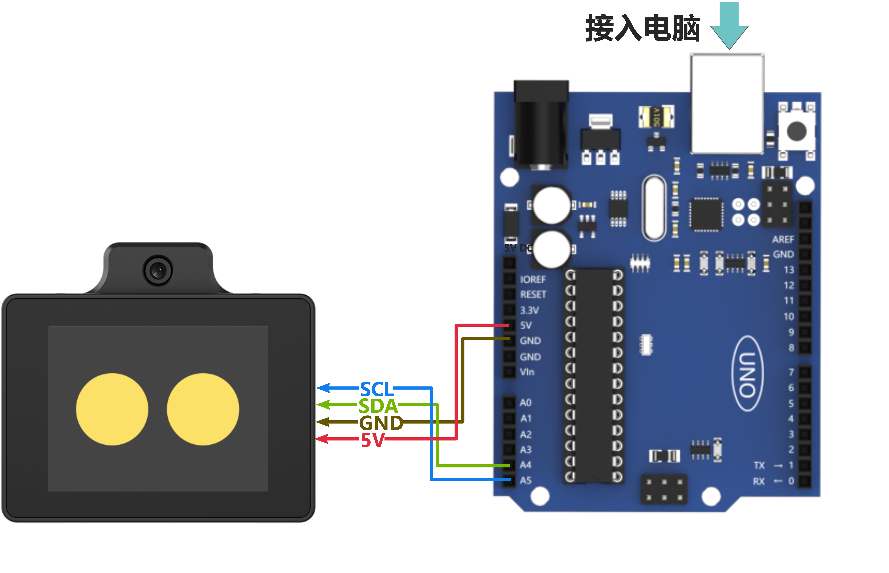

  (2) The Arduino UNO development board can be used with any of Hiwonder Arduino expansion boards, and the wiring with WonderLLM is shown below (using Board A as an example):

  

> [!NOTE]
>**Note: Before powering on, ensure that no metal objects are touching the controller. Otherwise, the exposed pins at the bottom of the board may cause a short circuit and damage the controller.**

  

1. **Arduino UNO Program Download**

(1) Locate and open the program file **“Appendix\04 Arduino Program Files\01 Arduino Face Recognition Example\Arduino_esp32cam_face\Arduino_esp32cam_face.ino”**.

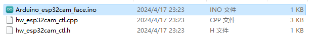

(2) Connect the Arduino controller to the computer using a USB Type-B cable.


(3) Click the "Select Board" option. The software will automatically detect the connected Arduino serial port. Then click to connect it.


(4) Click  to download the program to the Arduino and wait for the download to complete.


2. **WonderLLM Face Recognition Program Download**

(1) Connect one end of the Type-C cable to the module and the other end to the computer’s USB port.


(2) Open the **“Appendix\03 WonderLLM Program\ FaceDetection\ FaceDetection.ino”** file located in the same directory as this)


(3) Choose the development board “ESP32S3 Dev Module”.


(4) In the menu bar, click **Tools**, and choose the corresponding ESP32S3 controller configuration as illustrated.


(5) Click  to download the program to the WonderLLM and wait for the download to complete.


* #### Project Outcome

1. Open the serial tool in the top-right corner of Arduino IDE , and set the baud rate to 115200.

2. When WonderLLM does not detect a face, Arduino will print **face 0** in the serial monitor.

   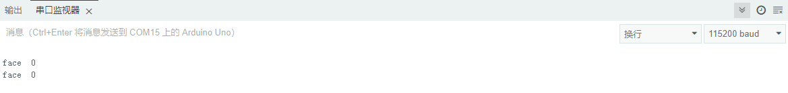

3. After detecting a face, the serial monitor will print **find face** and **face 1**.

   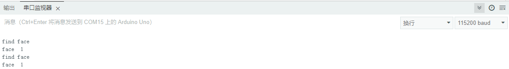

   

* ### Program Brief Analysis

1. **Program Initialization**

(1) First, import the required communication library for the WonderLLM offline vision feature.

```c
#include "hw_esp32cam_ctl.h" // Import ESP32Cam communication library
```

(2) Create a WonderLLM communication object, `hw_cam`, for communication between Arduino UNO and WonderLLM.

```c
// ESP32Cam communication object
HW_ESP32Cam hw_cam;
```

(3) In the `setup()` function, hardware initialization is performed. First, initialize the serial communication, setting the baud rate to 115200 and the data read timeout to 600ms, followed by the communication initialization for WonderLLM.

```c
void setup() {
  Serial.begin(115200);
  // Set the timeout for serial port data reading
  Serial.setTimeout(600);
  
  hw_cam.begin(); // Initialize communication interface with ESP32Cam

  delay(600);
  Serial.println("start");
}
```


2. **Loop to Call Sub-functions**

After initialization, the program enters the `loop` function and repeatedly calls the **espcam_task** function to detect face recognition and execute the serial print task.

```c
void loop() {
  // esp32cam communication task
  espcam_task();
}
```


3. **WonderLLM Communication Task**

(1) Define the **espcam_task** function to detect face recognition and execute the serial print task.

(2) First, define the `last_tick` variable to record the time of the last task execution; the `res` variable is used to store the face detection result (1 for detected, 0 for not detected).

```c
static uint32_t last_tick = 0;
int res = 0;
```

(3) The `last_tick` variable is combined with `millis()` for **delay operation**. Specifically, the `millis()` function is used to get the current program run time, and the difference between the current time and the `last_tick` variable is calculated. If the difference is less than 100, the function exits; if it is greater than or equal to 100, it means that 100ms have passed. Then, the current time is assigned to the `last_tick` variable for the next delay operation.

```c
  if (millis() - last_tick < 100) {
    return;
  }
  last_tick = millis();
```

(4) Call the `faceDetect` function of the `hw_cam` object to read the detected face data from the WonderLLM module via I2C.

```c
  res = hw_cam.faceDetect();
```

(5) Finally, check if face data is detected. If detected, print **find face** via the serial port.

```c
  if(res != 0)
  {
    Serial.println("find face");
  }
```


### 3.7.2 Face Recognition Example

This section demonstrates how the WonderLLM module detects colors and then sends the data to the Arduino controller via the I2C protocol.

* #### Implementation Flowchart


* #### Sensor Wiring

(1) When wiring, connect the WonderLLM's 5V, GND, SCL, and SDA pins to the Arduino UNO development board as shown in the diagram below:


(2) The Arduino UNO development board can be used with any of Hiwonder Arduino expansion boards, and the wiring with WonderLLM is shown below (using Board A as an example):


> [!NOTE]
>
>**Note: Before powering on, ensure that no metal objects are touching the controller. Otherwise, the exposed pins at the bottom of the board may cause a short circuit and damage the controller.**


* #### Program Download

1. **Arduino UNO Program Download**

(1) Locate and open the program file **“Appendix\04 Arduino Program Files\02 Arduino Color Recognition Example\Arduino_esp32cam_color\Arduino_esp32cam_color.ino”**.

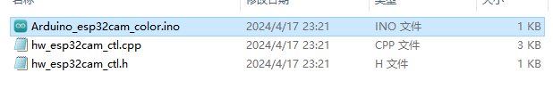

(2) Connect the Arduino controller to the computer using a USB Type-B cable.


(3) Click the "Select Board" option. The software will automatically detect the connected Arduino serial port. Then click to connect it.


(4) Click  to download the program to the Arduino and wait for the download to complete.


2. **WonderLLM Color Recognition Program Download**

(1) Connect the WonderLLM to the computer using a Type-C cable via the Type-C interface on the top of the module.


(2) Open the program **“Appendix\03 WonderLLM Program\ColorDetection\ColorDetection.ino”**.


(3) Select the development board **ESP32S3 Dev Module**.


(4) In the menu bar, click **Tools**, and choose the corresponding ESP32S3 controller configuration as illustrated.


(5) Click  to download the program to the WonderLLM and wait for the download to complete.


* **Project Outcome**

1. Open the serial tool in the top-right corner of Arduino IDE , and set the baud rate to 115200.

2. When WonderLLM detects red, it will print **COLOR_1** in the serial monitor.

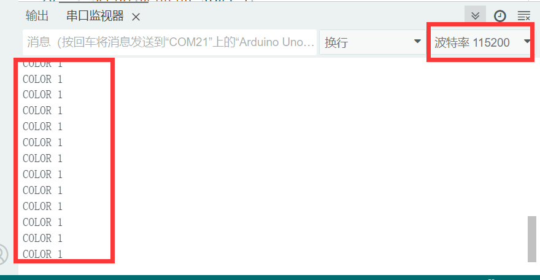

3. When WonderLLM detects green, print **COLOR_2** in the serial monitor.

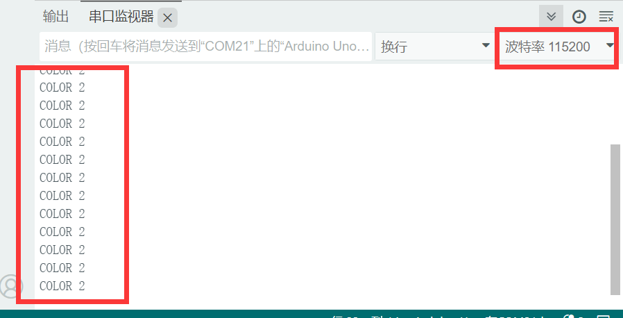


* **Program Brief Analysis**

1. **Program Initialization**

(1) First, import the required communication library for the WonderLLM offline vision feature.

```c
#include "hw_esp32cam_ctl.h" // Import ESP32Cam communication library
```

(2) Next, create a WonderLLM communication object for communication between Arduino UNO and WonderLLM, and define the corresponding IDs for red and green in the WonderLLM color recognition functionality.

```c
#define COLOR_red   0
#define COLOR_green   2

// ESP32Cam communication object
HW_ESP32Cam hw_cam;
```

(3) In the `setup()` function, hardware initialization is performed. First, initialize the serial communication, setting the baud rate to 115200 and the data read timeout to 600ms, followed by the communication initialization for WonderLLM.

```c
void setup() {
  Serial.begin(115200);
  // Set the timeout for serial port data reading
  Serial.setTimeout(600);
  
  hw_cam.begin(); // Initialize communication interface with ESP32Cam

  delay(600);
  Serial.println("start");
}
```

2. **Loop to Call Sub-functions**

After initialization, the program enters the `loop` function and repeatedly calls the **espcam_task** function to detect color recognition and execute the serial print task.

```c
void loop() {
  // esp32cam communication task
  espcam_task();
}
```

3. **WonderLLM Communication Task**

(1) Define the **espcam_task** function to detect face recognition and execute the serial print task.

(2) First, define the `last_tick` variable to record the time of the last task execution; the `color_results` array is used to store the real-time recognition results of all predefined colors from the module.

```c
  static uint32_t last_tick = 0;
  uint8_t color_result[Color_num] = {0x00};
```

(3) The `last_tick` variable is combined with `millis()` for **delay operation**. Specifically, the `millis()` function is used to get the current program run time, and the difference between the current time and the `last_tick` variable is calculated. If the difference is less than 100, the function exits; if it is greater than or equal to 100, it means that 100ms have passed. Then, the current time is assigned to the `last_tick` variable for the next delay operation.

```c
  if (millis() - last_tick < 100) {
    return;
  }
  last_tick = millis();
```

(4) Call the `colorDetect` function of the `hw_cam` object to read the detected color data from the WonderLLM module via I2C.

```c
if(hw_cam.colorDetect(color_result)) { // Get the color recognition result and determine if the retrieval was successful based on the return value
```

(5) This function reads the preset color register data from WonderLLM via I2C, then parses the data. If the width of any color's recognition box is 0, it is determined that the color was not recognized, and the corresponding element in the recognition result array is written as 0; otherwise, the color ID is written.

```c
/**
* @brief Get the recognition results of all preset colors of the module.
*
* @param color_result_info Pointer to the array storing the recognition results for each color. 
* @return Read result (true - success, false - failure).
*
* @note 1. The `color_result_info` parameter must pass the pointer to an array of type uint8_t with `Color_num` bytes.
*       2. Each element in the array stores the recognition result of one color, ordered by the color ID from low to high.
*       3. If a color is not recognized, the corresponding element will have a value of 0. Otherwise, it will store the corresponding color ID.
*/
bool colorDetect(uint8_t * color_result_info)
{
  uint8_t color_info[4];
  int num = 0;
  memset(color_result_info, -1, (Color_num * sizeof(uint8_t)));
  
  for(int i = 0; i < Color_num; i ++){

    num = WireReadDataArray(Color0_Detect_Reg + i,color_info,4);
    if(num != 4) // If not all color recognition data (x, y, w, h) is received
    {
      return false;
    }

    if(color_info[2] > 0) { // If the width of the recognition box is 0, no color is recognized; otherwise, the color is recognized
      color_result_info[i] = i;
    }

  }

  return true;
}
```

(6) Finally, check if red/green is detected in the results. If detected, print the corresponding color label via the serial monitor (print **COLOR 1** for red; print **COLOR 2** for green).

```c
if(hw_cam.colorDetect(color_result)) { // Get the color recognition result and determine if the retrieval was successful based on the return value
	if(color_result[COLOR_red] == COLOR_red)
	{
		Serial.println("COLOR 1");

	}
    if(color_result[COLOR_green] == COLOR_green)
	{
		Serial.println("COLOR 2");
	}

	}else{
		Serial.println("read failed");
	} 
```


### 3.7.3 Line-Following Recognition Example

This section demonstrates how to use WonderLLM to recognize specified color lines and send the data to the Arduino controller via the I2C protocol.

* #### Implementation Flowchart

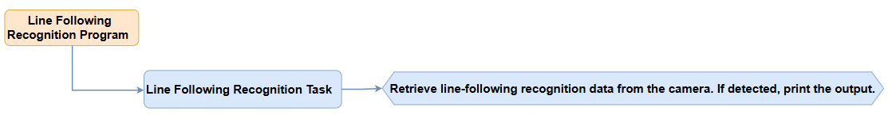


* #### Sensor Wiring

(1) When wiring, connect the WonderLLM's 5V, GND, SCL, and SDA pins to the Arduino UNO development board as shown in the diagram below:


(2) The Arduino UNO development board can be used with any of Hiwonder Arduino expansion boards, and the wiring with WonderLLM is shown below (using Board A as an example):


> [!NOTE]
>**Before powering on, ensure that no metal objects are touching the controller. Otherwise, the exposed pins at the bottom of the board may cause a short circuit and damage the controller.**


* #### Program Download

1. **Arduino UNO Program Download**

(1) Locate and open the program file **“Appendix\04 Arduino Program Files\03 Arduino Line-following Recognition Example\Arduino_esp32cam_linetrack\Arduino_esp32cam_linetrack.ino”**.

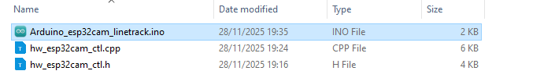

(2) Connect the Arduino controller to the computer using a USB Type-B cable.


(3) Click the "Select Board" option. The software will automatically detect the connected Arduino serial port. Then click to connect it.


(4) Click  to download the program to the Arduino and wait for the download to complete.


2. **WonderLLM Line-following Recognition Program Download**

(1) Connect the WonderLLM to the computer using a Type-C cable via the Type-C interface on the top of the module.


(2) Open the program **“Appendix\03 WonderLLM Program\LineTracking\LineTracking.ino”**.


(3) Select the development board **ESP32S3 Dev Module**.


(4) In the menu bar, click **Tools**, and choose the corresponding ESP32S3 controller configuration as illustrated.


(5) Click  to download the program to the WonderLLM and wait for the download to complete.


* **Project Outcome**

1. Open the serial tool in the top-right corner of Arduino IDE , and set the baud rate to 115200.

2. When WonderLLM detects a red line, it will print the recognition box parameters for the upper and middle sections of the image to the serial monitor. If not detected, the parameters will be all zeros.

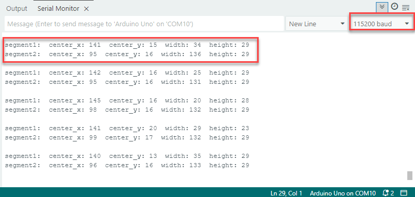


* **Program Brief Analysis**

1. **Program Initialization**

(1) First, import the required communication library for the WonderLLM offline vision feature.

```c
#include "hw_esp32cam_ctl.h" // Import ESP32Cam communication library
```

(2) Next, create a WonderLLM communication object for communication between Arduino UNO and WonderLLM, and define the preset ID for red in the module's line-following recognition function.

```c
#define COLOR_red   0

// ESP32Cam communication object
HW_ESP32Cam hw_cam;
```

(3) In the `setup()` function, hardware initialization is performed. First, initialize the serial communication, setting the baud rate to 115200 and the data read timeout to 600ms, followed by the communication initialization for WonderLLM.

```c
void setup() {
  Serial.begin(115200);
  // Set the timeout for serial port data reading
  Serial.setTimeout(600);
  
  hw_cam.begin(); // Initialize communication interface with ESP32Cam

  delay(600);
  Serial.println("start");
}
```


2. **Loop to Call Sub-functions**

(1) After initialization, the program enters the `loop` function and repeatedly calls the **espcam_task** function to detect face recognition and execute the serial print task.

```c
void loop() {
  // esp32cam communication task
  espcam_task();
}
```


3. **WonderLLM Communication Task**

(1) Define the **espcam_task** function to detect line-following recognition and execute the serial print task.

(2) First define the `last_tick` variable to record the time of the last task execution; the `line_info` array is used to store the parameters of the two recognition boxes for the same color.

```c
  static uint32_t last_tick = 0;
  uint8_t line_info[8];
```

(3) The `last_tick` variable is combined with `millis()` for **delay operation**. Specifically, the `millis()` function is used to get the current program run time, and the difference between the current time and the `last_tick` variable is calculated. If the difference is less than 100, the function exits; if it is greater than or equal to 100, it means that 100ms have passed. Then, the current time is assigned to the `last_tick` variable for the next delay operation.

```c
  if (millis() - last_tick < 100) {
    return;
  }
  last_tick = millis();
```

(4) Call the `line_position` function of the `hw_cam` object to read the detected red line segment recognition box data from the WonderLLM module via I2C.

```c
  if(hw_cam.line_position(COLOR_red,line_info)){
```

(5) The function reads the specified color line segment register data from WonderLLM via I2C. If all 8 bytes of data are successfully read, it returns true; otherwise, it returns false.

```c
/**
* @brief Get the recognition box (2 boxes) parameters for a specified color line segment.
*
* @param color_id   The color ID.
* @param line_info  A pointer to the array storing the line segment recognition box parameters.
* @return Read result (true - success, false - failure).
*
* @note 1. The `color_info` parameter must be passed as a pointer to an 8-byte uint8_t array.
*       2. color_id = 0 (default red), color_id = 1 (default green), color_id = 2 (default blue), color_id = 3 (default purple).
*/
bool HW_ESP32Cam::line_position(int color_id,uint8_t *line_info)
{
  // Confirm the validity of the color_id parameter
  if((color_id >= 0) && (color_id <= Color_line_num)){

    int num = WireReadDataArray((Color0_segment1_Detect_Reg + (2*color_id)),line_info,4);
    //Received the x, y, w, h values of the upper half of the image segment color recognition box in complete 4-byte format.
    if(num != 4){
      
      return false;
    }

    num = WireReadDataArray((Color0_segment2_Detect_Reg + (2*color_id)),(line_info + 4),4);
    //Received the x, y, w, h values of the middle half of the image segment color recognition box in complete 4-byte format.
    if(num != 4){

      return false;
    }

  }

  return true;
}
```

(6) Finally, print all the parameters of the two red segment recognition boxes. If they are all 0, it indicates that no red segment was detected in this area.

```c
  if(hw_cam.line_position(COLOR_red,line_info)){
  
    Serial.print("segment1:");      //Upper half area

    Serial.print("  center_x: ");
    Serial.print(line_info[0]);

    Serial.print("  center_y: ");
    Serial.print(line_info[1]);

    Serial.print("  width: ");
    Serial.print(line_info[2]);

    Serial.print("  height: ");
    Serial.println(line_info[3]);

    Serial.print("segment2:");      //Midlle half area

    Serial.print("  center_x: ");
    Serial.print(line_info[4]);

    Serial.print("  center_y: ");
    Serial.print(line_info[5]);

    Serial.print("  width: ");
    Serial.print(line_info[6]);

    Serial.print("  height: ");
    Serial.println(line_info[7]);

  }else{
    Serial.println("read failed");
  }

  Serial.println();
```


## 3.8 Communication with ESP32 Controller

### 3.8.1 Face Recognition Example

This section demonstrates how the WonderLLM module detects faces and then sends the data to the ESP32 controller via the I2C protocol.

* #### Implementation Flowchart


* #### **Wiring Instructions**

> [!NOTE]
>
> **MicroPython code can run on any microcontroller that supports MicroPython programming. This section uses Hiwonder ESP32 core board as an example.**

1. When wiring, connect the WonderLLM's 5V, GND, SCL, and SDA pins to the ESP32 core board as shown in the diagram below:

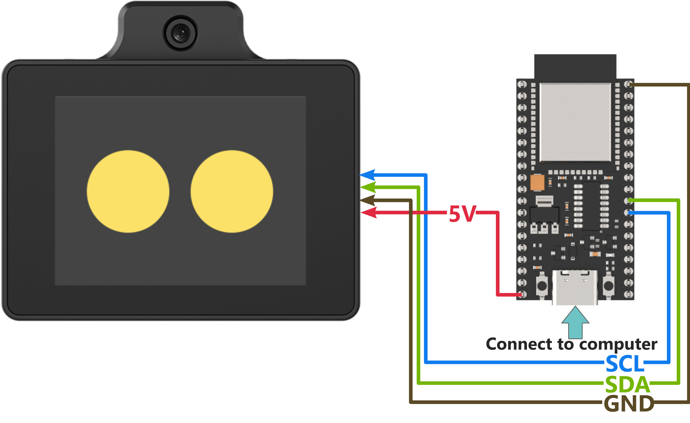


2. The ESP32 core board can be used in combination with Hiwonder open-source 6-channel servo controller, and the wiring to WonderLLM is shown in the diagram below:

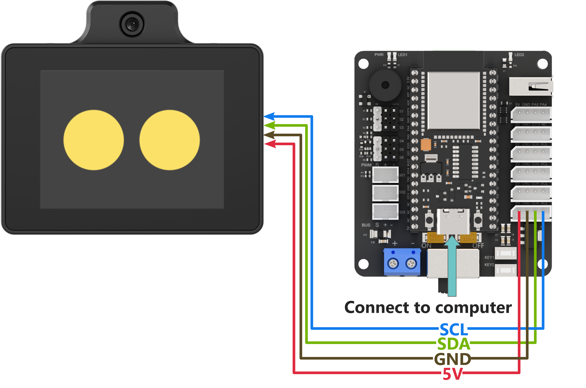


> [!NOTE]
>
>**Before powering on, ensure that no metal objects are touching the controller. Otherwise, the exposed pins at the bottom of the board may cause a short circuit and damage the controller.**


* #### Program Download

1. ESP32 Program Download
> [!NOTE]
>
> * **MicroPython supports multiple IDEs for downloading, such as Thonny and VScode. Relevant plugins need to be installed, and the specific operations should be searched independently. This example uses the "Hiwonder Python Editor" for downloading the program without installation.**
> * **If using ESP32, make sure that the MicroPython firmware is already installed on the ESP32 before downloading MicroPython. For firmware downloads, please visit the MicroPython official website. If using Hiwonder ESP32 core board, flash the firmware file provided by Hiwonder (path: **Appendix\10 ESP32 Core Board Firmware and Flashing Tool\02 ESP32 Firmware Flashing Tool**.) For flashing instructions, please refer to the document in the same path.**

1. Open the "**Hiwonder Python Editor**" software  (path: **Appendix\09 Hiwonder Python Editor**);

2. Drag the file "**Appendix\05 ESP32 Program Files\01 ESP32 Controller Face Recognition Example\main.py**" from this document's path into the Hiwonder Python editor. Make sure to drag it into the red-framed area for it to be valid.

   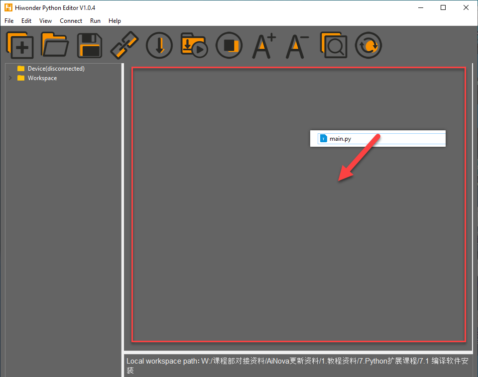

3. Click the connect button in the menu bar . After a successful connection, the icon will turn green .

4. After successful connection, click the download button on the menu bar , to download the program to the ESP32. Wait for the prompt in the information interaction box below to indicate that the download is complete.

   

> [!NOTE]
>**After completing the above 4 steps, please drag the WonderLLM offline vision feature communication library ("Appendix\05 ESP32 Program Files\01 ESP32 Controller Face Recognition Example\hw_esp32cam_ctl.py") into the editor. Follow the same steps to import the library file into the ESP32. After downloading, click the reset icon on the interface  to reset the ESP32. The output information will be displayed in the output information bar below.**


2. **WonderLLM Face Recognition Program Download**

(1) Connect one end of the Type-C cable to the module and the other end to the computer’s USB port.


(2) Open the **“Appendix\03 WonderLLM Program\ FaceDetection\ FaceDetection.ino”** file located in the same directory as this)


(3) Choose the development board “ESP32S3 Dev Module”.


(4) In the menu bar, click **Tools**, and choose the corresponding ESP32S3 controller configuration as illustrated.


(5) Click  to download the program to the WonderLLM and wait for the download to complete.


* #### **Project Outcome**

1. When WonderLLM detects a face, it will print **find face** in the serial port.

   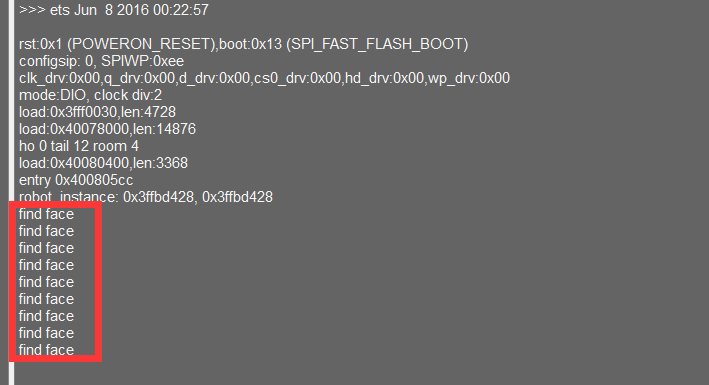


* ### Program Brief Analysis

1. **Import Libraries**

(1) Import the I2C module and the WonderLLM offline vision feature module `hw_esp32cam_ctl`.

```python
from time import sleep_ms
from machine import Pin, I2C
from hw_esp32cam_ctl import HW_ESP32Cam 
```

(2) Define the face recognition result variable `face_detect_result`, initialized to false (not detected).

```python
face_detect_result = False
```


2. **Initial I2C**

Initialize the I2C bus and pass the I2C bus handle. Instantiate the HW_ESP32Cam class as the object cam. 

```python
if __name__ == "__main__":
  iic = I2C(0, scl=Pin(23), sda=Pin(22), freq=100000)
  cam = HW_ESP32Cam(iic)
  sleep_ms(1000)
```

3. **Loop to Call Sub-functions**

(1) Call the `faceDetect()` function to read the module's face recognition results. If a face is detected, print **find face**.

```python
  while True:

    face_detect_result = cam.faceDetect()
    
    if (face_detect_result == True):
        print("find face")

    sleep_ms(600)
```


### 3.8.2 Face Recognition Example

This section demonstrates how the WonderLLM module detects colors and then sends the data to the ESP32 controller via the I2C protocol.

* #### Implementation Flowchart


* #### **Wiring Instructions**

> [!NOTE]
>
> **MicroPython code can run on any microcontroller that supports MicroPython programming. This section uses Hiwonder ESP32 core board as an example.**

1. When wiring, connect the WonderLLM's 5V, GND, SCL, and SDA pins to the ESP32 core board as shown in the diagram below:


2. The ESP32 core board can be used in combination with Hiwonder open-source 6-channel servo controller, and the wiring to WonderLLM is shown in the diagram below:


> [!NOTE]
>
>**Before powering on, ensure that no metal objects are touching the controller. Otherwise, the exposed pins at the bottom of the board may cause a short circuit and damage the controller.**


* #### Program Download

1. ESP32 Program Download

> [!NOTE]
>
> * **MicroPython supports multiple IDEs for downloading, such as Thonny and VScode. Relevant plugins need to be installed, and the specific operations should be searched independently. This example uses the "Hiwonder Python Editor" for downloading the program without installation.**
> * **If using ESP32 controller, make sure that the MicroPython firmware is already installed on the ESP32 before downloading MicroPython. For firmware downloads, please visit the MicroPython official website. If using Hiwonder ESP32 core board, flash the firmware file provided by Hiwonder (path: **Appendix\10 ESP32 Core Board Firmware and Flashing Tool\02 ESP32 Firmware Flashing Tool**.) For flashing instructions, please refer to the document in the same path.**

1. Open the **Hiwonder Python Editor** software  (path: **Appendix\09 Hiwonder Python Editor**);

2. Drag the file "**Appendix\05 ESP32 Program Files\02 ESP32 Controller Color Recognition Example\main.py**" from this document's path into the Hiwonder Python editor. Make sure to drag it into the red-framed area for it to be valid.

   

3. Click the connect button in the menu bar . After a successful connection, the icon will turn green .

4. After successful connection, click the download button on the menu bar , to download the program to the ESP32. Wait for the prompt in the information interaction box below to indicate that the download is complete.

   

> [!NOTE]
>**After completing the above 4 steps, please drag the WonderLLM offline vision feature communication library ("Appendix\05 ESP32 Program Files\02 ESP32 Controller Color Recognition Example\hw_esp32cam_ctl.py") into the editor. Follow the same steps to import the library file into the ESP32. After downloading, click the reset icon on the interface  to reset the ESP32. The output information will be displayed in the output information bar below.**


2. **WonderLLM Color Recognition Program Download**

(1) Connect one end of the Type-C cable to the module and the other end to the computer’s USB port.


Open the **“Appendix\ 03 WonderLLM Program\ ColorDetection\ ColorDetection.ino”** file located in the same directory as this document.


(3) Choose the development board **ESP32S3 Dev Module**.


(4) In the menu bar, click **Tools**, and choose the corresponding ESP32S3 controller configuration as illustrated.


(5) Click  to download the program to the WonderLLM and wait for the download to complete.


* #### **Project Outcome**

1. When WonderLLM detects red, it will print **COLOR_1** in the serial monitor.

   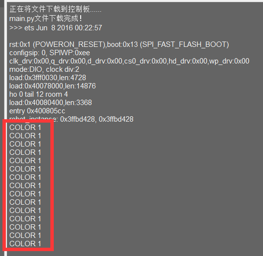

2. When WonderLLM detects green, print **COLOR_2** in the serial monitor.

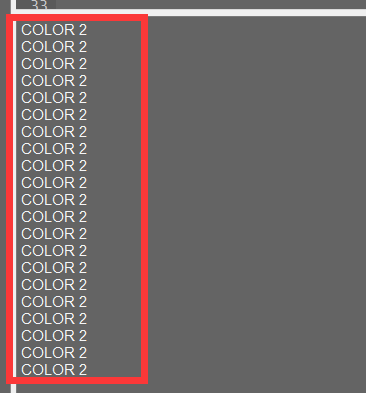


* ### Program Brief Analysis

1. **Import Libraries**

(1) Import the I2C module and the WonderLLM offline vision feature module `hw_esp32cam_ctl`.

```python
from time import sleep_ms
from machine import Pin, I2C
from hw_esp32cam_ctl import HW_ESP32Cam 
```

(2) Define the preset IDs for red and green in the color recognition function, and store the recognition results for all preset colors in the array `color_detect_result`.

```python
COLOR_red = 0
COLOR_green = 2

color_detect_result = [0] * 5
```


2. **Initial I2C**

(1) Initialize the I2C bus and pass the I2C bus handle. Instantiate the HW_ESP32Cam class as the object cam.

```python
if __name__ == "__main__":
  iic = I2C(0, scl=Pin(23), sda=Pin(22), freq=100000)
  cam = HW_ESP32Cam(iic)
  sleep_ms(1000)
```


3. **Loop to Call Sub-functions**

(1) Call the `colorDetect` function to obtain real-time recognition results for all preset colors from the module, passing them into the list `color_detect_result`. Then read the recognition results for red and green using their corresponding IDs in the list. If detected, print the corresponding label.

```python
  while True:

    cam.colorDetect(color_detect_result)
    if (color_detect_result[COLOR_red] == COLOR_red):
        print("COLOR 1")
    if (color_detect_result[COLOR_green] == COLOR_green):
        print("COLOR 2")

    sleep_ms(600)
```


### 3.8.3 Line-Following Recognition Example

This section demonstrates how to use WonderLLM to recognize specified color lines and send the data to the ESP32 controller via the I2C protocol.

* #### Implementation Flowchart


* #### **Wiring Instructions**

> [!NOTE]
> **MicroPython code can run on any microcontroller that supports MicroPython programming. This section uses Hiwonder ESP32 core board as an example.**

1. When wiring, connect the WonderLLM's 5V, GND, SCL, and SDA pins to the ESP32 core board as shown in the diagram below:


2. The ESP32 core board can be used in combination with Hiwonder open-source 6-channel servo controller, and the wiring to WonderLLM is shown in the diagram below:


> [!NOTE]
>
>**Before powering on, ensure that no metal objects are touching the controller. Otherwise, the exposed pins at the bottom of the board may cause a short circuit and damage the controller.**


* #### Program Download

1. ESP32 Program Download

> [!NOTE]
>
> * **MicroPython supports multiple IDEs for downloading, such as Thonny and VScode. Relevant plugins need to be installed, and the specific operations should be searched independently. This example uses the "Hiwonder Python Editor" for downloading the program without installation.**
> * **If using ESP32, make sure that the MicroPython firmware is already installed on the ESP32 before downloading MicroPython. For firmware downloads, please visit the MicroPython official website. If using Hiwonder ESP32 core board, flash the firmware file provided by Hiwonder (path: **Appendix\10 ESP32 Core Board Firmware and Flashing Tool\02 ESP32 Firmware Flashing Tool**.) For flashing instructions, please refer to the document in the same path.**

1. Open the **Hiwonder Python Editor** software  (path: **Appendix\09 Hiwonder Python Editor**);

2. Drag the file "**Appendix\05 ESP32 Program Files\03 ESP32 Controller Line-following Recognition Example\main.py**" from this document's path into the Hiwonder Python editor. Make sure to drag it into the red-framed area for it to be valid.

   

3. Click the connect button in the menu bar . After a successful connection, the icon will turn green .

4. After successful connection, click the download button on the menu bar , to download the program to the ESP32. Wait for the prompt in the information interaction box below to indicate that the download is complete.

   
> [!NOTE]
>**After completing the above 4 steps, please drag the WonderLLM offline vision feature communication library ("Appendix\05 ESP32 Program Files\03 ESP32 Controller Line-following Recognition Example\hw_esp32cam_ctl.py") into the editor. Follow the same steps to import the library file into the ESP32. After downloading, click the reset icon on the interface  to reset the ESP32. The output information will be displayed in the output information bar below.**


2. **WonderLLM Line-following Recognition Program Download**

(1) Connect the WonderLLM to the computer using a Type-C cable via the Type-C interface on the top of the module.


(2) Open the program **“Appendix\03 WonderLLM Program\LineTracking\LineTracking.ino”**.


(3) Select the development board **ESP32S3 Dev Module**.


(4) In the menu bar, click **Tools**, and choose the corresponding ESP32S3 controller configuration as illustrated.


(5) Click  to download the program to the WonderLLM and wait for the download to complete.


* #### **Project Outcome**

When WonderLLM detects a red line, it will print the recognition box parameters for the upper and middle sections of the image to the serial monitor. If not detected, the parameters will be all zeros.

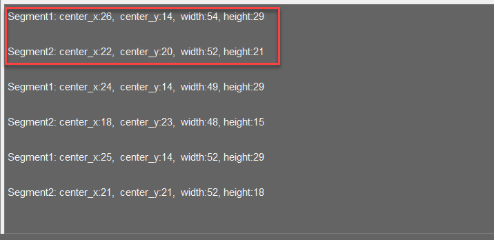


* ### Program Brief Analysis

1. **Import Libraries**

(1) Import the I2C module and the WonderLLM offline vision feature module `hw_esp32cam_ctl`.

```python
from time import sleep_ms
from machine import Pin, I2C
from hw_esp32cam_ctl import HW_ESP32Cam 
```

(2) Define the preset ID for red in the line-following recognition function, and store the parameters of two recognition boxes for one color segment in the list `line_detect_result`.

```python
COLOR_red = 0

line_detect_result = [0] * 8
```


2. **Initial I2C**

Initialize the I2C bus and pass the I2C bus handle. Instantiate the HW_ESP32Cam class as the object cam.

```python
if __name__ == "__main__":
  iic = I2C(0, scl=Pin(23), sda=Pin(22), freq=100000)
  cam = HW_ESP32Cam(iic)
  sleep_ms(1000)
```


3. **Loop to Call Sub-functions**

Call the `line_position` function to read the parameters of the two line-following recognition boxes for the red segment and print them on the screen.

```python
  while True:
    cam.line_position(COLOR_red,line_detect_result)
    print(f"Segment1: center_x:{line_detect_result[0]},  center_y:{line_detect_result[1]},  width:{line_detect_result[2]}, height:{line_detect_result[3]}\r\n")
    print(f"Segment2: center_x:{line_detect_result[4]},  center_y:{line_detect_result[5]},  width:{line_detect_result[6]}, height:{line_detect_result[7]}\r\n")
    sleep_ms(600)
```


### 3.8.4 Hiwonder Python Editor

> [!NOTE]
>
> **If the editor fails to open, rename the editor to a fully English name, such as "Hiwonder."**

* **Feature Introduction**

1. The current editor interface is divided into five parts, as shown in the image below:

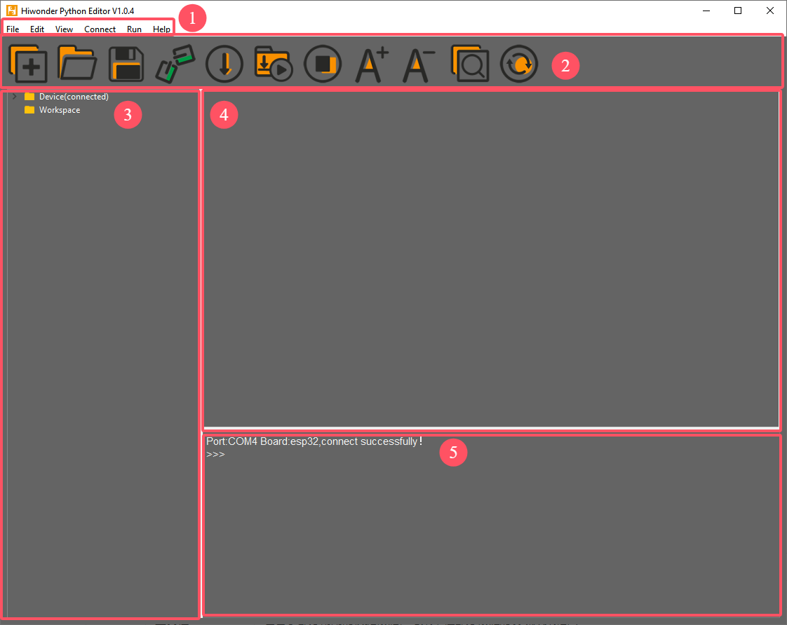

2. Each area has a corresponding function, as shown in the table below:

<table>
<tr><td>No.</td><td> Function</td></tr>
<tr><td>1</td><td>Menu Bar</td><td>Includes File, Edit, View, Connect, Run, Help. </td></tr>
<tr><td>2</td><td>Toolbar</td><td>Contains some commonly used shortcut keys, with the same functionality as some keys in the menu bar.</td></tr>
<tr><td>3</td><td>File List</td><td>Divided into multiple project files within the device and local machine. Allows viewing of project file contents (folders, source code, etc.). </td></tr>
<tr><td>4</td><td>Code Editor</td><td>Used for viewing and writing code. </td></tr>
<tr><td>5</td><td>Terminal</td><td>Displays message logs and debugging information. When no device is connected, only message logs are displayed. </td></tr>
</table>


* **Operating Instructions**

1. **Import Local Project**

(1) When importing a local project for the first time, left-click on **Local Projects** to open the file selection list. (For subsequent imports, right-click on **"Local Project -> Switch Project Path"**).

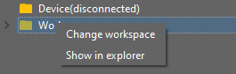

(2) Select the folder where the MicroPython program is stored and click the **Select Folder** button.

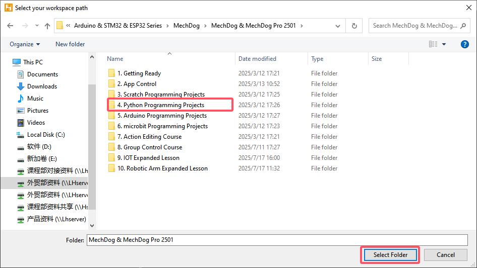

(3) The files in the folder will be automatically added to the local project and can be viewed under **Local Project**.

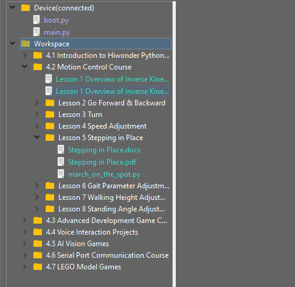

> [!NOTE]
>**Importing a local project means bringing files from the computer into the editor. It does not mean downloading them to the ESP32 Core Board.**

2. **View Imported Files/Programs**

Here, double-click the program file in the file list to view the detailed code. The example used here is **march_on_the_spot.py**:

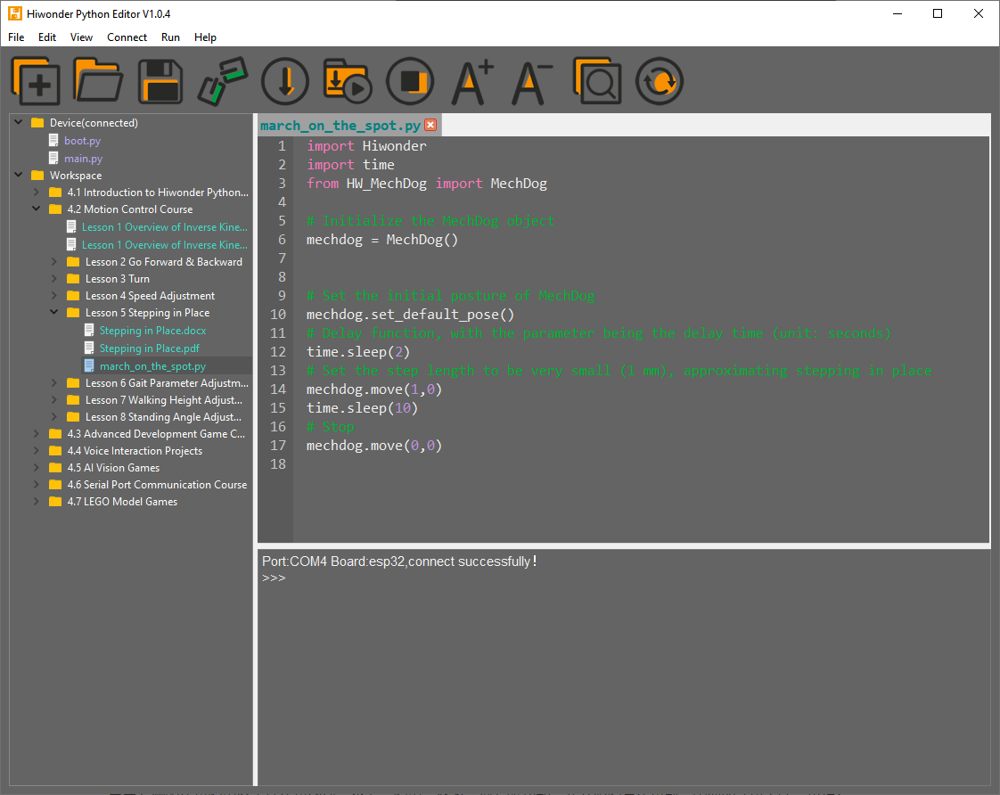

Similarly, after downloading the program to the ESP32 board, double-click the file under the **Device** list to view it.

3 **Code Writing and Saving**

The code editing area on the right side of the interface supports creating, viewing, editing, modifying, and saving code. Before writing code, please read the following notes carefully:

(1) Users cannot create files directly under the **Device** tab. Files in **Device** can only be saved via download. To back up a file, first copy it into the **Local Project**.

(2) Do not modify action group files with the **.rob** suffix in the editor, as this may lead to format errors. To edit action group files, use the upper computer software.

(3) Among the provided low-level files, main.py is the device’s main program. All robot functions must be launched via this file. Reset and startup operations both rely on it. If main.py crashes, no other functions can be executed. To add functions to main.py, renaming the file first is safer. Even if the program hangs, shortcuts like **Ctrl+C** or **Ctrl+D** don’t respond, reset the board and re-download the program. This will restore normal operation.

4 **Program Download and Execution**

Downloading the program is an interaction between the editor and the device. The example used here is **march_on_the_spot.py**:

(1) After selecting the **Hello.py** file under the **Local Projects** tab, click the icon in the toolbar , or right-click the file and select **Download and Run**.

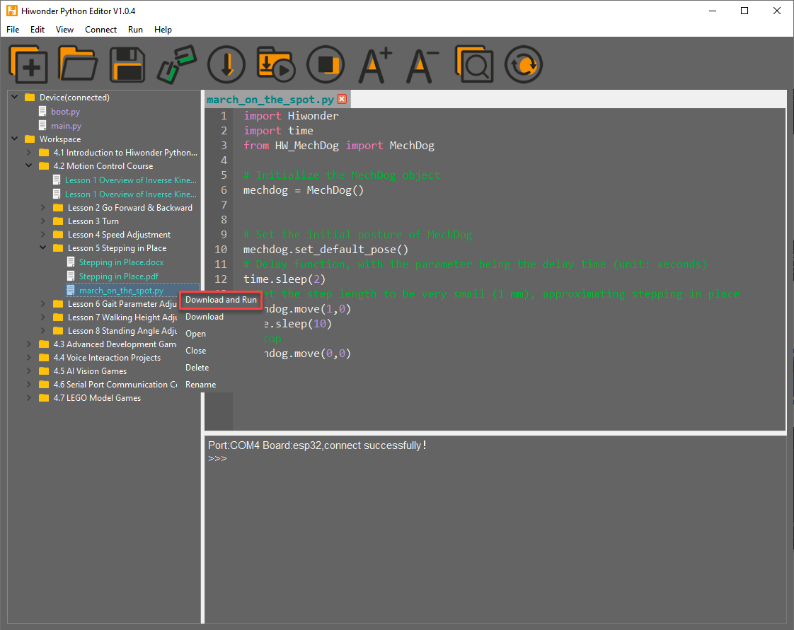

(2) View the download progress and completion status in the terminal window. The previous step selected **Download and Run**, so the program's running effect can also be viewed.


(3) Once the download is complete, the program will appear in the file list under the **Device** tab.

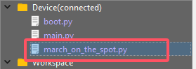

(4) Finally, delete the original **main.py** file and rename the downloaded **change_speed.py** to **main.py**.


(5) Additionally, there are a few points users should be aware of:

① Besides this download method, rename the file to **main.py** before downloading it.

② The **Download and Run** function first resets the device (reboots), then downloads and runs the program, which helps improve program stability.

③ If the program does not need to be executed immediately, click the button , or right-click the target file and select **Download**. Before executing the program, press the  icon to reset the device, then execute the program.

5. **Terminal Usage (Debugging)**

(1) The terminal is a functional area that combines both the information window and debugging interface. However, it should be noted that if the device is not connected, the terminal area can only be used for viewing information and cannot be used for editing or debugging.

(2) Regarding information viewing, this has already been experienced in previous steps, so it will not be discussed further. This section focuses on explaining the debugging functions.

① The terminal supports inputting code. Enter the code `print(123)` in the terminal and press Enter. The result will be as follows:

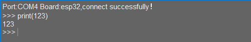

②Additionally, the terminal also supports auto-indentation. When typing Python statements that end with a colon, such as if, for, or while, and pressing Enter, the next line will automatically continue with the same indentation level as the current statement, or with an appropriate indentation level as required. Pressing the Backspace key undoes one level of indentation.


③ To copy and paste code, right-click the target code after selecting it in the terminal interface.

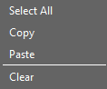

> [!NOTE]
>**Please note that, because the terminal supports auto-indentation, before pasting code, press “Ctrl+E” to enter edit mode. Otherwise, indentation errors may occur during debugging.**

④ Here’s an example of correct indentation after copying and pasting:

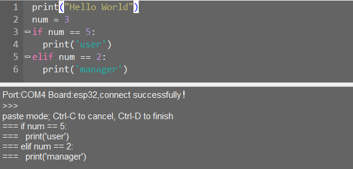

⑤ And here’s an example of incorrect indentation:

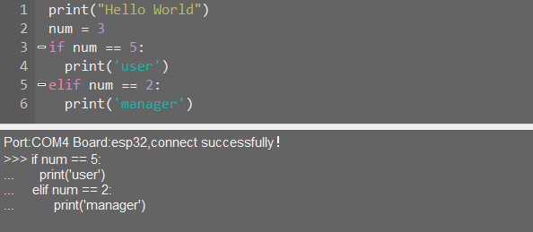

⑥ To exit the edit mode, press **Ctrl+C**. Additionally, if there is a dead loop, press **Ctrl+C** to exit..

> [!NOTE]
>
>* **In the terminal, the shortcut “Ctrl+C” is only used to interrupt a running program. It does not perform the copy function, and “Ctrl+V” does not paste.**
>* **When entering commands in the terminal, use the “Tab" key for code completion. For example, after typing “os” in the terminal and pressing “Tab”, the behavior is as follows:**
>  **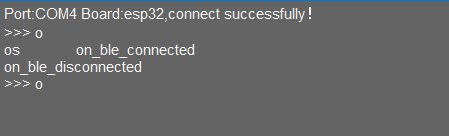**
>   **If there are two or more possible completions, the terminal will list all options. If there is only one possible completion, the terminal will complete it automatically. If there are no matches, nothing happens.**
>* **Use the Up (↑) and Down (↓) arrow keys in the terminal to browse through the command history, saving input time. For more commands and explanations, please visit:<http://docs.micropython.org/en/latest/library/uos.html>.**


<p id = "anther2.2.4"></p>

### 3.8.5 ESP32 Core Board Firmware and Flashing Software

* **Device Connection**

Connect the ESP32 core board's Type-C port to the computer via a USB cable, as shown below.

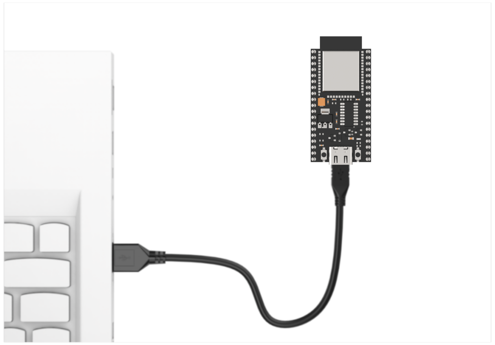


* **Operation Process**

1. Please open the **flash_download_tool_3.9.7.exe** file located in the "**Appendix\10 ESP32 Core Board Firmware and Flashing Software\02 ESP32 Firmware Flashing Tool**" folder.

   

2. Select **ESP32** as the Chip Type, leave the other settings as default, and then click **OK**.

   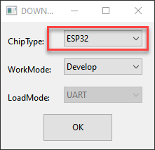

3. Once the tool is open, click **...** to select the program .bin file to be flash (path: [“03 ESP32 Development Board Firmware](https://drive.google.com/drive/u/1/folders/1qYzSJhRTjWf82o9QBftaQhm5H0cW--TR)).

   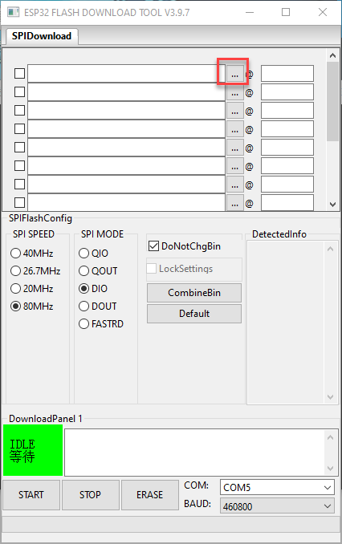

   

4. On the left side, check the box, and configure the remaining settings as shown in the diagram. Select the COM port number corresponding to the module's assigned port.

> [!NOTE]
> **Setting the SPI MODE to DIO as shown in the diagram may cause the module to malfunction after flashing. Please try setting the SPI MODE to DOUT and flash the firmware again.**

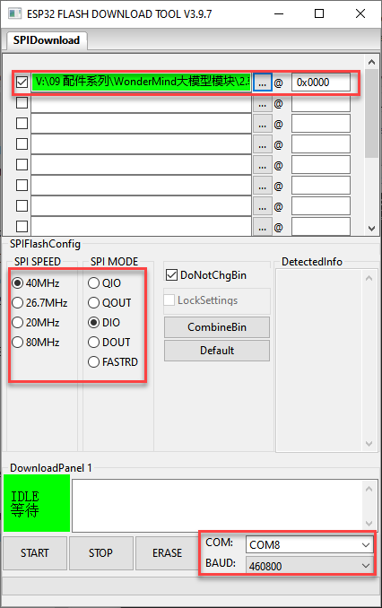

5. First, click **ERASE** to erase the previously downloaded firmware. This step is necessary! Then wait for the status bar to display **FINISH**.

   

   

6. Click **START** to download the newly selected firmware. Wait for the progress bar to complete, and the firmware download will be finished.


7. After the download is complete, unplug and reconnect the data cable. Once the device powers on again, it will start operating according to the new firmware program.


## 3.9 Communication with STM32 Controller

### **3.9.1 Face Recognition Example**

This section demonstrates how the WonderLLM module detects faces and then sends the data to the STM32 controller via the I2C protocol.

* **Implementation Flowchart**


* **Sensor Wiring**

When wiring, the 5V, GND, SCL, and SDA pins of the WonderLLM module need to be connected to the STM32 development board. Using Hiwonder Ros Robot Controller v1.2 as an example. The wiring diagram is shown below:


> [!NOTE]
>
>**Before powering on, ensure that no metal objects are touching the controller. Otherwise, the exposed pins at the bottom of the board may cause a short circuit and damage the controller.**


* **Program Download**

1. **STM32 Program Download**

(1) Connect the Type-C cable to the Type-C port on the STM32 controller. Make sure to use the UART1 port as shown in the figure below and plug the other end into the USB port of the computer.

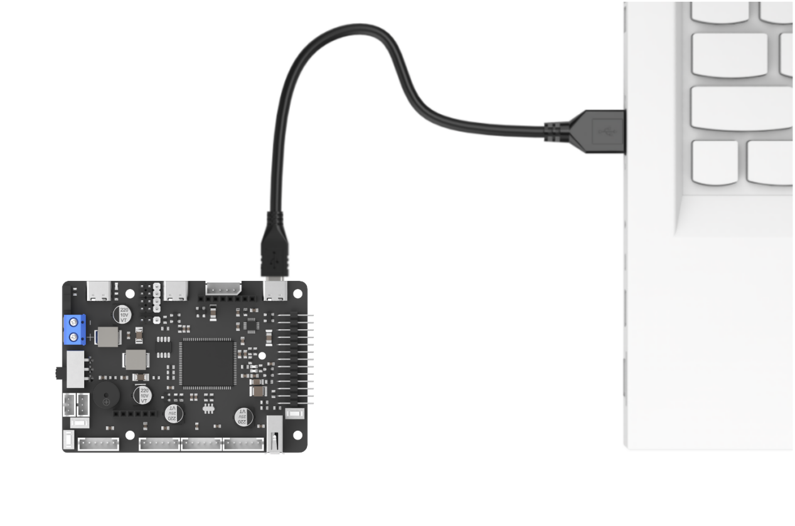

(2) Open the Device Manager on the computer and check the COM port number under the “Ports” section.

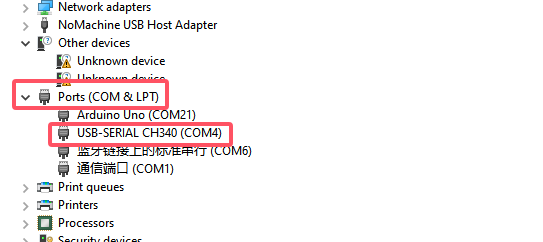

(3) Launch the **ATK-XISP** software, select the corresponding COM port, and set the baud rate to 115200.

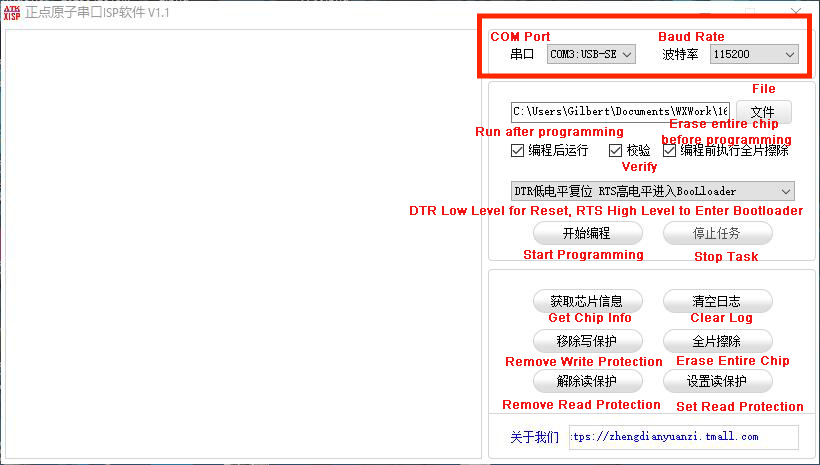

(4) Configure the software as shown in the image below.

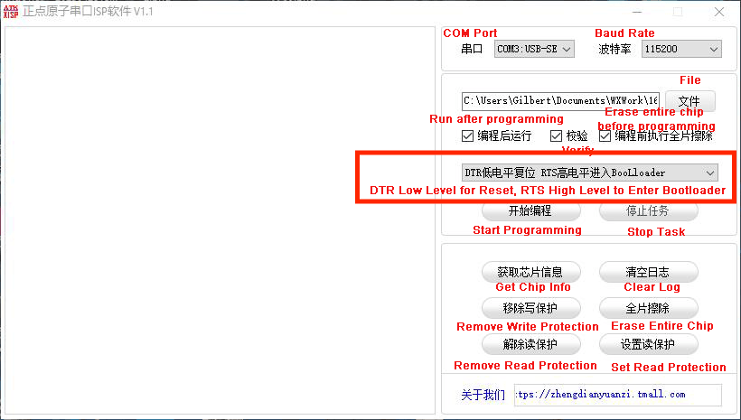

(5) Click the **File** button on the software interface, select the file "**Appendix\06 STM32 Program Files\01 STM32 Controller Face Recognition Example\RosRobotControllerM4-armclang\MDK-ARM\RosRobotControllerM4\RosRobotControllerM4.hex**" for programming.

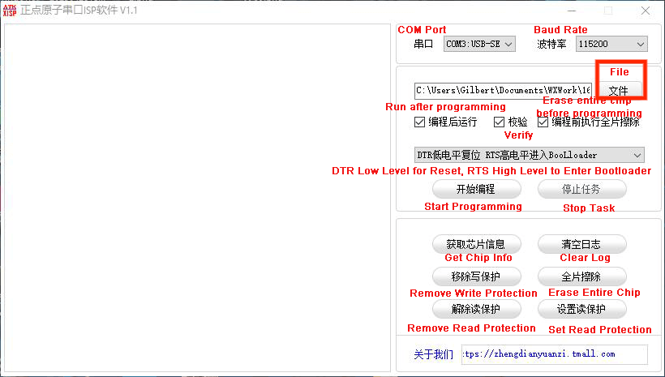

(6) Click the **Start** button on the page to flash the generated hex file onto the STM32 main control board. Wait for the flashing process to complete successfully.


2. **WonderLLM Face Recognition Program Download**

(1) Connect one end of the Type-C cable to the module and the other end to the computer’s USB port.


(2) Open the **“Appendix\03 WonderLLM Program\ FaceDetection\ FaceDetection.ino”** file located in the same directory as this)


(3) Choose the development board **ESP32S3 Dev Module**.


(4) In the menu bar, click **Tools**, and choose the corresponding ESP32S3 controller configuration as illustrated.


(5) Click  to download the program to the WonderLLM and wait for the download to complete.


* **Project Outcome**

When WonderLLM detects a face, the controller will print **find face** on serial port 3, with a baud rate of 115200.


* **Program Brief Analysis**

> [!NOTE]
>
>**The WonderLLM module STM32 example runs on the FreeRTOS system, with the app_task task provided to execute custom logic. The main.c file is only used for initializing system peripherals and starting the RTOS system. The logic related to the WonderLLM module is placed in the app_task callback function app_task_entry (located in app.c).**

1. **Define the address of WonderLLM**

`device_addr` is the device address, and `face_data_reg_addr` is the register address. The register will return 4 elements.

```c
#define device_addr 0x52  // (Device address) Communication address of ESP32-Cam

// When ESP32-Cam is in face recognition mode:
#define face_data_reg_addr   0x01  // (Starting address of face recognition register)
/* The elements in the register are arranged as follows:
		 data[0] : center_x
		 data[1] : center_y
		 data[2] : detection_width
		 data[3] : detection_length
*/
```

2. **Initial I2C**

```c
void MX_I2C2_Init(void)
{

  /* USER CODE BEGIN I2C2_Init 0 */

  /* USER CODE END I2C2_Init 0 */

  /* USER CODE BEGIN I2C2_Init 1 */

  /* USER CODE END I2C2_Init 1 */
  hi2c2.Instance = I2C2;
  hi2c2.Init.ClockSpeed = 100000;
  hi2c2.Init.DutyCycle = I2C_DUTYCYCLE_16_9;
  hi2c2.Init.OwnAddress1 = 0;
  hi2c2.Init.AddressingMode = I2C_ADDRESSINGMODE_7BIT;
  hi2c2.Init.DualAddressMode = I2C_DUALADDRESS_DISABLE;
  hi2c2.Init.OwnAddress2 = 0;
  hi2c2.Init.GeneralCallMode = I2C_GENERALCALL_DISABLE;
  hi2c2.Init.NoStretchMode = I2C_NOSTRETCH_DISABLE;
  if (HAL_I2C_Init(&hi2c2) != HAL_OK)
  {
    Error_Handler();
  }
  /* USER CODE BEGIN I2C2_Init 2 */

  /* USER CODE END I2C2_Init 2 */

}
```

3. **Loop to Call Sub-functions**

If a face is detected, print **find face** on serial port 3 and clear the data.

```c
/*
Function: Retrieve the module's face recognition data and print it to the serial port
Parameters: None
Note: 1. Ensure the module has the corresponding face recognition firmware programmed, or the module will not have valid data to read.
      2. Before calling this function, make sure MX_I2C2_Init() has been called to complete hardware initialization.
*/
void esp32cam_face_data_get(){
	HAL_I2C_Mem_Read(&hi2c2, device_addr << 1 , face_data_reg_addr, I2C_MEMADD_SIZE_8BIT, cam1.face_detection ,4*sizeof(uint8_t), 0xFFFF);
	/* In the 8-bit I2C address, the highest 7 bits represent the device address, and the lowest bit is the read/write indicator (1 for read, 0 for write). 
This is why the device address is shifted left by one bit using device_addr << 1. 
The specific read/write bit handling is implemented internally by HAL_I2C_Mem_Read and HAL_I2C_Mem_Write.
*/
	if(cam1.face_detection[0] != 0 && cam1.face_detection[1] != 0 && cam1.face_detection[2] != 0  && cam1.face_detection[3] != 0){
		const char *msg = "find face\n";
		HAL_UART_Transmit_DMA(&huart3, (uint8_t*)msg, strlen(msg));  /* Trigger DMA transmission */
	}
}
```


### 3.9.2 Face Recognition Example

This section demonstrates how the WonderLLM module detects colors and then sends the data to the STM32 controller via the I2C protocol.

* **Implementation Flowchart**


* **Sensor Wiring**

When wiring, the 5V, GND, SCL, and SDA pins of the WonderLLM module need to be connected to the STM32 development board. Using Hiwonder Ros Robot Controller v1.2 as an example. The wiring diagram is shown below:


* **Program Download**

1. **STM32 Program Download**

(1) Connect the Type-C cable to the Type-C port on the STM32 controller. Make sure to use the UART1 port as shown in the figure below and plug the other end into the USB port of the computer.


(2) Open the Device Manager on the computer and check the COM port number under the “Ports” section.


(3) Launch the **ATK-XISP** software, select the corresponding COM port, and set the baud rate to 115200.


(4) Configure the software as shown in the image below.


(5) Click the **File** button on the software interface, select the file "**Appendix\06 STM32 Program Files\02 STM32 Controller Color Recognition Example\RosRobotControllerM4-armclang\MDK-ARM\RosRobotControllerM4\RosRobotControllerM4.hex**" for programming.


(6) Click the **Start** button on the page to flash the generated hex file onto the STM32 main control board. Wait for the flashing process to complete successfully.


2. **WonderLLM Color Recognition Program Download**

(1) Connect the WonderLLM to the computer using a Type-C cable via the Type-C interface on the top of the module.


(2) Open the program **“Appendix\03 WonderLLM Program\ColorDetection\ColorDetection.ino”**.


(3) Select the development board **ESP32S3 Dev Module**.


(4) In the menu bar, click **Tools**, and choose the corresponding ESP32S3 controller configuration as illustrated.


(5) Click  to download the program to the WonderLLM and wait for the download to complete.


* #### Project Outcome

1. When WonderLLM detects red, the controller will print **COLOR_1** in the serial monitor.

   

2. When WonderLLM detects green, the controller prints **COLOR_2** in the serial monitor.

   

   

* ### Program Brief Analysis

> [!NOTE]
>
>**The WonderLLM module STM32 example runs on the FreeRTOS system, with the app_task task provided to execute custom logic. The main.c file is only used for initializing system peripherals and starting the RTOS system. The logic related to the WonderLLM module is placed in the app_task callback function app_task_entry (located in app.c).**

1. **Define the address of WonderLLM**

(1) `device_addr` is the device address, and `color_data_reg_addr` is the register address. The register will return 4 elements ID.

```c
#define device_addr 0x52  // (Device address) Communication address of ESP32-Cam

// When ESP32-Cam is in color recognition mode:
#define color_data_reg_addr 0x00    // (Starting address of the color register, from 0x00 to 0x04. Color order: red, yellow, green, blue, purple. 0x04 displays all recognized color IDs)
/* The information arrangement of the first 4 elements is as follows:                        
	   data[0] : center_x												  
		 data[1] : center_y                    
		 data[2] : width                        
		 data[3] : length                       
```

2. **Initial I2C**

```c
void MX_I2C2_Init(void)
{

  /* USER CODE BEGIN I2C2_Init 0 */

  /* USER CODE END I2C2_Init 0 */

  /* USER CODE BEGIN I2C2_Init 1 */

  /* USER CODE END I2C2_Init 1 */
  hi2c2.Instance = I2C2;
  hi2c2.Init.ClockSpeed = 100000;
  hi2c2.Init.DutyCycle = I2C_DUTYCYCLE_16_9;
  hi2c2.Init.OwnAddress1 = 0;
  hi2c2.Init.AddressingMode = I2C_ADDRESSINGMODE_7BIT;
  hi2c2.Init.DualAddressMode = I2C_DUALADDRESS_DISABLE;
  hi2c2.Init.OwnAddress2 = 0;
  hi2c2.Init.GeneralCallMode = I2C_GENERALCALL_DISABLE;
  hi2c2.Init.NoStretchMode = I2C_NOSTRETCH_DISABLE;
  if (HAL_I2C_Init(&hi2c2) != HAL_OK)
  {
    Error_Handler();
  }
  /* USER CODE BEGIN I2C2_Init 2 */

  /* USER CODE END I2C2_Init 2 */

}
```

3. **Loop to Call Sub-functions**

Read the register address storing all colors. If the returned values are all 0, it indicates that no color was detected. If any returned value is non-zero, it indicates that the corresponding color was detected, and the corresponding string will be printed.

```c
/*
Function: Retrieve the module's color recognition data and print it to the serial port
Parameters: None
Note: 1. Ensure the module has the corresponding color recognition firmware programmed, or the module will not have valid data to read.
      2. Before calling this function, make sure MX_I2C2_Init() has been called to complete hardware initialization.
*/
void esp32cam_color_data_get(uint8_t reg){
	HAL_I2C_Mem_Read(&hi2c2, device_addr << 1, reg, I2C_MEMADD_SIZE_8BIT, cam1.color_detection, 4*sizeof(uint8_t), 0xFFFF);
	if(reg == 0x04){
		if(cam1.color_detection[0] != 0){
			const char *msg = "COLOR 1\n";
			HAL_UART_Transmit_DMA(&huart3, (uint8_t*)msg, strlen(msg));  /* Trigger DMA transmission */
		}
		if(cam1.color_detection[1] != 0){
			const char *msg = "COLOR 2\n";
			HAL_UART_Transmit_DMA(&huart3, (uint8_t*)msg, strlen(msg));  /* Trigger DMA transmission */
		}
		if(cam1.color_detection[2] != 0){
			const char *msg = "COLOR 3\n";
			HAL_UART_Transmit_DMA(&huart3, (uint8_t*)msg, strlen(msg));  /* Trigger DMA transmission */
		}
		if(cam1.color_detection[3] != 0){
			const char *msg = "COLOR 4\n";
			HAL_UART_Transmit_DMA(&huart3, (uint8_t*)msg, strlen(msg));  /* Trigger DMA transmission */
		}
	}else{
		HAL_UART_Transmit_DMA(&huart3, cam1.color_detection, 4);  /* Trigger DMA transmission */
	}
	
}
```


### 3.9.3 Line-Following Recognition Example

This section demonstrates how to use WonderLLM to recognize specified color lines and send the data to the STM32 controller via the I2C protocol.

* **Implementation Flowchart**


* **Sensor Wiring**

When wiring, the 5V, GND, SCL, and SDA pins of the WonderLLM module need to be connected to the STM32 development board. Using Hiwonder Ros Robot Controller v1.2 as an example. The wiring diagram is shown below:


* **Program Download**

1. **STM32 Program Download**

(1) Connect the Type-C cable to the Type-C port on the STM32 controller. Make sure to use the UART1 port as shown in the figure below and plug the other end into the USB port of the computer.


(2) Open the Device Manager on the computer and check the COM port number under the “Ports” section.


(3) Launch the **ATK-XISP** software, select the corresponding COM port, and set the baud rate to 115200.


(4) Configure the software as shown in the image below.


(5) Click the **File** button on the software interface, select the file "**Appendix\06 STM32 Program Files\03 STM32 Controller Line-following Recognition Example\RosRobotControllerM4-armclang\MDK-ARM\RosRobotControllerM4\RosRobotControllerM4.hex**" for programming.


(6) Click the **Start** button on the page to flash the generated hex file onto the STM32 main control board. Wait for the flashing process to complete successfully.


2. **WonderLLM Line-following Recognition Program Download**

(1) Connect the WonderLLM to the computer using a Type-C cable via the Type-C interface on the top of the module.


(2) Open the program **“Appendix\03 WonderLLM Program\LineTracking\LineTracking.ino”**.


(3) Select the development board **ESP32S3 Dev Module**.


(4) In the menu bar, click **Tools**, and choose the corresponding ESP32S3 controller configuration as illustrated.


(5) Click  to download the program to the WonderLLM and wait for the download to complete.


* #### Project Outcome

1. When WonderLLM detects red, controller will print **COLOR_1** in the serial monitor.

   

2. When WonderLLM detects green, controller prints **COLOR_2** in the serial monitor.

   

   

* ### Program Brief Analysis

> [!NOTE]
>
>**The WonderLLM module STM32 example runs on the FreeRTOS system, with the app_task task provided to execute custom logic. The main.c file is only used for initializing system peripherals and starting the RTOS system. The logic related to the WonderLLM module is placed in the app_task callback function app_task_entry (located in app.c).**

1. **Define the address of WonderLLM**

(1) `device_addr` is the device address, and `color_data_reg_addr` is the register address. The register will return 4 elements ID.

```c
# define device_addr 0x52  // (Device address) Communication address of ESP32-Cam

// When ESP32-Cam is in color recognition mode:
#define color_data_reg_addr 0x00    // (Starting address of the color register, from 0x00 to 0x04. Color order: red, green, blue, purple. 0x04 displays all recognized color IDs)
/* The information arrangement of the first 4 elements is as follows:         The information arrangement in the last element is as follows:                
	   data[0] : center_x												  data[0] : Red ID	
		 data[1] : center_y                         data[1] : Green ID
		 data[2] : width                            data[2] : Blue ID
		 data[3] : length                           data[3] : Purple ID
```

2. **Initial I2C**

```c
void MX_I2C2_Init(void)
{

  /* USER CODE BEGIN I2C2_Init 0 */

  /* USER CODE END I2C2_Init 0 */

  /* USER CODE BEGIN I2C2_Init 1 */

  /* USER CODE END I2C2_Init 1 */
  hi2c2.Instance = I2C2;
  hi2c2.Init.ClockSpeed = 100000;
  hi2c2.Init.DutyCycle = I2C_DUTYCYCLE_16_9;
  hi2c2.Init.OwnAddress1 = 0;
  hi2c2.Init.AddressingMode = I2C_ADDRESSINGMODE_7BIT;
  hi2c2.Init.DualAddressMode = I2C_DUALADDRESS_DISABLE;
  hi2c2.Init.OwnAddress2 = 0;
  hi2c2.Init.GeneralCallMode = I2C_GENERALCALL_DISABLE;
  hi2c2.Init.NoStretchMode = I2C_NOSTRETCH_DISABLE;
  if (HAL_I2C_Init(&hi2c2) != HAL_OK)
  {
    Error_Handler();
  }
  /* USER CODE BEGIN I2C2_Init 2 */

  /* USER CODE END I2C2_Init 2 */

}
```

3. **Loop to Call Sub-functions**

Read the register address storing all colors. If the returned values are all 0, it indicates that no color was detected. If any returned value is non-zero, it indicates that the corresponding color was detected, and the corresponding string will be printed.

```c
/*
Function: Retrieve the module's color recognition data and print it to the serial port
Parameters: None
Note: 1. Ensure the module has the corresponding color recognition firmware programmed, or the module will not have valid data to read.
      2. Before calling this function, make sure MX_I2C2_Init() has been called to complete hardware initialization.
*/
void esp32cam_color_data_get(uint8_t reg){
	HAL_I2C_Mem_Read(&hi2c2, device_addr << 1, reg, I2C_MEMADD_SIZE_8BIT, cam1.color_detection, 4*sizeof(uint8_t), 0xFFFF);
	if(reg == 0x04){
		if(cam1.color_detection[0] != 0){
			const char *msg = "COLOR 1\n";
			HAL_UART_Transmit_DMA(&huart3, (uint8_t*)msg, strlen(msg));  /* Trigger DMA transmission */
		}
		if(cam1.color_detection[1] != 0){
			const char *msg = "COLOR 2\n";
			HAL_UART_Transmit_DMA(&huart3, (uint8_t*)msg, strlen(msg));  /* Trigger DMA transmission */
		}
		if(cam1.color_detection[2] != 0){
			const char *msg = "COLOR 3\n";
			HAL_UART_Transmit_DMA(&huart3, (uint8_t*)msg, strlen(msg));  /* Trigger DMA transmission */
		}
		if(cam1.color_detection[3] != 0){
			const char *msg = "COLOR 4\n";
			HAL_UART_Transmit_DMA(&huart3, (uint8_t*)msg, strlen(msg));  /* Trigger DMA transmission */
		}
	}else{
		HAL_UART_Transmit_DMA(&huart3, cam1.color_detection, 4);  /* Trigger DMA transmission */
	}
	
}
```


## 3.10 Communication with Raspberry Pi Controller

### 3.10.1 Face Recognition Example

This section demonstrates how the WonderLLM module detects faces and then sends the data to the Raspberry Pi controller via the I2C protocol.

* **Implementation Flowchart**


* **Sensor Wiring**

The connection between the WonderLLM module and the Raspberry Pi main control board is as shown below:


* #### Program Download

1. **Importing and Running the Program**

(1) First, power on the Raspberry Pi and connect to it from the PC using VNC or other methods.

(2) Upload the example file from "**Appendix\07 Raspberry Pi Program Files\01 Raspberry Pi Face Recognition Example**" in the same directory as this document to any path on the Raspberry Pi using SSH or other methods.


(3) In the menu bar, click: **"TOOLS" -- "Open Current Folder in Terminal"** to open the command line in the current directory.


(4) Enter the following command in the command line to run the program:

```bash
python main.py
```

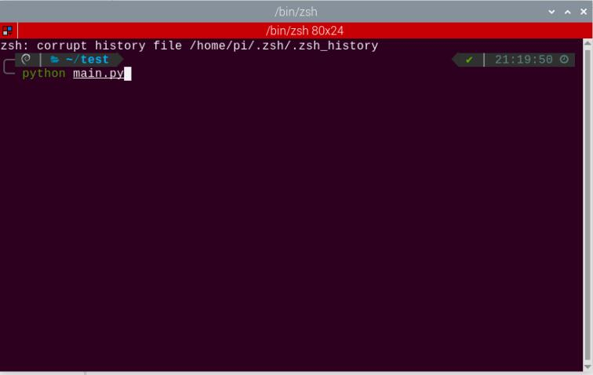


2. **WonderLLM Face Recognition Program Download**

(1) Connect one end of the Type-C cable to the module and the other end to the computer’s USB port.


(2) Open the **“Appendix\03 WonderLLM Program\ FaceDetection\ FaceDetection.ino”** file located in the same directory as this)


(3) Choose the development board **ESP32S3 Dev Module**.


(4) In the menu bar, click **Tools**, and choose the corresponding ESP32S3 controller configuration as illustrated.


(5) Click  to download the program to the WonderLLM and wait for the download to complete.


* **Project Outcome**

When WonderLLM detects a face, it will print **find face** in the serial port.


* **Program Brief Analysis**

1. **Define the address of WonderLLM**

`device_addr` is the device address, and `face_data_reg_addr` is the register address. The register will return 4 elements.

```python
ESP32CAM_ADDR = 0x52

# When ESP32-Cam is in face recognition mode:
'''
     data[0] : center_x
		 data[1] : center_y
		 data[2] : detection_width
		 data[3] : detection_length
'''
face_data_reg_addr = 0x01  # Starting address of face recognition register
```

2. **Initial I2C**

```python
bus = smbus.SMBus(I2C_BUS)
```

3. **Loop to Call Sub-functions**

If a face is detected, print **find face**.

```python
if __name__ == "__main__":
  while True:
    # Get face data
    result = faceDetect()
    if (result == true):
	  print("find face")
	  
    time.sleep(2)
```


### **3.10.2 Color Recognition Example**

This section demonstrates how the WonderLLM module detects colors and then sends the data to the Raspberry Pi controller via the I2C protocol.

* **Implementation Flowchart**


* **Sensor Wiring**

The connection between the WonderLLM module and the Raspberry Pi main control board is as shown below:


* #### Program Download

1. **Importing and Running the Program**

(1) First, power on the Raspberry Pi and connect to it from the PC using VNC or other methods.

(2) Upload the example file from "**Appendix\07 Raspberry Pi Program Files\02 Raspberry Pi Color Recognition Example**" in the same directory as this document to any path on the Raspberry Pi using SSH or other methods.


(3) In the menu bar, click: **"TOOLS" -- "Open Current Folder in Terminal"** to open the command line in the current directory.


(4) Enter the following command in the command line to run the program:

```bash
python main.py
```


2. **WonderLLM Color Recognition Program Download**

(1) Connect one end of the Type-C cable to the module and the other end to the computer’s USB port.


(2) Open the “**Appendix\ 03 WonderLLM Program\ColorDetection\ ColorDetection.ino**” located in the same directory as this document.


(3) Choose the development board **ESP32S3 Dev Module**.


(4) In the menu bar, click **Tools**, and choose the corresponding ESP32S3 controller configuration as illustrated.


(5) Click  to download the program to the WonderLLM and wait for the download to complete.


* **Project Outcome**

1. When WonderLLM detects red, it will print **COLOR_1** in the serial monitor.

   

2. When WonderLLM detects green, print **COLOR_2** in the serial monitor.

   


* **Program Brief Analysis**

1. **Define the address of WonderLLM**

`device_addr` is the device address, and `Color0_Detect_Reg` is the starting address of the color recognition register. The register will return 4 elements ID.

```python
ESP32CAM_ADDR = 0x52

# When ESP32-Cam is in color recognition mode:
# Starting address of the color register, from 0x00 to 0x04. Color order: red, yellow, green, blue, purple
'''
    The information arrangement of the first 4 elements is as follows:            
	  data[0] : center_x												  
		data[1] : center_y                       
		data[2] : width                            
		data[3] : length                          
'''
Color_num = 5

Color0_Detect_Reg = 0x00   # ID 0 corresponds to the default color red
Color1_Detect_Reg = 0x01   # ID 1 corresponds to the default color yellow
Color2_Detect_Reg = 0x02   # ID 2 corresponds to the default color green
Color3_Detect_Reg = 0x03   # ID 3 corresponds to the default color blue
Color4_Detect_Reg = 0x04   # ID 4 corresponds to the default color purple
```

2. **Initial I2C**

```python
bus = smbus.SMBus(I2C_BUS)
```

3. **Loop to Call Sub-functions**

Read the register address storing all colors. If the returned list `color_detect_result` contains all 0s, it indicates that no color was detected. If any element in the list contains the ID of the corresponding color, it means that the color was detected, and the corresponding string will be printed. In this example, only the recognition results for red and green colors are processed.

```python
if __name__ == "__main__":

	COLOR_red = 0
	COLOR_green = 2
	
	color_detect_result = [0] * 5

  while True:
    # Obtain Color Recognition Results
    colorDetect(color_detect_result)
    if (color_detect_result[COLOR_red] == COLOR_red):
        print("COLOR 1")
    if (color_detect_result[COLOR_green] == COLOR_green):
        print("COLOR 2")
    
    time.sleep(2)
```


### **3.10.3 Line-Following Recognition Example**

This section demonstrates how to use WonderLLM to recognize specified color lines and send the data to the Raspberry Pi controller via the I2C protocol.

* **Implementation Flowchart**


* **Sensor Wiring**

The connection between the WonderLLM module and the Raspberry Pi main control board is as shown below:


* #### Program Download

1. **Importing and Running the Program**

(1) First, power on the Raspberry Pi and connect to it from the PC using VNC or other methods.

(2) Upload the example file from "**Appendix\07 Raspberry Pi Program Files\03 Raspberry Pi Line-following Recognition Example**" in the same directory as this document to any path on the Raspberry Pi using SSH or other methods.


(3) In the menu bar, click: **"TOOLS" -- "Open Current Folder in Terminal"** to open the command line in the current directory.


(4) Enter the following command in the command line to run the program:

```bash
python main.py
```


2. **WonderLLM Line-following Recognition Program Download**

(1) Connect the WonderLLM to the computer using a Type-C cable via the Type-C interface on the top of the module.


(2) Open the program **“Appendix\03 WonderLLM Program\LineTracking\LineTracking.ino”**.


(3) Select the development board **ESP32S3 Dev Module**.


(4) In the menu bar, click **Tools**, and choose the corresponding ESP32S3 controller configuration as illustrated.


(5) Click  to download the program to the WonderLLM and wait for the download to complete.


* #### **Project Outcome**

When WonderLLM detects a red line, it will print the recognition box parameters for the upper and middle sections of the image to the serial monitor. If not detected, the parameters will be all zeros.

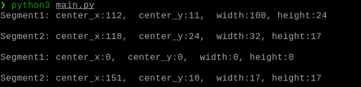


* ### Program Brief Analysis

1. **Define the address of WonderLLM**

`device_addr` is the device address, and `Color0_segment1_Detect_Reg` is the starting address of the line-following recognition register. The register will return 4 elements ID.

```python
ESP32CAM_ADDR = 0x52

# When ESP32-Cam is in line-following recognition mode:
# The starting address of the visual line-following register is from 0x00 to 0xA7. The color order is: red, green, blue, purple. A0 and A1 correspond to the upper and lower parts of the red color, respectively, and so on.
'''
     data[0]:center_x                  
     data[1]:center_y           
     data[2]:detection_width           
     data[3]:detection_length                        
'''
Color_line_num = 4

Color0_segment1_Detect_Reg = 0xA0   # ID 0 corresponds to the default color red
Color0_segment2_Detect_Reg = 0xA1   # ID 0 corresponds to the default color red

Color1_segment1_Detect_Reg = 0xA2   # ID 1 corresponds to the default color green
Color1_segment2_Detect_Reg = 0xA3   # ID 1 corresponds to the default color green

Color2_segment1_Detect_Reg = 0xA4   # ID 2 corresponds to the default color blue
Color2_segment2_Detect_Reg = 0xA5   # ID 2 corresponds to the default color blue

Color3_segment1_Detect_Reg = 0xA6   # ID 3 corresponds to the default color purple
Color3_segment2_Detect_Reg = 0xA7   # ID 3 corresponds to the default color purple
```

(2) Define the preset ID for red in the line-following recognition function, and store the parameters of two recognition boxes for one color segment in the list `line_detect_result`.

```python
if __name__ == "__main__":
  COLOR_red = 0
  line_detect_result = [0] * 8
```

2. **Initial I2C**

```python
bus = smbus.SMBus(I2C_BUS)
```

3. **Loop to Call Sub-functions**

Call the `line_position` function to read the parameters of the two line-following recognition boxes for the red segment and print them on the screen.

```python
  while True:

    line_position(COLOR_red,line_detect_result)
    print(f"Segment1: center_x:{line_detect_result[0]},  center_y:{line_detect_result[1]},  width:{line_detect_result[2]}, height:{line_detect_result[3]}\r\n")
    print(f"Segment2: center_x:{line_detect_result[4]},  center_y:{line_detect_result[5]},  width:{line_detect_result[6]}, height:{line_detect_result[7]}\r\n")
    
    time.sleep(2)
```


