# 4.离线语音功能

## 4.1 功能概述

### 4.1.1 常见概念说明

>[!note]
>
>* **为便于加深理解，建议用户结合“附录/05 命令词播报词协议列表”下的“命令词播报词协议列表”文件进行学习。**
>* **关于 ”命令词播报词协议列表“ 的详细说明，请见[4.10 命令词播报语ID解析](#4.10)。 **

1. 在WonderLLM的离线语音功能中，可对三类词条进行处理：**(1)功能性词条  (2)命令词类型词条  (3)播报语类型词条**。

2. **“功能性词条”**和**“命令词类型词条”**可被模块语音识别的功能(即用户说出该词条，模块能够自行识别)。**“功能性词条”**被模块识别后，执行对应底层功能(如调节模块播报音量)；**“命令词类型词条”**被模块识别后，识别结果可被外部主控读取进行自定义操作。

3. **“播报语类型词条”**不具备被模块语音识别的功能，仅用于被外部主控发送指令触发该类下的某一个词条，模块收到指令后播报词条对应的回复语句。

4. 所有词条都可选择 **“播报类型”** ，分为：**(1)主动播报  (2)被动播报**。

>[!note]
>
>* **若选择主动播报，则该词条由用户说出后，被模块识别到后，自行播报对应回复语句；若选择被动播报，该词条对应的回复语句只能由外部主控发送指令触发播报。**
>* **播报语类型词条不支持被模块语音识别，仅可选择“被动播报”。**
>* **支持“主动播报”的词条默认也支持“被动播报”，反过来则不行。**

5. 功能性词条具体包括：**(1)欢迎语  (2)休息语  (3)唤醒词  (4)增大音量  (5)减小音量  (6)最大音量  (7)中等音量  (8)最小音量  (9)开播报  (10)关播报 ** 十种功能。

>[!note]
>
>* **以上10种功能词条依次对应 “命令词协议列表” 文件语义标签1-10的词条。**
>* **(!!重要)功能性词条只能用于调节模块工作，不支持查询该类词条的语音识别结果，但可以控制模块播报该类词条对应的播报语句。**
>* **“欢迎语”为模块上电后自动播报的词条，“休息语”为模块长时间未识别到有效词条，进入休眠模式自动播报的词条，在出厂固件种这两种词条默认为被动播报。**
>* **“唤醒词”用于激活模块，脱离休眠模式，开始主动识别 “功能性词条” 和 “命令词类型词条”**。
>* **如果用户下达“关播报”类型词条指令，则播报类型为“主动播报” 的词条在被模块识别到后，不再会自动播报对应回复语句；“开播报” 工作效果则相反。**

<p id ="4.1.2"></p>

### 4.1.2 通信结构与功能分工

1. WonderLLM模块内置CI1302语音芯片、ESP32S3主控，其中ESP32S3主控可单向接收来自CI1302的串口信息(即词条识别结果)。
2. 在离线语音功能中，二者分别负责实现一部分的语音交互功能，如下图：

>[!note]
>
>**用户在后续如有开发自定义词条的需求，可参考此图，了解需要改动的词条所属种类，以及该词条各功能实现时涉及的芯片，从而有计划的进行对应芯片的固件的制作。**


### 4.1.3 模块使用流程

>[!note]
>
>**在使用模块离线语音功能前，需参考[4.2 固件烧录教程](#4.2)分别为模块烧录CI1302固件、ESP32S3固件。**

* **功能性词条/命令词类型词条**

1. **语音识别工作流程**

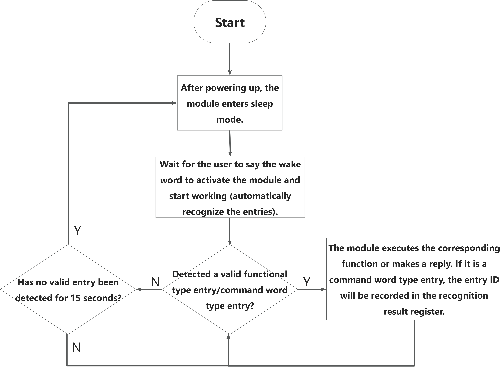


2. **外部主控通信流程**

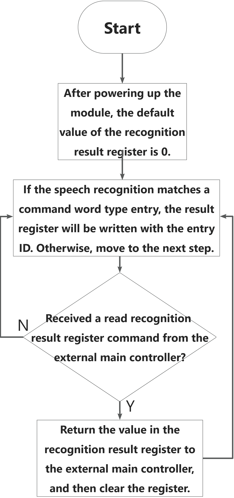


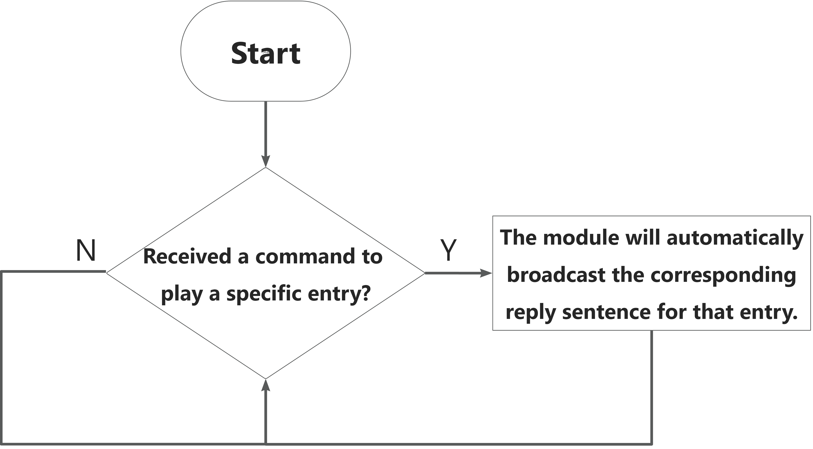


* **播报语类型词条**

1. **外部主控通信流程**


<p id ="4.2"></p>

## 4.2 固件烧录教程

>[!note]
>**本节以英文版的出厂固件为例，讲解如何分别将CI1302固件、ESP32S3固件烧录至WonderLLM模块，从而使模块运行离线语音功能。**

<p id ="4.2.1"></p>

### 4.2.1 CI1302固件烧录


1. 首先将 WonderLLM下方Type-C接口通过USB数据线连接至电脑。


2. 打开**“附录/01 CI1302固件烧录工具”**路径下的“**PACK_UPDATE_TOOL.exe**”文件，选择“**CI1302**”芯片，然后点击“**固件升级**”。

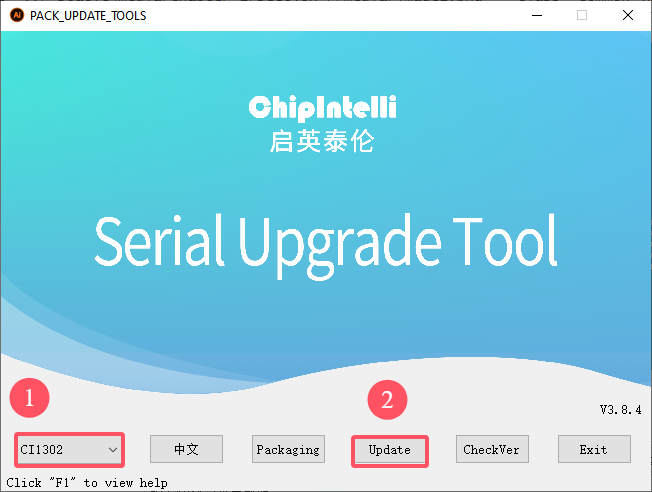

>[!note]
>**我们以烧录英文固件（唤醒词：hello hiwonder）为例，操作步骤也于中文唤醒词烧录。**

3. 点击“**选择固件**”，在**“附录/02 CI1302出厂固件/02 英文固件(唤醒词：hello-hiwonder)”**路径下找到英文版CI1302出厂固件。

   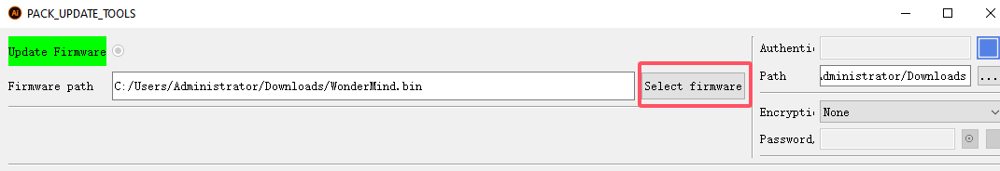

4. 找到相应的串口，并单击选择。

   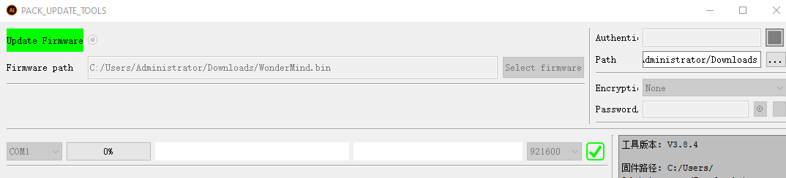

5. 接着**同时按下**WonderLLM模块左右两个按键，即可进入到烧录中，等待烧录成功即可。


* #### 唤醒测试

当烧录好固件之后，重启模块，等待模块完成网络配置，进入表情界面后，说出固件唤醒词，若模块蜂鸣器鸣响一声，并进入聊天界面，语音回复问好语句，则表示唤醒词修改成功。


### 4.2.2 ESP32S3固件烧录

* #### 设备连接

将WonderLLM大模型模块上方Type-C接口通过USB线接入电脑，如下图。


* #### 操作流程

1. 请打开**“附录/04  ESP32固件烧录工具/flash_download_tool_3.9.7”**路径里面的**flash_download_tool_3.9.7.exe**文件。

   

2. 选择Chip Type为**ESP32-S3**，其他保持默认，然后点击OK。

   

3. 工具打开后，点击**“...”**选择需要烧录的程序bin文件（存放路径：**“附录/03  ESP32S3固件/02 英文版本”**）。

   

   

4. 左侧需打勾，其余配置按照下图所示进行配置即可，COM端口号选择模块所占的端口号。

>[!note]
>**如果您按下图的配置，将SPI MODE设置为DIO，烧录固件后模块无法正常工作；请尝试将SPI MODE设置为DOUT并再次烧录。**


5. 先点击**"ERASE"**擦除之前下载的固件(一定要进行)，等待状态栏显示“**FINISH完成**”。

   

   

6. 再点击"**START**"下载刚刚选择的固件，等待进度条加载完成，即完成固件下载。


7. 下载完成后，重新拔插数据线，设备重新上电后，即根据固件程序开始工作。

<p id ="4.2"></p>

## 4.3 修改唤醒词

我司提供的CI1302出厂固件具有自学习功能，支持在原有固件的基础上自学习用户的自定义唤醒词，从而避免重新制作一份固件的麻烦。

>[!note]
>
>* **本小节讲解的 “修改唤醒词” ，并不是原创一个新的唤醒词，从工作原理上说，是在一个原有的唤醒词基础上为它取别名。**
>* **如果用户需要在制作固件时修改自定义唤醒词，可参考[4.8.1 CI1302固件制作](#4.8.1)。**

### 4.3.1 注意事项

1)  请在安静的场景下进行修改唤醒词，嘈杂的环境会影响WonderLLM模块的识别准确率。

2)  说词条时，声音要洪亮且语速不宜过快，建议与模块之间保持在5米以内。

### 4.3.2 设备连接

通过模块自带的2个Type-C口、4-Pin接口中任意一个为WonderLLM模块供电。

### 4.3.3 修改唤醒词实现

1. 对WonderLLM模块说出“**小幻小幻**”将WonderLLM模块唤醒，当模块回复“**我在**”时，表明当前处于可识别状态。

>[!note]
>**英文版本出厂固件的唤醒词为“hello hi wonder”，模块唤醒时回复“i'm here”**。

2. 再对WonderLLM模块说出“**学习唤醒词**”词条，WonderLLM模块回应“**说出唤醒词**”，即进入到唤醒词学习功能状态。

>[!note]
>**英文版本出厂固件为说出“study wake”词条，WonderLLM模块回应“please say command”，进入唤醒词学习功能状态**。

3. 接着对WonderLLM模块说出想要设置的唤醒词，唤醒词应尽量简短，这里以设置“**你好小幻**”为例。
>[!note]
>**英文版本出厂固件以“hiwonder”为例设置为模块唤醒词**。

4. 当WonderLLM模块识别成功后，将会播报“**学习成功**”，表明唤醒词修改成功且**支持掉电保存**，这时候我们就可以同时使用“**你好小幻**”、**“小幻小幻”**中任意一个词条来唤醒模块了。

>[!note]
>
>* **英文版本出厂固件识别成功，播报“learning succeed”，此时可以同时使用“hello hi wonder”、“hiwonder”中任意一个词条来唤醒模块**。
>* **出厂固件中的唤醒词“小幻小幻”是基础唤醒词 (英文版本出厂固件的唤醒词“hello hi wonder”是基础唤醒词) ，无法通过语音进行修改或删除。用户使用语音修改的唤醒词与基础唤醒词是共同存在的。**
>* **如果用户在学习一个自定义唤醒词后，又学习了一个新的自定义唤醒词，新的自定义唤醒词会覆盖旧的。**

<p id ="4.4"></p>

## 4.4 修改命令词

我司提供的CI1302出厂固件具有自学习功能，支持在原有固件的基础上自学习用户的自定义命令词，从而避免重新制作一份固件的麻烦。

>[!note]
>
>* **本小节讲解的 “修改命令词” ，并不是原创一个新的命令词，从工作原理上说，是在一个原有的命令词基础上为它取别名。**
>* **例如固件自带命令词 “前进” ，通过修改命令词操作，为命令词“前进”学习一个别名“向前”。学习成功后，用户对模块说出“向前”，模块会播报 “前进” 对应的回复语句，外部主控此时读取识别结果传感器，得到的是 “前进” 的识别结果。**
>* **不是每一个命令词都支持通过 “修改唤醒词” 功能学习别名，这一功能是在固件制作时确定的，出厂固件支持“修改唤醒词”功能的词条会在后文介绍。**
>* **关于如何在制作固件时指定支持 “修改唤醒词” 的词条，可参考[4.8.1 CI1302固件制作](#4.8.1)。**

### 4.4.1 注意事项

1)  请在安静的场景下进行修改命令词，嘈杂的环境会影响WonderLLM模块的识别准确率。

2)  说词条时，声音要洪亮且语速不宜过快，建议与模块之间保持在5米以内。

### 4.4.2 设备连接

通过模块自带的2个Type-C口、4-Pin接口中任意一个为WonderLLM模块供电。

### 4.4.3 修改命令词实现

1. WonderLLM模块中文出厂固件中预置15个可以语音修改的命令词，如下所示：

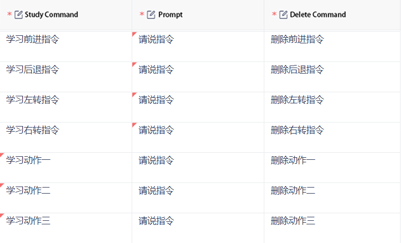


2. WonderLLM模块英文出厂固件中预置4个可以语音修改的命令词，如下所示：

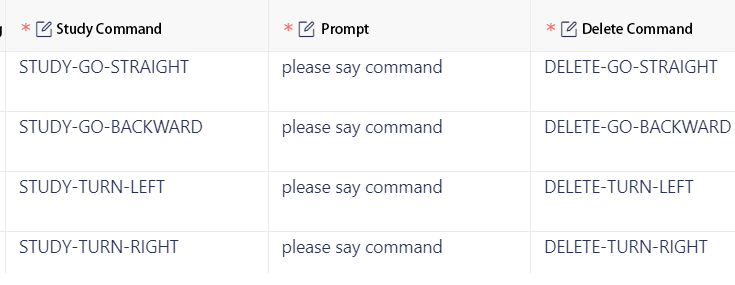

3. 用法举例如下：

(1) 对WonderLLM模块说出“**小幻小幻**”将WonderLLM模块唤醒，当模块回复“**我在**”时，表明当前处于可识别状态。
>[!note]
>**英文版本出厂固件的唤醒词为“hello hi wonder”，模块唤醒时回复“i'm here”**。

(2) 再对WonderLLM模块说出“**学习前进指令**”词条，WonderLLM模块回应“**请说指令**”，即进入到命令词学习功能状态。
>[!note]
>**英文版本出厂固件可以说出”study go straight“指令，模块回应”please say command“，进入命令词学习功能状态。**

(3) 接着对WonderLLM模块说出想要设置的命令词，命令词应尽量简短，这里以设置“**向前走**”为例。
>[!note]
>**英文版本出厂固件以设置”go forward“为例。**

(4) 当WonderLLM模块识别成功后，将会播报“**学习成功**”，表明命令词修改成功，这时候我们就可以使用“**向前走**”词条就能达到与**“前进”**命令词一样的效果了。
>[!note]
>**英文版本出厂固件在识别成功后会播报”learnning succeed“，此时可以使用“go forward”词条就能达到与“go straight”命令词一样的效果。**

(5) 若需要删除掉**“向前走”**词条，只需要说出**“删除前进指令”**，当回复**“删除成功“**时，即完成词条删除（只会删除**“向前走”**，不会删除**“前进”**）。
>[!note]
>
>* **英文版本出厂固件若需删除”go forward“词条，说出”delete go straight“即完成词条删除(只会删除“go forward”，不会删除“go straight”)**
>* **出厂固件中的命令词是基础命令词（如上中文版本出厂固件的“前进”，英文版本出厂固件的”go straight“），无法通过语音进行修改或删除。用户使用语音修改的命令词只能同时存在一个，与基础命令词是共同存在的。**
>* **如果用户在为一个命令词通过”学习命令词“ 功能学习了一个别名，又再次为该命令词学习了一个别名，该命令词新的别名会覆盖旧的。**

<p id ="4.5"></p>

## 4.5 修改功能性词条

>[!note]
>**本小节以英文版本为例讲解，中文版本操作同步适用。**

### 4.5.1 CI1302固件修改适配

1. 在**“附录/05 命令词播报词协议列表/01 命令词协议列表/02 英文版本”**路径找到与出厂固件对应的**”命令词播报词协议列表“**，将其复制粘贴至其他路径备用，我们将在备份版本上进行后续改动。

>[!note]
>
>* **请不要直接在文件原件上直接进行改动，以免出现不可复原的错误。**

2. 找到表格中的功能性词条，也就是表格中的前10项。需要注意的是，这里的前10条功能性词条均为固定词条，无法新增，只能进行修改。

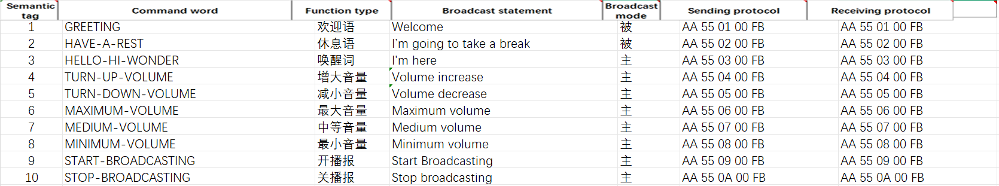

3. 这里我们以修改唤醒词为例，当用户说出**”hello robot”(你好机器人)**，模块被激活并自动播报回复语句**“nice to meet you”(很高兴见到你)**，如下图：


>[!note]
>
>* **英文版本的 “命令词播报语协议列表” 中，所有词条(含命令词、播报语、功能性词条)的 ”命令词“ 一列下的所有内容需要完全以大写字母书写，并使用连字符（-）将多个单词分隔开。**
>* **词条的 ”播报语句“ 一列没有以上要求，使用小写即可。**

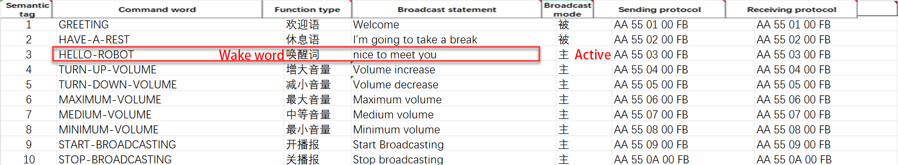

4. 将修改好的备份**”命令词播报词协议列表“**文件保存，后续参照[4.8.1 CI1302固件制作](#4.8.1)中的步骤，将表格导入到网站制作CI1302固件。如果已经制作过一次固件了，那么可以点击之前项目中的“**继承**”按键，这样可以省去参数配置的步骤。

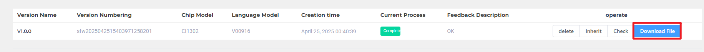

5. 重新制作固件后，参照 [4.2.1 CI1302固件烧录](#4.2.1) 将固件烧录到WonderLLM模块中。

>[!note]
>
>**烧录CI1302固件后，该词条的语音识别、主动播报功能修改成功。接下来开始制作ESP32S3固件，适配该新词条的被动播报功能。**

### 4.5.2 ESP32S3固件修改适配

1. 在**“附录/05 命令词播报词协议列表/02 播报语协议列表/02 英文版本”**路径找到与出厂固件对应的 **”播报词V3_英文模板_“**，将其复制粘贴至其他路径备用，我们将在备份版本上进行后续改动，随后将备份版本文件打开。

>[!note]
>
>* **请不要直接在文件原件上直接进行改动，以免出现不可复原的错误。**

2. 在该表格中，有**”序号“**、**”音频名“**、**”合成内容“**三列内容，分别与 **"附录/05 命令词播报词协议列表/01 命令词协议列表"** 路径下的”命令词播报词协议列表“ 文件的**”语义标签“** 、**”命令词“** 、**”播报语句“** 三列内容对应。

3. 在本表格中找到 **”序号“** 与 **”命令词播报词协议列表“** 中**唤醒词**的 **”语义标签“** 对应的一行，同步修改 **”音频名“** 、 **”合成内容“**。

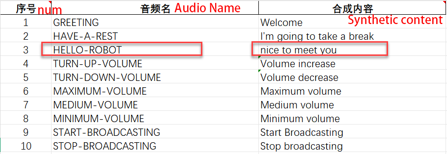

4. 将修改好的备份**”播报词V3_英文模板“**文件保存，后续参照 [4.8.2 ESP32S3固件制作](#4.8.2) 中的步骤，将表格导入到网站制作词条音频，后期用于外部主控以被动播报方式调用播放。

5. 重新制作固件后，参照 [4.2.2 ESP32S3固件烧录](#4.2.2) 将固件烧录到WonderLLM模块中。

>[!note]
>**烧录ESP32S3固件后，该词条的被动播报功能修改成功。**

<p id ="4.6"></p>

## 4.6 新增命令词条

>[!note]
>**本小节以英文版本为例讲解，中文版本操作同步适用。**

### 4.6.1 CI1302固件修改适配

1. 在**“附录/05 命令词播报词协议列表/01 命令词协议列表/02 英文版本”**路径找到与出厂固件对应的**”命令词播报词协议列表“**，将其复制粘贴至其他路径备用，我们将在备份版本上进行后续改动。

>[!note]
>
>* **请不要直接在文件原件上直接进行改动，以免出现不可复原的错误。**

2. 在表格中所有功能类型为命令词的词条的最后，新增一行表格，在其中填写自定义内容，例如当用户说出**“start patrol”（开始巡逻）**，模块被激活并自动播报回复语句**“OK,I will inspect the surrounding area.”(好的，我将巡视周边环境)**，如下图：

>[!note]
>
>* **英文版本的 “命令词播报语协议列表” 中，所有词条(含命令词、播报语、功能性词条)的 ”命令词“ 一列下的所有内容需要完全以大写字母书写，并使用连字符（-）将多个单词分隔开。**
>* **词条的 ”播报语句“ 一列没有以上要求，使用小写即可。**
>* **在“命令词播报语协议列表”文件中。每一个词条(包括功能性词条、命令词类型词条、播报语类型词条)具有唯一的语义标签，用户可任意为新词条设置语义标签，但是需要检查表格，确保没有与其他任何词条冲突。对于用户的最佳实践为将新词条语义标签设置为“前一个词条语义标签+1”即可。**
>* **新词条的功能类型选择“命令词”；播报模式可自由选择，默认选择“主”(主动播报)；**

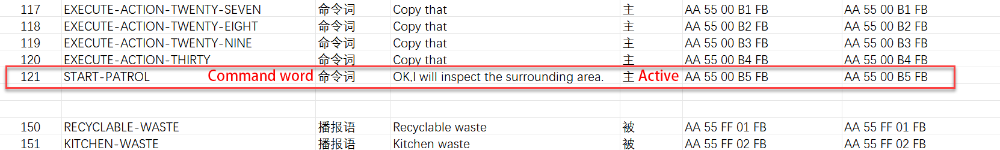

3. 之后填写新词条的发送协议和接收协议，同一个命令词的接收协议和发送协议一致，前2个字节填写固定帧头 **”AA 55“** ，第3字节填写命令词的类型值 **”00“** ，第4字节填写1字节新词条的ID**(推荐填写为 “前一个命令词ID+1”)**，第5字节填写固定帧尾 **”FB“** 。

>[!note]
>
>* **所有命令词类型词条的发送协议和接收协议除第4字节外，其他字节均一致。用户可以先复制其他命令词类型词条的发送协议和接受协议并粘贴至新词条一行。**
>* **命令词类型词条发送协议和接收协议的第4字节为每一个命令词自身的ID(取值：01--FF)，每一个命令词类型词条的ID必须保证唯一性，用户可任意为新词条设置ID，但是需要检查表格，确保没有与其他命令词冲突。**
>* **在我们提供的“命令词播报语协议列表” 文件中，命令词类型词条的ID由小到大，从上到下排布。对于用户的最佳实践为将新词条ID设置为“前一个命令词ID+1” 即可。**
>* **此外，表格中已有的命令词类型词条也支持修改，您只需修改已有词条的“命令词”和“播报语句”即可，这样更加高效且节省词条ID的分配。**

4. 将修改好的备份**”命令词播报词协议列表“**文件保存，后续参照“[4.8.1 CI1302固件制作](#4.8.1)”中的步骤，将表格导入到网站制作CI1302固件。如果已经制作过一次固件了，那么可以点击之前项目中的“**继承**”按键，这样可以省去参数配置的步骤。


5. 重新制作固件后，参照 [4.2.1 CI1302固件烧录](#4.2.1) 将固件烧录到WonderLLM模块中。

>[!note]
>**烧录CI1302固件后，该词条的语音识别、主动播报功能修改成功。接下来开始制作ESP32S3固件，适配该新词条的被动播报功能。**

### 4.6.2 ESP32S3固件修改适配

1. 在**“附录/05 命令词播报词协议列表/02 播报语协议列表/02 英文版本”**路径找到与出厂固件对应的 **”播报词V3_英文模板_“**，将其复制粘贴至其他路径备用，我们将在备份版本上进行后续改动，随后将备份版本文件打开。

>[!note]
>
>* **请不要直接在文件原件上直接进行改动，以免出现不可复原的错误。**

2. 在该表格中，有**”序号“**、**”音频名“**、**”合成内容“**三列内容，分别与 **"附录/05 命令词播报词协议列表/01 命令词协议列表"** 路径下的”命令词播报词协议列表“ 文件的**”语义标签“** 、**”命令词“** 、**”播报语句“** 三列内容对应。

3. 在本表格中找到 **”序号“** 与 **”命令词播报词协议列表“** 中**新增/修改的命令词**的 **”语义标签“** 对应的一行，同步修改 **”音频名“** 、 **”合成内容“**。

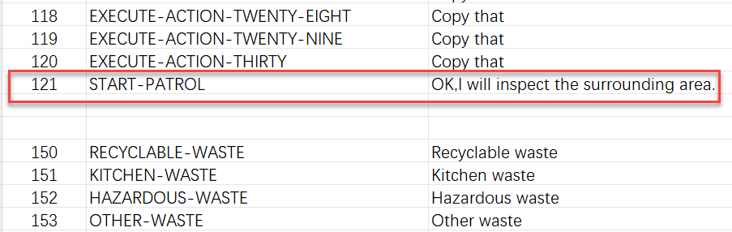

4. 将修改好的备份**”播报词V3_英文模板“**文件保存，后续参照 [4.8.2 ESP32S3固件制作](#4.8.2) 中的步骤，将表格导入到网站制作词条音频，后期用于外部主控以被动播报方式调用播放。

5. 重新制作固件后，参照 [4.2.2 ESP32S3固件烧录](#4.2.2) 将固件烧录到WonderLLM模块中。

>[!note]
>**烧录ESP32S3固件后，该词条的被动播报功能修改成功。**

<p id ="4.7"></p>

## 4.7 新增播报语
>[!note]
> **本小节以英文版本为例讲解，中文版本操作同步适用。**

### 4.7.1 命令词播报词协议列表修改

>[!note]
>
>* **在 [4.1.2 通信结构与功能分工](#4.1.2) 可以了解到，由于播报语的工作完全由ESP32S3固件控制实现，因此若需新增播报语，无需进行CI1302固件修改适配。**
>
>* **本小节在 ”命令词播报词协议列表“ 执行的目的在于：①便于用户理解后续操作  ②完全对应模块最新功能。**

1. 在**“附录/05 命令词播报词协议列表/01 命令词协议列表/02 英文版本”**路径找到与出厂固件对应的**”命令词播报词协议列表“**，将其复制粘贴至其他路径备用，我们将在备份版本上进行后续改动。

>[!note]
>
>* **请不要直接在文件原件上直接进行改动，以免出现不可复原的错误。**

2. 在表格中所有功能类型为播报语的词条的最后，新增一行表格，在其中填写自定义内容，如下图：

>[!note]
>* **英文版本的 “命令词播报语协议列表” 中，所有词条(含命令词、播报语、功能性词条)的 ”命令词“ 一列下的所有内容需要完全以大写字母书写，并使用连字符（-）将多个单词分隔开。**
>* **词条的”播报语句“ 一列没有以上要求，使用小写即可。**
>* **播报语的 ”命令词“ 一列的内容在以上拼写要求的基础上可任意填写，我们推荐对于用户的最佳实践为将新词条的 ”命令词“ 填写为 ”播报内容“ 经过全大写与单词分隔处理后得到的字符串，如下图。**
>* **在“命令词播报语协议列表”文件中。每一个词条(包括功能性词条、命令词类型词条、播报语类型词条)具有唯一的语义标签，用户可任意为新词条设置语义标签，但是需要检查表格，确保没有与其他任何词条冲突。对于用户的最佳实践为将新词条语义标签设置为“前一个词条语义标签+1”即可。**
>* **新词条的功能类型选择“播报语”；播报模式必须选择“被”(被动播报)；**

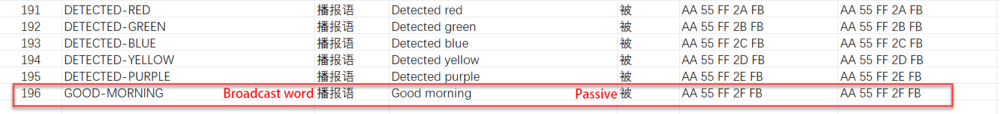

3. 之后填写新词条的发送协议和接收协议，同一个播报语的接收协议和发送协议一致，前2个字节填写固定帧头 **”AA 55“** ，第3字节填写播报语的类型值 **”FF“** ，第4字节填写1字节新词条的ID**(推荐填写为 “前一个播报语ID+1”)**，第5字节填写固定帧尾 **”FB“** 。

>[!note]
>
>* **所有播报语类型词条的发送协议和接收协议除第4字节外，其他字节均一致。用户可以先复制其他播报语类型词条的发送协议和接受协议并粘贴至新词条一行。**
>* **播报语类型词条发送协议和接收协议的第4字节为每一个播报语自身的ID(取值：01--FF)，每一个播报语类型词条的ID必须保证唯一性，用户可任意为新词条设置ID，但是需要检查表格，确保没有与其他播报语冲突。**
>* **在我们提供的“命令词播报语协议列表” 文件中，播报语类型词条的ID由小到大，从上到下排布。对于用户的最佳实践为将新词条ID设置为“前一个播报语ID+1” 即可。**
>* **此外，表格中已有的播报语类型词条也支持修改，您只需修改已有词条的“命令词”和“播报语句”即可，这样更加高效且节省词条ID的分配。**

4. 将修改好的备份**”命令词播报词协议列表“**文件保存。

>[!note]
>**接下来开始制作ESP32S3固件，适配该新词条的被动播报功能。**

### 4.7.2 ESP32S3固件制作

1. 在**“附录/05 命令词播报词协议列表/02 播报语协议列表/02 英文版本”**路径找到与出厂固件对应的 **”播报词V3_英文模板_“**，将其复制粘贴至其他路径备用，我们将在备份版本上进行后续改动，随后将备份版本文件打开。

>[!note]
>
>* **请不要直接在文件原件上直接进行改动，以免出现不可复原的错误。**

2. 在该表格中，有**”序号“**、**”音频名“**、**”合成内容“**三列内容，分别与 **"附录/05 命令词播报词协议列表/01 命令词协议列表"** 路径下的”命令词播报词协议列表“ 文件的**”语义标签“** 、**”命令词“** 、**”播报语句“** 三列内容对应。

3. 在表格中所有功能类型为播报语的词条的最后，新增一行表格，在其中填写自定义内容，**”序号“** 填写 **”命令词播报词协议列表“** 中新增词条的 **”语义标签“** ；**”音频名“** 填写 **”命令词播报词协议列表“** 中新增词条的 **”命令词“**； **”合成内容“** 填写 **”命令词播报词协议列表“** 中新增词条的 **”播报语句“** ，如下图：

>[!note]
>
>**如果用户在 ”命令词播报词协议列表“ 中修改了已有的播报语，此处也需要一并修改。**

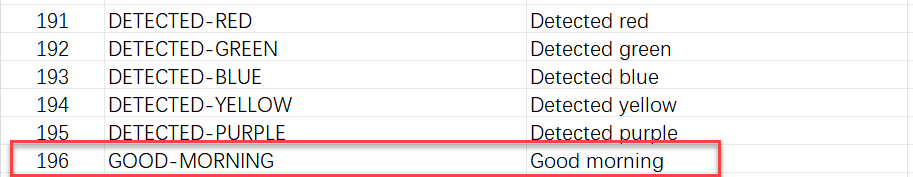

4. 将修改好的备份**”播报词V3_英文模板“**文件保存，后续参照 [4.8.2 ESP32S3固件制作](#4.8.2) 中的步骤，将表格导入到网站制作词条音频。

5. 重新制作固件后，参照 [4.2.2 ESP32S3固件烧录](#4.2.2) 将固件烧录到WonderLLM模块中。

>[!note]
>**烧录ESP32S3固件后，该词条的被动播报功能修改成功。**


## 4.8 固件制作教程

>[!note]
>
>* **本小节以制作英文固件为例，讲解固件制作流程，中文版本固件制作流程一致适用。**
>* **CI1302固件具有自学习功能，对于用户的部分个性化需求可以在原先固件的基础上实现而无需重新制作新固件。建议您先完成[4.3 修改唤醒词](#4.3)、[4.4 修改命令词](#4.4)、[4.5 修改功能性词条](#4.5)、[4.6 新增命令词条](#4.6)、[4.7 新增播报语](#4.7)几节。**
>* **在下面的案例中，我们将演示在英文版本出厂固件原有功能的基础上，新增一个命令词类型词条、一个播报语类型词条，修改功能性词条中常用的唤醒词。**
>* **在开始本节操作前，请先完成[4.1.2 通信结构与功能分工](#4.1.2)的学习，了解自身需求需要改动的词条所属种类，以及该词条各功能实现时涉及的芯片，从而有计划的进行对应固件的制作。**

<p id ="4.8.1"></p>

### 4.8.1 CI1302固件制作

1. 首先需要打开“[<u>启英泰伦语音AI平台 (chipintelli.com)</u>](https://aiplatform.chipintelli.com/home/index.html) ”链接，进入固件制作官网。

2. 点击菜单栏的“**平台功能**”，再点击产品开发栏下的“**产品固件及SDK深度开发**”。

   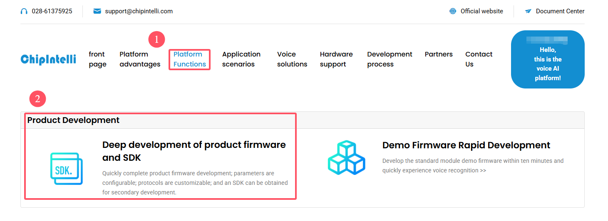

3. 此时系统将提示需要登录账号（若未注册需先完成平台账号注册）。本文示例中我们已提前完成注册，登录成功后请先点击“**离线语音识别大模型应用**”。


4. 在子菜单中再点击**“产品固件及SDK深度开发”**入口。

   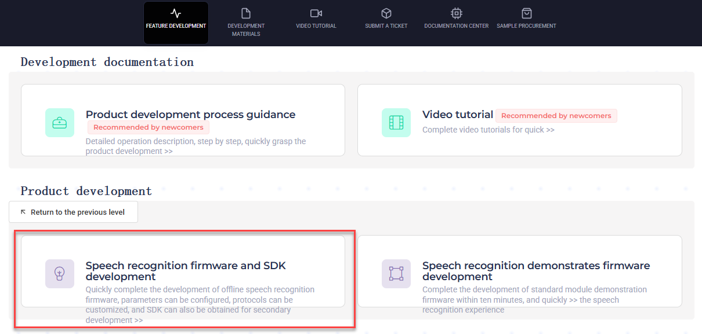

5. 当页面跳转后，在左侧点击，按照下图新建一个产品，其中产品名称和描述可自定义，应用方案需要选择“**单麦语音识别**”。

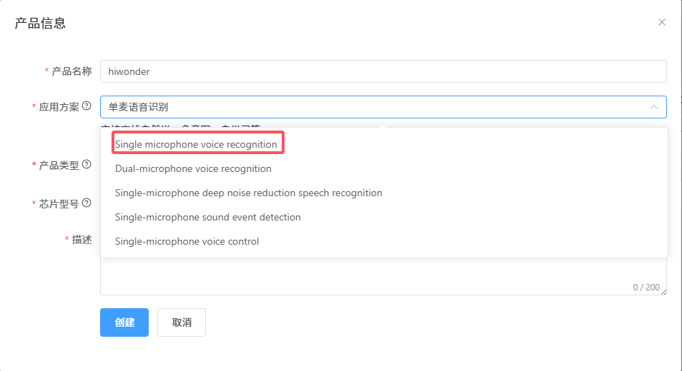

6. 在弹出的参数项中，产品类型选择“**通用-/>智能中控**”，芯片型号选择“**CI1302**”。之后继续弹出sdk名称，这里选择“**CI13XX_SDK_ASR_Offline**。

7. 在随后弹出的sdk版本选项选择“**1.12.16**”，描述可随意填写，完成全部选项配置后，点击“**创建**”。

   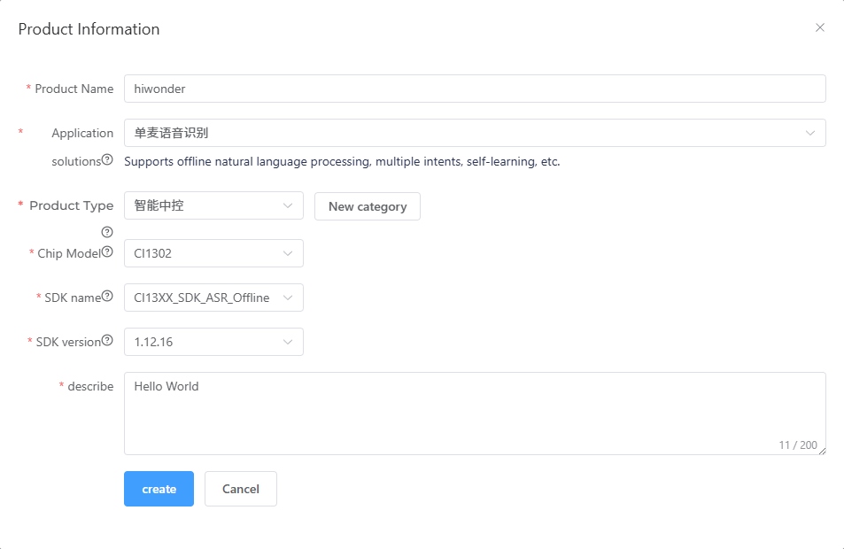

8. 接下来填写项目的基本信息，我们需要识别英文，那么语言类型选择“**英文**”（**识别中文只需要“语音类型”选择及“选择声学模型”选为中文即可）**，其余信息按照下图选择，完成后点击“**继续**”。

   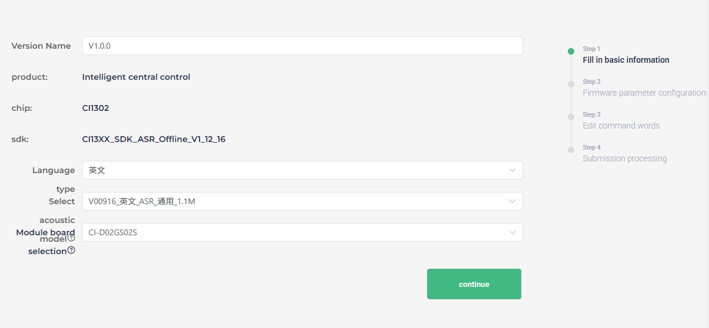

   识别语音为中文时，可按如下方式配置：

   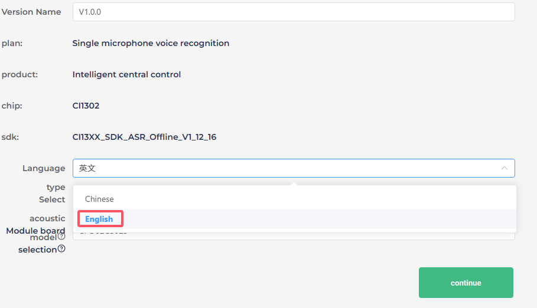

9. 进入固件配置界面后，我们将重点说明关键参数的修改步骤。首先，在算法参数设置中启用"**回声消除**"功能。

   

10. 在硬件参数中，需要将晶振源选择为“**内部RC**”，同时需要关闭波特率校准功能。

    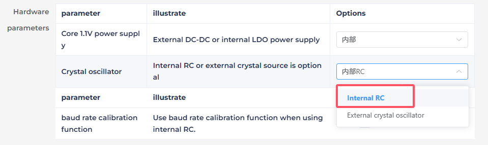

11. 在打印串口配置中，将UART0电平配置为开漏功能，支持外部上拉5V。

    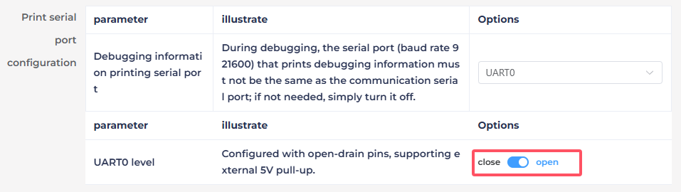

12. 对通讯串口配置进行修改，设置波特率为115200，并配置UART1电平为开漏功能，支持外部上拉5V，配置完成后点击“**继续**”进入下一步。

    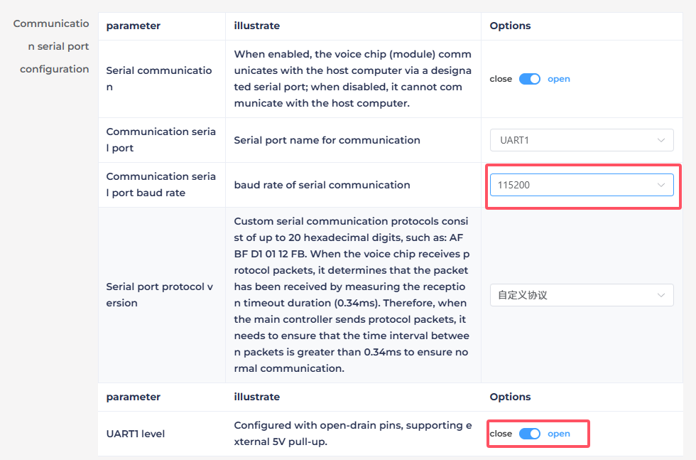

13. 下面进入到编辑词条功能中，首先需要选择播放的音色，这里我们选择“**Dane-英语男声**”。**（如果是中文的话也可以选择程程-标准男童 Ver.1）**

>[!note]
>
>* **在WonderLLM离线语音功能中，此处选择的音色就是模块与用户交互发言时的音色。**


14. 接着我们将修改好的备份**”命令词播报词协议列表“**文件进行上传，将文件直接拖入到网页中进行上传。

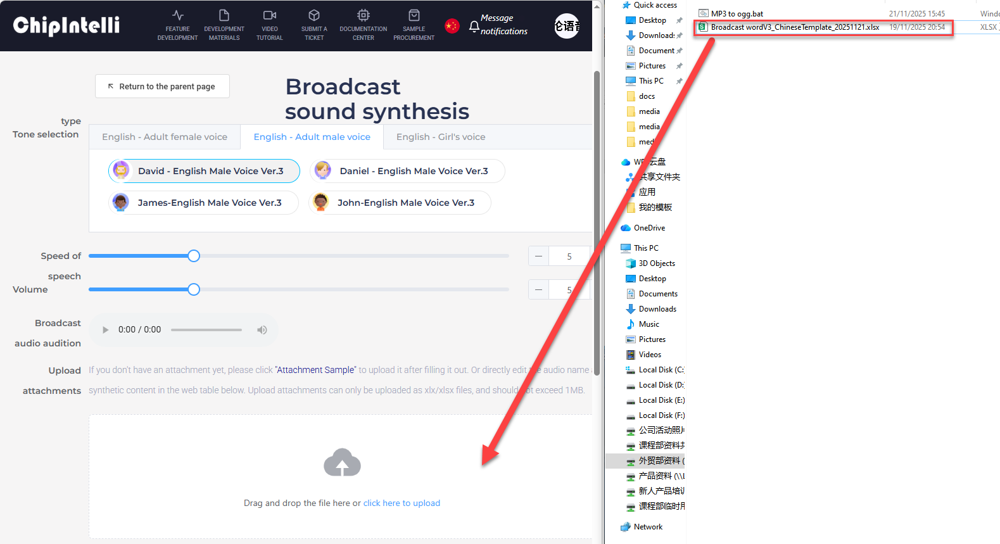

15. 上传文件后，即可在下方的表格中看到我们的词条数据，向下滑动页面，打开**“自学习功能”**，在弹出的**“自学习方式”**中选择**“指定学习”**。


16. 选择**”自学习方式“**后，页面自动弹出一个列表，列表上的词条即为之后生成的CI1302固件支持进行**”修改唤醒词“**、**”修改命令词“**功能的词条。该列表默认支持几条已上传的 **”命令词播报词协议列表“** 文件中的词条。


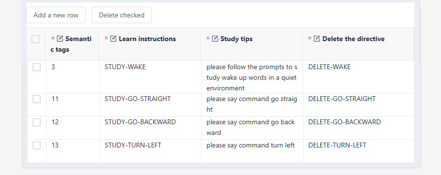
>[!note]
>
>**在上图中，语义标签为3的词条对应唤醒词，语义词条11-13对应命令词类型词条”GO-STRAIGHT“、”GO-BACKWARD“、”TURN-LEFT“。**
>
>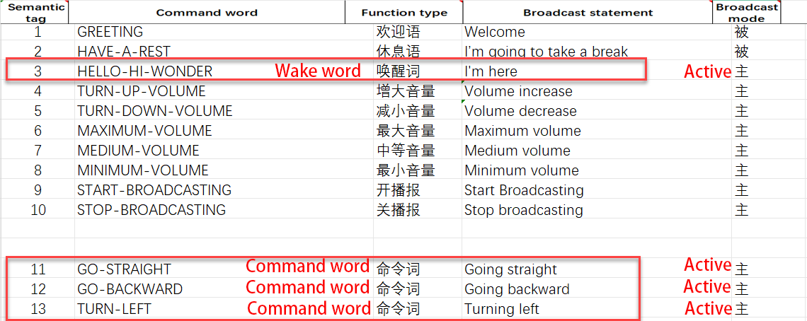

17. 该列表支持手动修改操作。如下图，将几个词条的**”学习提示“**进行简化修改。

>[!note]
>
>* **学习指令、删除指令也支持修改，但在英文版本固件制作中，这两列所有内容需要完全以大写字母书写，并使用连字符（-）将多个单词分隔开。**
>
>* **语义标签不建议修改，如果不需要某个语义标签对应的词条开启自学习功能，建议整行删除。如果需要增加对其他命令词的自学习功能，见参见下文操作。**

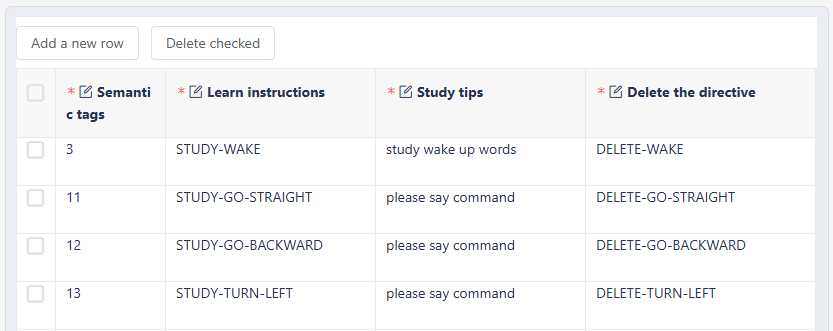

18. 该列表也支持增删操作，如下图，增加对语义标签为38的命令词类型词条 **”SHOW-A-SKIII“** 的**”修改命令词“**功能的支持。先在列表左上角点击**”新增行“**，然后在列表最后一行弹出的空白行填写该词条的信息。

>[!note]
>
>* **该列表中，不同词条间不能使用相同 ”学习指令“ 、”删除指令“，只有 ”学习提示“ 可以相同。**
>
>* **”学习指令“ 、”删除指令“可以任意填写，我们推荐用户的最佳实践为某词条xx的 ”学习指令“ 填写 ”STUDY-XX“ ， ”删除指令“ 填写 ”DELETE-XX“ 。**


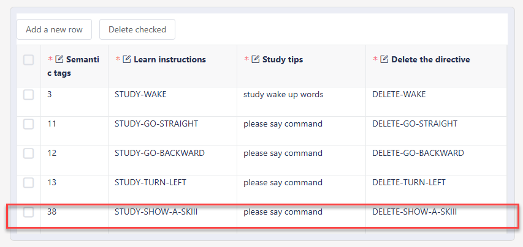

19. 完成上述操作后，在页面最下方，点击“**立即提交**”开始制作固件。


20. 提交后等待几分钟即可完成固件制作，完成后点击“**下载固件**”即可获取到制作的固件了。

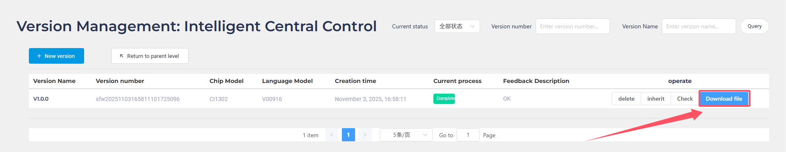


21. 固件下载完成，得到一个压缩包，解压后内部存放一个.bin格式文件，后续参考[4.2.1 CI1302固件烧录](#4.2.1)将其烧录至CI1302芯片。

<p id ="4.8.2"></p>

### 4.8.2 ESP32S3固件制作

1. 首先需要打开“[<u>启英泰伦语音AI平台 (chipintelli.com)</u>](https://aiplatform.chipintelli.com/home/index.html) ”链接，进入固件制作官网。

2. 点击菜单栏的“**平台功能**”，再点击产品开发栏下的“**产品固件及SDK深度开发**”。

   

   

3. 此时系统将提示需要登录账号（若未注册需先完成平台账号注册）。本文示例中我们已提前完成注册，登录成功后请先点击“**播报音合成**”。

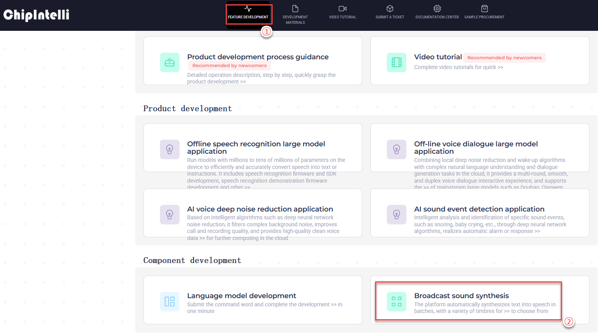

4. 当页面跳转后，在左侧点击，在项目详情页面中，**”项目名称“**可任意填写，**”语音类型“** 根据实际需要选择，**”音色类型“** 可任意选择，其他选项保持默认。

>[!note]
>
>* **由于CI1302芯片只支持中/英文语音的语音识别，因此我们推荐您在 ”播报语合成“ 中也仅在中文/英文中选择，保持语音识别&播报使用语种的一致。**
>* **”音色类型“ 的选择建议与制作CI1302固件时使用的音色保持一致。(在出厂固件中，中文版本使用 ”程程-标准男童 Ver.1“ 音色，英文版本使用 ”David-英语男声 Ver.3“ 音色)**

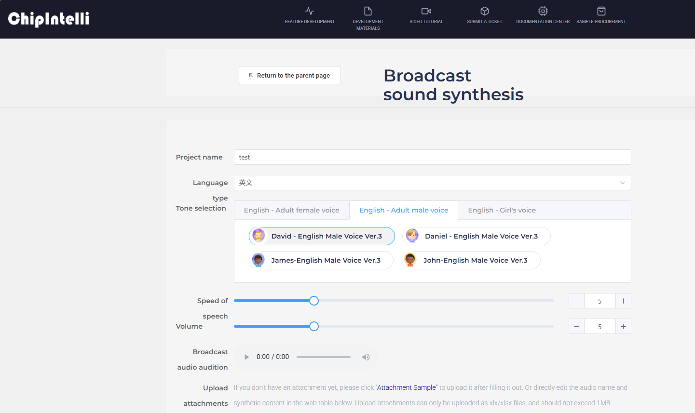

5. 接着我们将修改好的备份**”播报词V3_英文模板“**文件进行上传，将文件直接拖入到网页中进行上传。

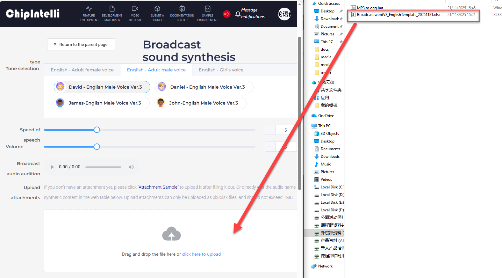

6. 完成上述操作后，在页面最下方，点击“**立即提交**”开始制作词条音频。


7. 提交后等待几分钟即可完成音频制作，完成后点击“**下载文件**”即可获取到制作的音频了。

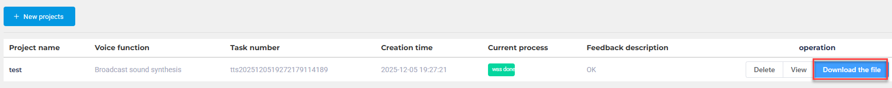

8. 固件下载完成，得到一个压缩包，将其解压后，进入并打开内部 **“mp3”** 文件夹。


9. 在文件夹内，存放制作好的我们提交的 **”播报词V3_英文模板“ **文件的词条对应的 **“合成内容”** 音频文件，音频文件格式为 **"mp3"** ，以词条 **“音频名”** 为标准对应进行命名。

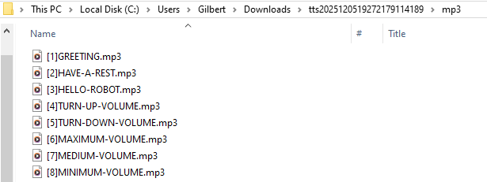

10. 在 **“附录/11 音频转换工具”** 的路径下，找到音频转换工具安装文件压缩包，完成该工具的工作环境搭建，详见 **“4.8.3 音频转换工具环境搭建(选看)”** 。

>[!note]
>
>**用户只需要在第一次使用时搭建环境，后续使用无需再执行，直接跳过此步骤。**

11. 在 **“附录/11 音频转换工具”** 的路径下，找到音频转换脚本文件 **“MP3 to ogg.bat”** ， 将该脚本文件复制粘贴至上文打开的 **“mp3”** 文件夹下。

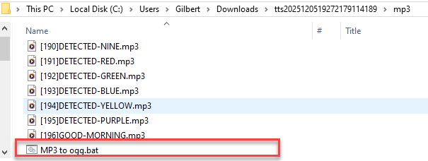

12. 双击运行该脚本文件，脚本运行时出现弹窗，如下图，当弹窗停止输出并出现 **“press any key to continue...”** ，说明全部转换工作执行完毕，此时可以关闭弹窗。

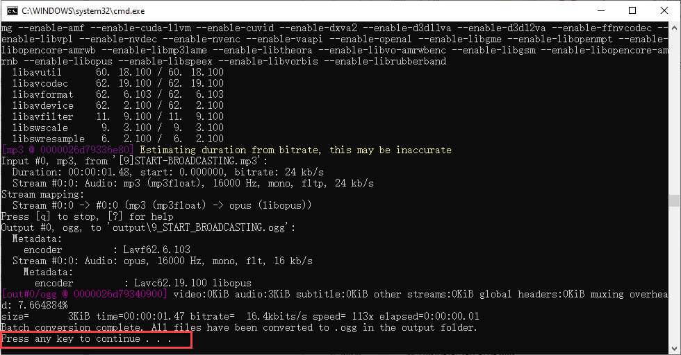

13. 脚本执行完毕，会在 **“mp3”** 文件夹内自动生成子文件夹 **“output”** ，点击进入。

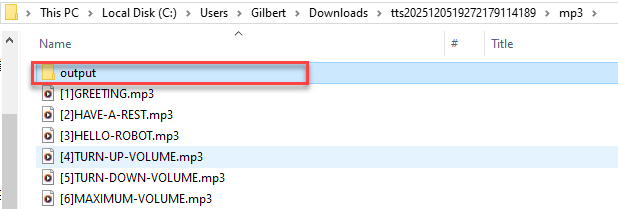

14. **“output”** 子文件夹中存放着 **“mp3”** 文件夹内的同名音频文件，格式已经转换为ESP32S3主控支持的音频文件格式ogg。我们先打开该文件夹以备后用。

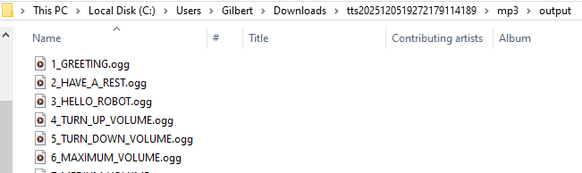

15. 在 **“附录/12 WonderLLM离线语音功能源码”** 的路径下找到对应版本，选择 **“02_英文版本”** ，将源码工程复制粘贴至其他路径备用。

>[!note]
>
>* **此处以英文版本为例，中文版本操作一致适用。**
>* **在本步我们以粘贴至  “Desktop(桌面)” 文件夹为例。**
>* **请不要直接在文件原件上直接进行改动，以免出现不可复原的错误。**


16. 使用完成ESP-IDF开发环境搭建的VScode，点击“**文件-打开文件夹**”。

>[!note]
>
>* **具体的环境搭建流程，已在 “2.6.1小智开源程序说明/开发环境部署” 有所说明，此处不再展开。**

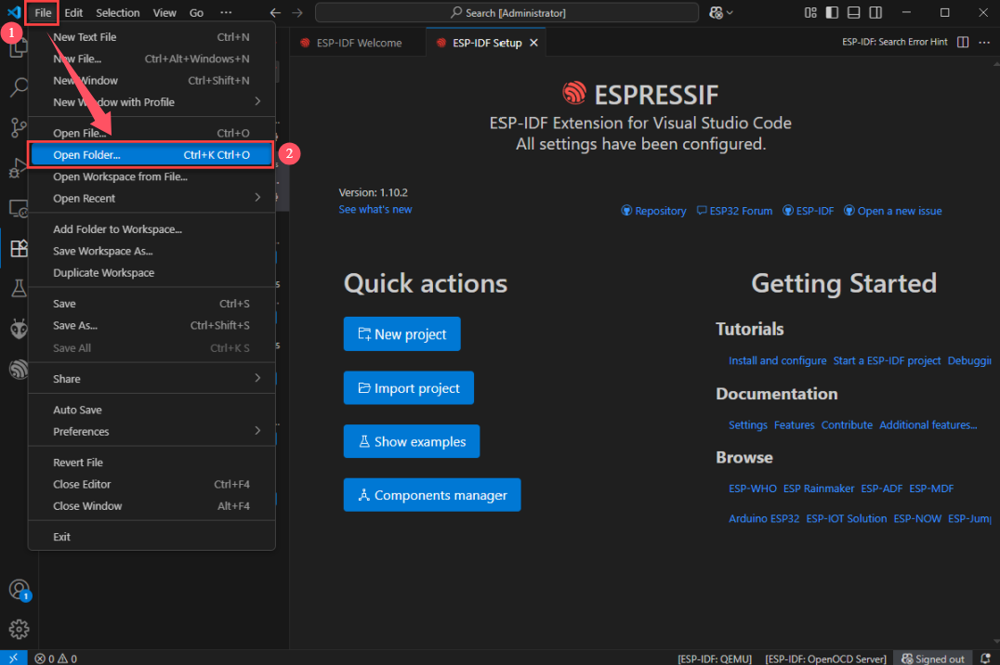

17. 选择粘贴的备份源码工程文件夹 **“WonderLLM_Echo”** 并打开。

>[!note]
>
>**若VScode出现弹窗询问是否信任该文件夹作者，请选择信任，否则ESP-IDF插件的使用会受限。**

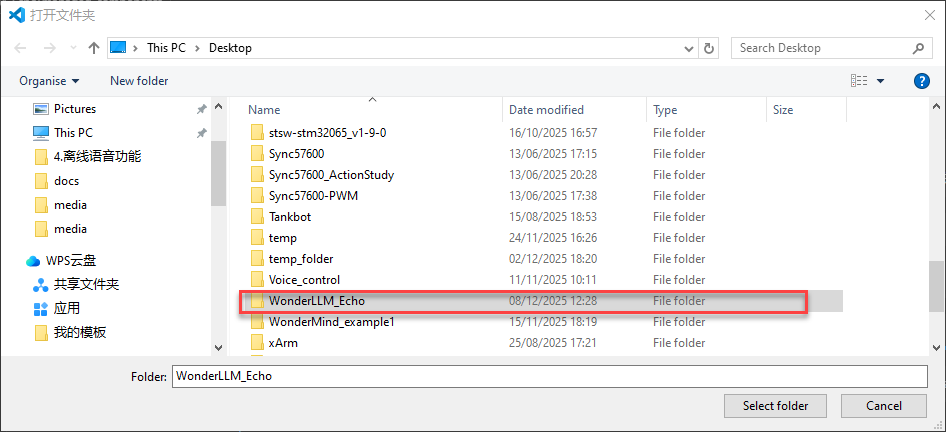

18. 在工程 **“main/assets”** 路径下，存放固件需要用到的全部词条音频文件。

>[!note]
>
>* **我们提供中英文版本的出厂固件，对应使用到的音频文件对应存放在 “zh-CN” 、“en-US” 文件夹中，如下图。**
>* **后文操作以英文版本为例，中文版本操作一致适用。**

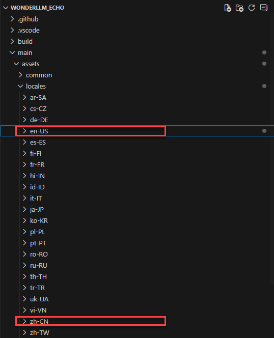

19. 展开 **“en-US”** 文件夹，文件夹下存放的ogg格式音频文件为模块工作中使用到的系统音频文件，无需作任何改动； **“Announcement”** 子文件夹内存放全部功能性词条、命令词类型词条、播报语类型词条的词条音频文件，此文件夹用于存放用户文件。

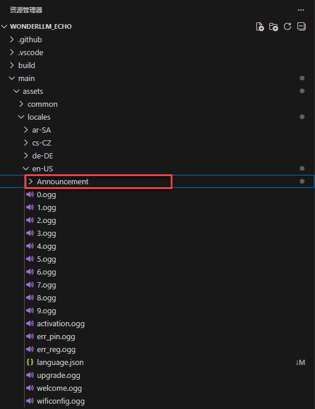

20. 展开 **“Announcement”** 文件夹，可以看到，我们已经在该路径下预先存放有与出厂固件配套的全部词条音频文件(即对应 **“附录/05 命令词播报词协议列表/01 命令词协议列表/02 英文版本/命令词播报词协议列表”** 和 **“附录/05 命令词播报词协议列表/02 播报语协议列表/02 英文版本/播报词V3_英文模板 ”** 文件的内容)。

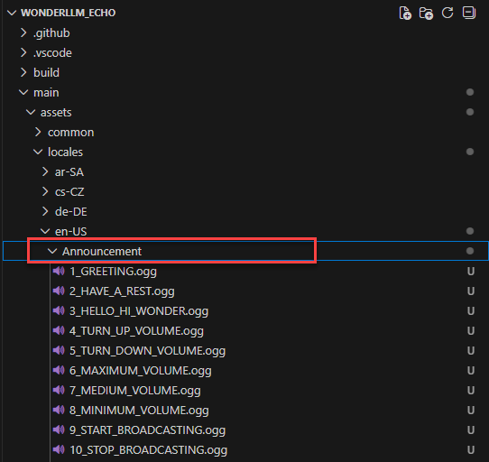

21. 将第14步中提及的 **“mp3/output”** 文件夹打开，如果用户在原先的出厂固件**增加/修改**了任意类型的词条(即在 **“[4.5 修改功能性词条](#4.5)” 、 “[4.6 新增命令词条](#4.6)” 、 “[4.7 新增播报语](#4.7)”** 三小节中的操作)，则需要将全部改动的词条生成的ogg格式音频文件，依次粘贴至备份源码工程的 **“main/assets/locales/en-US/Announcement”** 路径下。

>[!note]
>
>* **由于ESP32S3对非英文语言仅提供有限的支持，如果客户此时制作的中文版本固件，导入包含中文的音频文件，需要在导入前自行完成英文翻译并重命名，需要符合如下的命名规则：语义标签(序号) + 下划线(_) + 词条名英语翻译(全大写字母拼写，单词间使用下划线为连字符)。**
>* **例如有文件名为 "3_你好机器人.ogg"  ,则按照上文的命名规范，可将其修改为 “3_HELLO_ROBOT.ogg” 。**

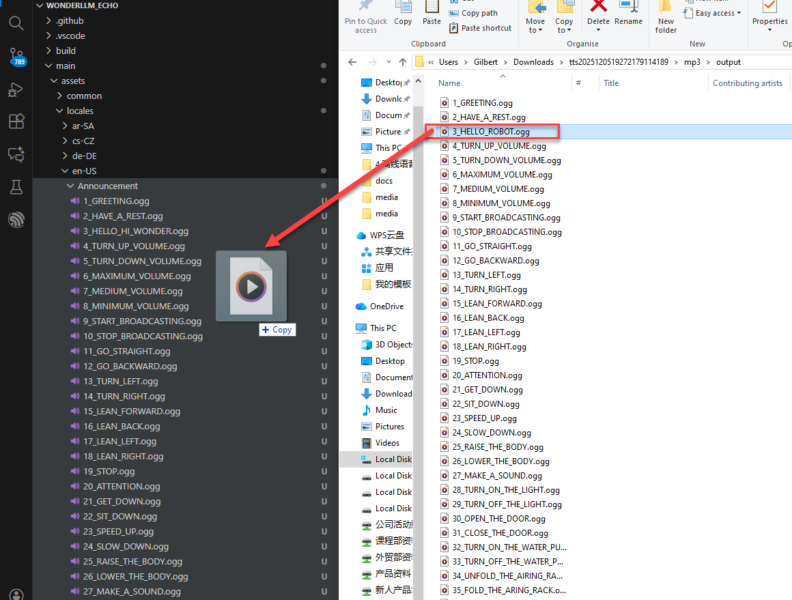

22. 如果是新增词条，则将对应合成的ogg格式音频文件粘贴完成即可；如果是原有词条的改动，在粘贴完成该词条的ogg格式音频文件后，在备份源码工程的 **“main/assets/locales/en-US/Announcement”** 路径下，可以看到出现了两个以相同的 **“语义标签(序号)+下划线”** 为前缀命名的ogg格式音频文件，分别对应该语义标签的词条在改动前后使用的音频文件，用户需要将改动前的音频文件删除。

>[!note]
>
>**在该路径下，每一个ogg格式必须使用不同的 “语义标签(序号)+下划线” 为前缀命名，否则后续使用会出现冲突。**

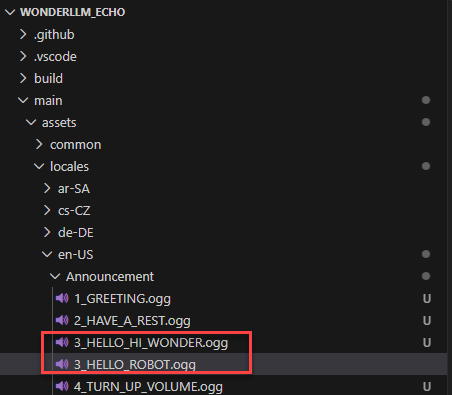

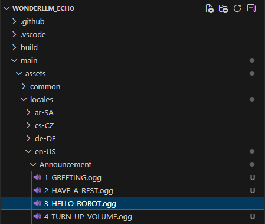

23. 之后开始改动源码文件，同步更新**修改/新增**词条与调用的音频文件的映射关系，总共有2处。

24. 第一处：在备份源码工程的 **“main/boards/HiwonderExploit_S3”** 路径下，打开 **“VoiceProtocol.h”** 文件，此处关联了词条播报对应 **“播报语句”** 时，在屏幕上同步显示的 **“播报语句”** 字符串。

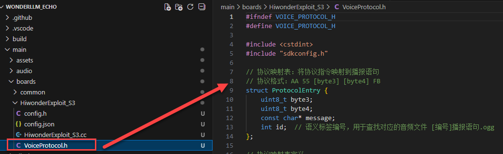

25.  如果用户此时制作的是中文版本的固件，找到并打开 **"/#if CONFIG_LANGUAGE_ZH_CN"** 分支下的代码；如果制作的是英文版本的固件，找到并打开 **"/#elif CONFIG_LANGUAGE_EN_US"** 分支下的代码。

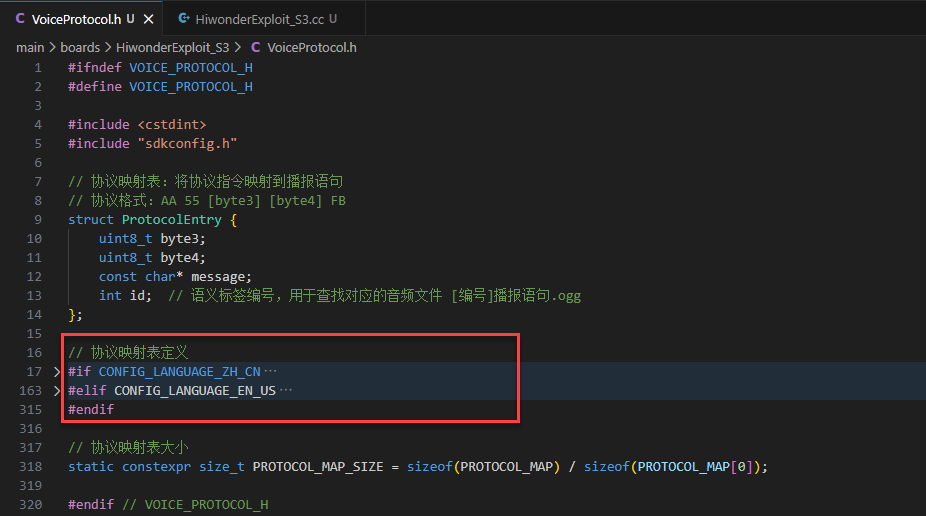

26. 根据制作的固件语言版本，打开对应分支的代码，找到 **“PROTOCOL_MAP”** 数组。

>[!note]
>
>* **数组内每个元素的数据排布格式为：{词条发送/接收协议第3字节，词条发送/接收协议第4字节， 词条播报语句， 词条语义标签}。**
>* **词条的发送/接收协议、播报语句、语义标签请见 “命令词播报词协议列表” 文件。**

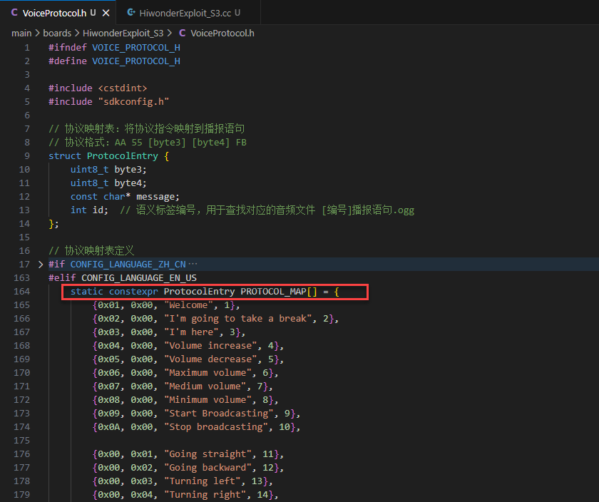

27. 如果用户修改了已有的任意词条，需要将词条最新的 **“播报语句”** 更新至对应数组元素，例如唤醒词有修改，在程序文件中对应修改如下图。


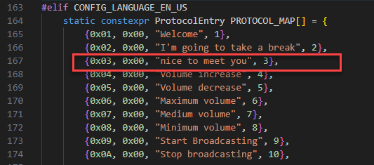

28. 如果用户新增词条，需按照数据排布格式： **"{词条发送/接收协议第3字节，词条发送/接收协议第4字节， 词条播报语句， 词条语义标签}"** ，自行在代码中新增一行，并填写对应信息。

>[!note]
>
> **“PROTOCOL_MAP” 数组的元素按照语义标签从小到大的顺序从上到下排布，为例程序的可读性和可维护性，我们推荐用户的最佳实践为：按照新增词条的数值按大小顺序插入对应位置。**


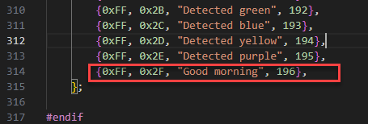

29. 第二处：在备份源码工程的 **“main/boards/HiwonderExploit_S3”** 路径下，打开 **“HiwonderExploit_S3.cc”** 文件，此处关联了词条播报对应 **“播报语句”** 时对应调用的音频文件。

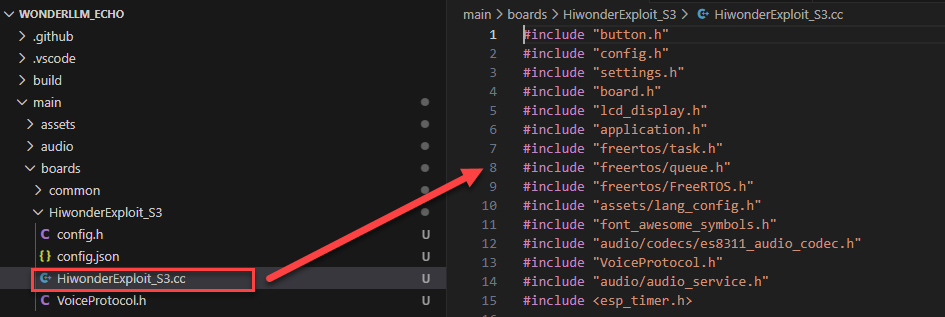

30. 找到 **“GetAnnouncementAudioById”** 函数，在函数中的switch分支， **“分支的取值”** 对应词条的 **“语义标签”** 。

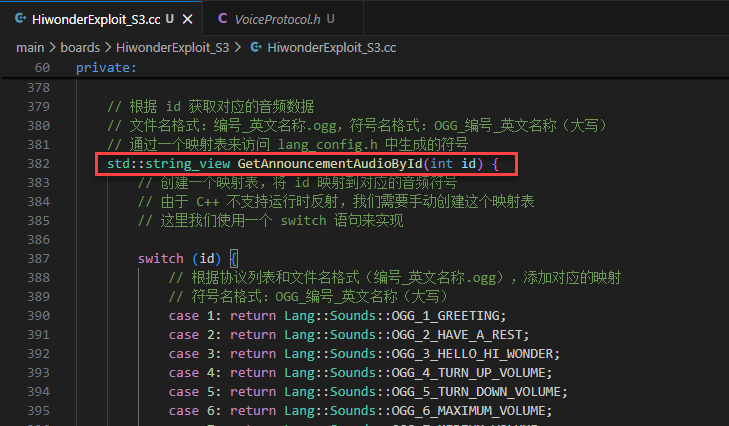

31. 如果用户修改了已有的任意词条，需要将导入源码工程的词条最新的 **“播报语句”** 音频文件名更新至对应数组元素，例如唤醒词有修改，在程序文件中对应修改如下图。

>[!note]
>
>**导入工程的音频名需要经过ESP-IDF编译，编译后生成的文件才是最终程序调用的文件，编译后的生成文件被自动命名为 “OGG_导入源码工程的词条音频文件名” 。**


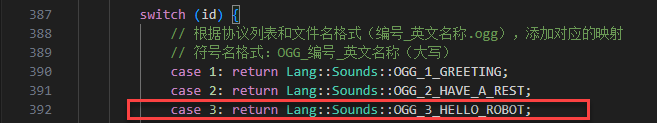

32. 如果用户新增词条，需按照格式： **"OGG_导入源码工程的词条音频文件名"** ，自行在代码中新增一行，并填写对应信息。

>[!note]
>**switch分支按照语义标签从小到大的顺序从上到下排布，为例程序的可读性和可维护性，我们推荐用户的最佳实践为：按照新增词条的数值按大小顺序插入对应位置。**


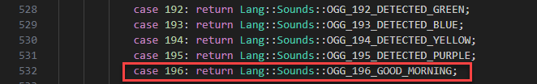

33. 将WonderLLM接入电脑，在下方扩展栏中点击图示图标，选择设备串口。

34. 在下方扩展栏中点击图示图标，选择芯片型号为“**ESP32S3**”。

    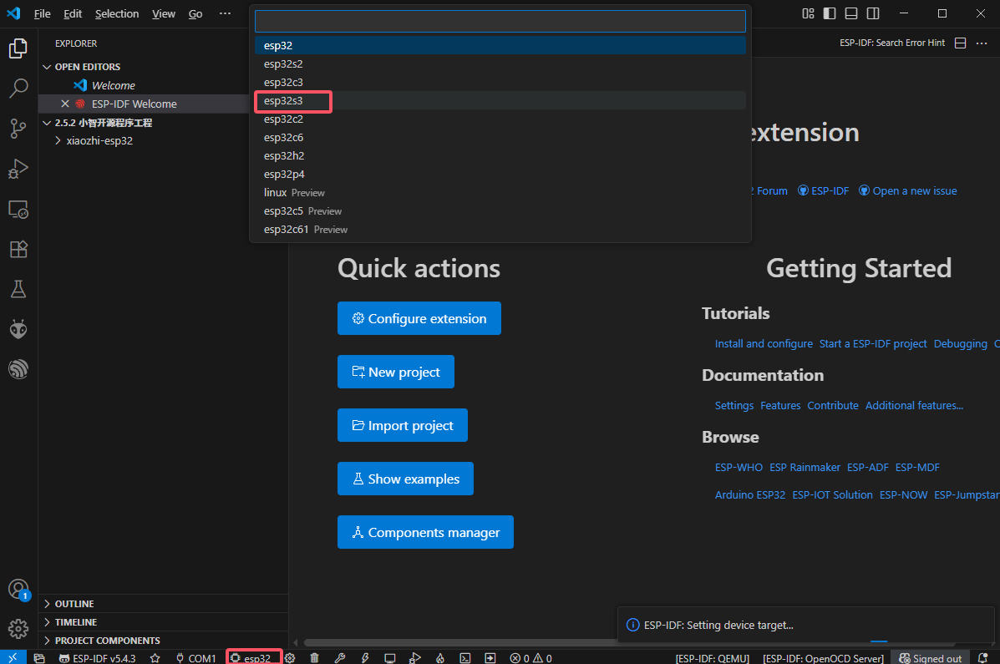

35. 在下方扩展栏中点击图示图标，自动调用ESP-IDF对当前工程依次进行构建、烧录、监视。初次构建工程需要一定时间，请您等待片刻。


36. 当终端输出如下提示，表示工程构建成功。

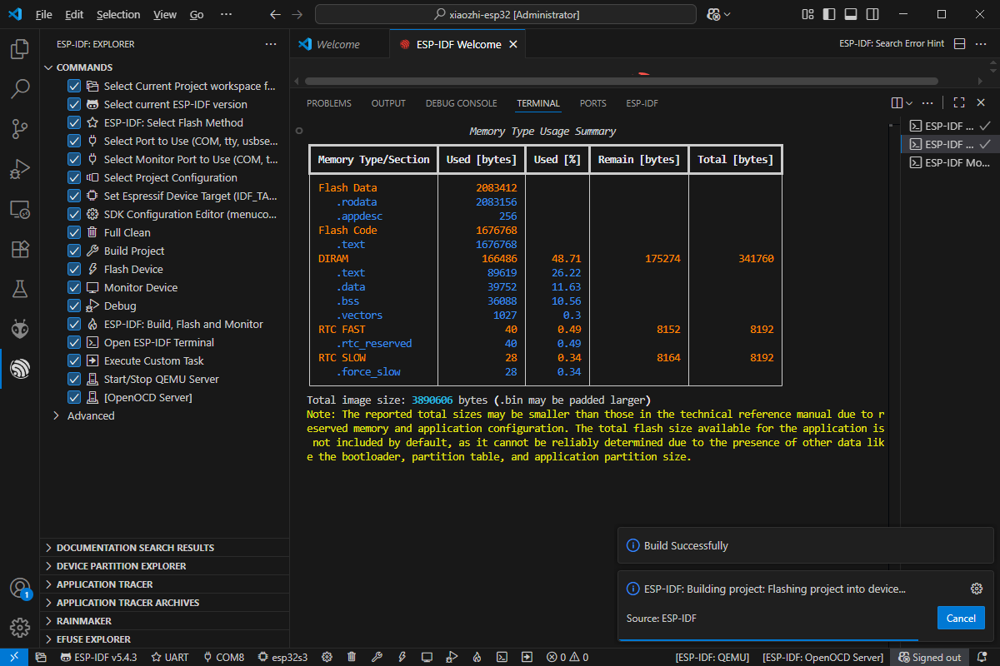
>[!note]
>
>**ESP-IDF编译完成后，会在工程文件夹根目录生成build文件夹存放编译输出文件，用户可以在其中找到AiXiaoZhi_Hiwonder.bin文件，后续可使用该固件按照 “4.2.2 ESP32S3固件烧录” 的方式烧录至ESP32S3主控。**
>
>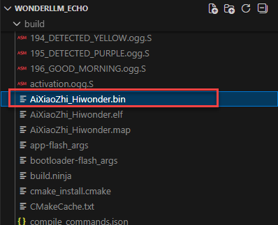


37. 当终端输出如下提示，表示工程烧录成功。

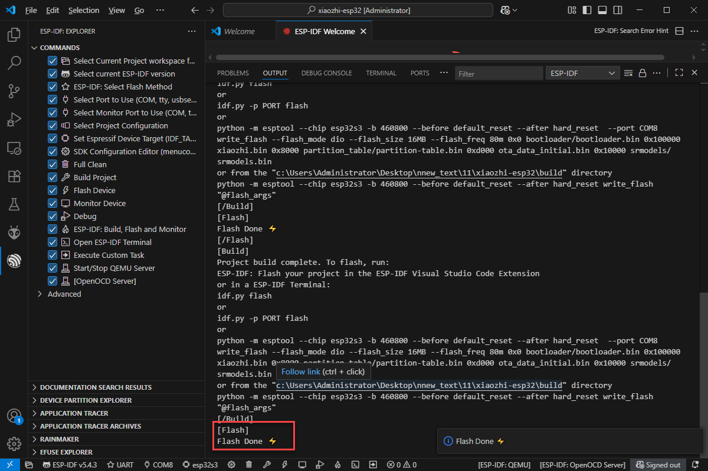


### 4.8.3 音频转换工具环境搭建(选看)

1. 在 **“附录/11 音频转换工具”** 的路径下找到音频转换工具安装文件压缩包，将其复制到任意路径下。

>[!note]
>
>**我们推荐对于用户的最佳实践是在个人电脑选择其中一个磁盘的根目录，在其上新建同名文件夹，并将安装文件压缩包放置在内部，文中以新建路径 “D:/ffmpeg” 为例。**

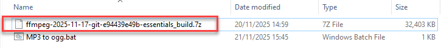

2. 将压缩包直接在该路径下解压。

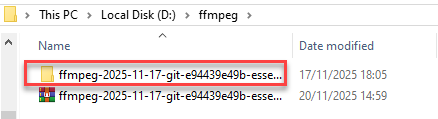

3. 进入解压后的文件夹，再进入内部的 **“bin”** 文件夹，找到内部的音频转换工具。

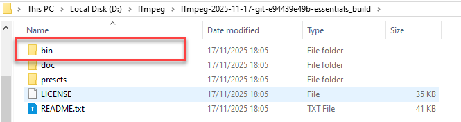

4. 在音频转换工具 **“ffmpeg.exe”** 的路径下，复制该路径以备后用。

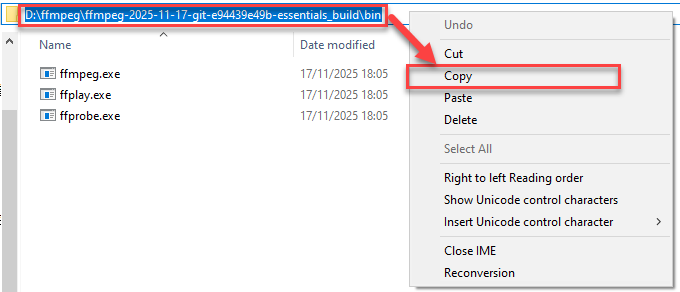

5. 回到电脑 **“DeskTop(桌面)”** 界面，左键点击选中 **“This PC(此PC)”** 图标，点击右键，在展开菜单中选择 **“Properties(属性)”** 。

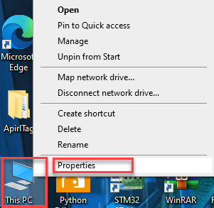

6. 在打开的界面中选择 **“Advanced system settings(高级系统设置)”** 。

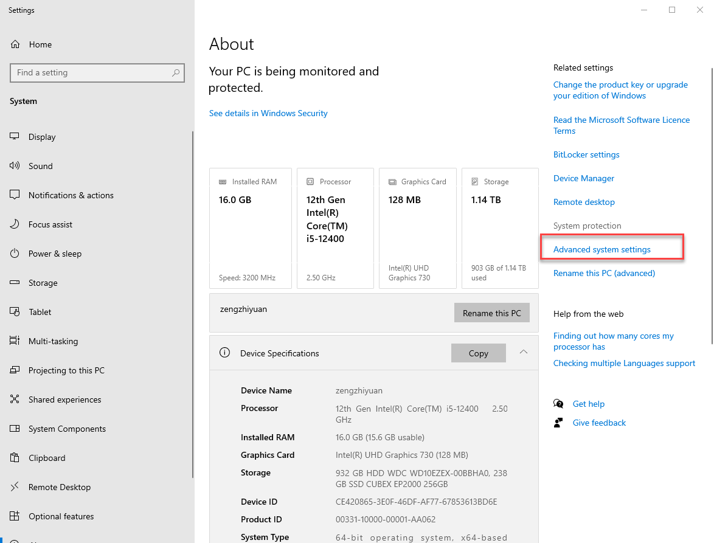

7. 在打开的界面中选择 **“Environment Variables(环境变量)”** 。

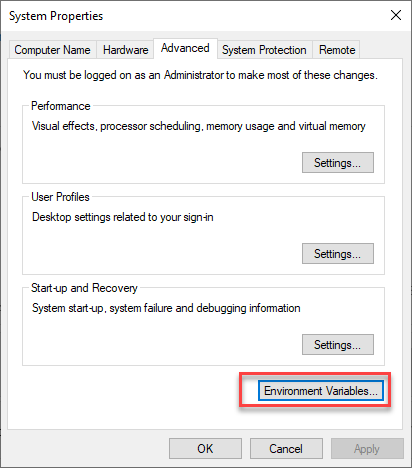

8. 在打开的界面中，在 **“System variables(系统变量)”** 一栏，左键单击选择 “Path” 变量，再点击 **“Edit...(编辑...)”** 图标。

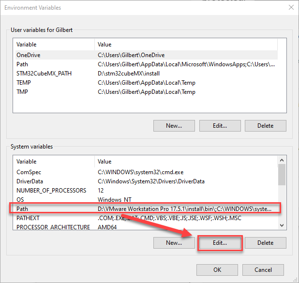

9. 在打开的界面中，点击 **“New(新建)”** ，新建该变量的可选值。

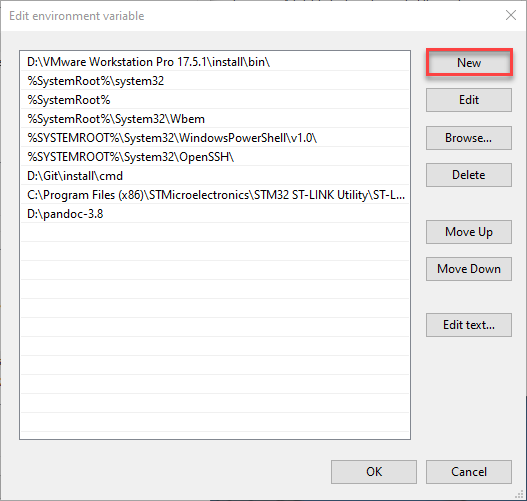

10. 将前文复制的音频转换工具 **“ffmpeg.exe”** 路径粘贴至此处，之后点击 **“OK”** 保存修改， **"Edit environment variable(编辑环境变量)"** 界面自行关闭。

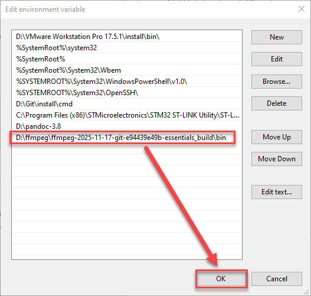

11. 在 **"Environment variables(环境变量)"** 界面点击 **“OK”** 保存修改，该节面自行关闭。

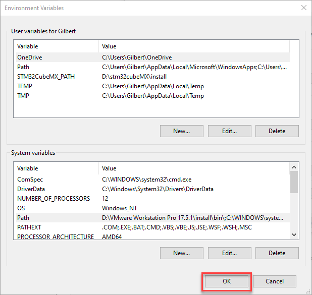

12. 在 **"System Properties(系统属性)"** 界面点击 **“OK”** 保存修改，该节面自行关闭。

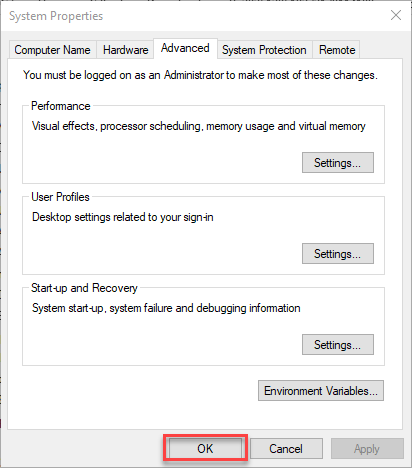

13. 完成以上步骤后，音频转换工具环境搭建工作完成。


## 4.9 设备主从通讯原理&寄存器说明

1. 本节旨在为用户介绍关于WonderLLM模块在与不同设备（如Arduino、STM32等主控）通信时的主从关系的详细信息，理解WonderLLM模块是如何作为从机与其他设备进行通信的，以及其他设备如何作为主机访问WonderLLM模块数据和控制的。

2. 本章中WonderLLM模块都是作为从机设备，通过IIC协议与其他设备进行信息传输。


### 4.9.1 主从关系

在主从机控制系统中，WonderLLM模块作为从机设备，其他单片机等设备作为主机。

* **WonderLLM模块作为从机的功能**

1. 接收解析主机发送的信号：等待IIC信号中断，若IIC有数据接收到，则根据IIC接收到的寄存器地址信息，调用对应的函数功能。

2. 数据处理与反馈：当WonderLLM模块接收到读取寄存器命令时，则需要调用对应的发送函数，将识别到的数据发送给主机设备。


* **其他设备作为主机**

1. 指令发送：主机需要将读取数据发送给WonderLLM模块。

2. 控制协调：主机设备需管理好整个系统的协同工作，确保主机与WonderLLM模块和主机连接的其他设备之间的通信和操作无冲突，保持良好的工作状态。

3. 数据接收：主机读取数据时，在发送读取指令后，需要接收WonderLLM模块发送的状态信息数据，并解析数据包，提取其中的有用信息。


### 4.9.2 IIC设备地址及功能寄存器

WonderLLM模块的IIC从机的设备地址默认为 **0x34** 。

<table border="1">
<colgroup>
<col style="width: 28%" />
<col style="width: 71%" />
</colgroup>
<tbody>
<tr>
<td style="text-align: center;">寄存器</td>
<td style="text-align: center;">作用</td>
</tr>
<tr>
<td style="text-align: center;">0x64</td>
<td style="text-align: left;">存放识别到结果的寄存器，主机需要读取1个字节数据，即识别结果的ID号。（未识别到时，结果为0x00)</td>
</tr>
<tr>
<td style="text-align: center;">0x6E</td>
<td style="text-align: left;"><p>设置播报语音的寄存器，主机需要发送2个字节数据。</p>
<p>（第一个字节为0x00或0xFF，0x00为命令词播报语类型，0xFF为普通播报语类型；第二个字节为ID号）</p></td>
</tr>
</tbody>
</table>
由于词条较多，所以对应类型及ID号需查看协议文档。

### 4.9.3 IIC设备地址修改及地址寄存器

在使用多种类模块或传感器的场景中，WonderLLM模块的IIC地址有可能与其他模块冲突（如我司的**WonderLLM模块**与**四路电机驱动模块**、**WonderEchoWonderLLM模块**），WonderLLM模块提供IIC地址修改功能，具体细节如下：

<table border="1">
<colgroup>
<col style="width: 50%" />
<col style="width: 50%" />
</colgroup>
<tbody>
<tr>
<td style="text-align: center;"><strong>寄存器</strong></td>
<td style="text-align: center;"><strong>作用</strong></td>
</tr>
<tr>
<td style="text-align: center;">0x03</td>
<td style="text-align: left;"><p>设置模块IIC地址的寄存器，主机需要发送1个字节数据。</p>
<p>（可选取值：0x33/0x34，其余取值无效，寄存器默认取值0x34）</p></td>
</tr>
</tbody>
</table>
>[!note]
>
>* **将符合要求的数据写入该寄存器成功，模块即开始切换内部IIC从机地址。**
>
>* **模块内部的IIC从机地址切换需要一定的时间，如在切换IIC地址后立刻以新的IIC地址发送指令至WonderLLM模块，模块将无法正常应答。为保证通信正常，请您至少延时100ms后再尝试以新地址与模块通信。**

### 4.9.4 注意事项

主机设备与WonderLLM模块的供电电源可以不同，但在连接时必须要共地，才可以提供稳定的通讯电平。

<p id ="4.10"></p>

## 4.10 命令词播报语ID号解析
>[!note]
>**本小节以英文版本文档为例，中文版本同步适用。**

1. 在**“附录/05 命令词播报词协议列表/01 命令词协议列表/02 英文版本”**路径找到与出厂固件对应的**”命令词播报词协议列表“**文档，该文档是CI1302芯片与ESP32S3芯片通讯的协议。

2. 协议以**0xAA**、**0x55**开头，以**0xFB**结尾，中间2个字节，分别为**功能类型**和**ID号**。

### 4.10.1 功能性词条

1. 协议文档的第一部分为语音识别的功能性词条，是对WonderLLM模块进行设置的词条，一般不做更改。

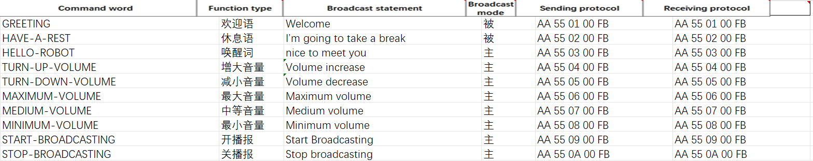

### 4.10.2 命令词类型词条

1. 识别的命令词示例如下，命令词中间的2个字节分别为0x00和ID号。例如：

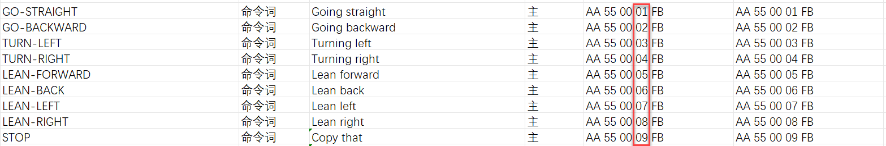

2. 举例：当WonderLLM模块识别到 **“go straight(前进)”** 命令词时，会回应 **“going straight(正在前进)”**，主控可在识别结果寄存器（0x64）上读取到 0x01 一个字节数据，该数据与 **“go straight(前进)”** 的发送协议中第4个字节相同。

### 4.10.3 播报语类型词条

1. 播报语词条不会主动播报，必须要主控通过IIC设置才会进行播报（命令词条的播报语也可以进行播报）。

2. 主控通过IIC在播报寄存器地址（0x6E）上写入2个字节，分别为类型和ID号，语音播报模块就会播报对应的语句，常用的有2种类型，0x00为命令词条播报语（即为 **“2.命令词类型词条”** 中的播报语句），0xFF为普通播报语。例如：

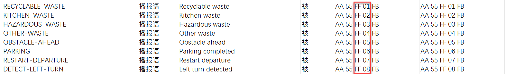

3. 举例1：用户需要播放播报语类型词条 **“recycle waste(厨余垃圾)”** 时，主控需要通过IIC在播报寄存器（0x6E）上写入“**0xFF 0x02**”，WonderLLM模块即会播报 **“recycle waste(厨余垃圾)”** 。

4. 举例2：用户需要播放命令词类型词条 **“turn left(左转)”** 时，主控需要通过IIC在播报寄存器（0x6E）上写入“**0x00 0x03**”，WonderLLM模块即会播报 **“recycle waste(厨余垃圾)”** 。

5. **(扩展)**举例3：功能性词条的 **“播报语句”** 也支持调用播报，例如用户需要播放唤醒词 **“greeting(问候语)”** 时，主控需要通过IIC在播报寄存器（0x6E）上写入“**0x01 0x00**”，WonderLLM模块即会播报 **“welcome(欢迎)”** 。

   

## 4.11 与Arduino主机通讯

### **4.11.1 Arduino语音识别例程**

* #### 准备工作

1. **接线说明**

(1) 接线时，WonderLLM的5V、GND、SCL和SDA引脚需与Arduino UNO开发板进行连接，接线方式如下图所示：


(2) Arduino UNO开发板可与我司任意一款Arduino扩展板搭配使用，与WonderLLM的接线方式如下图（以A板为例）：


>[!note]
>
>**注意：通电前确保不要有金属物体接触到主板，否则可能会因主板底部的引脚导致电路短路从而烧毁主板。**

  

2. **Arduino程序下载**

(1) 将Arduino开发板通过数据线连接至电脑。

(2) 打开本文档同路径下的“**附录/06 Arduino程序文件/01 Arduino语音识别例程/ASRcontrol/ASRcontrol.ino**”程序文件。

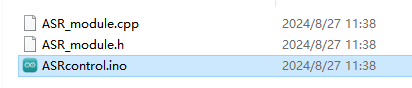

(3) 开发板选择Arduino UNO，并选择正确的端口号。


(4) 点击，将程序下载至Arduino中，等待下载完成即可。


* #### 测试案例

本例程使用Arduino开发板获取WonderLLM模块的识别结果，并通过串口打印出来。

1. **实现效果**

>[!note]
>**模块在识别前，需要先对模块说出“小幻小幻”将模块唤醒，才能进行识别。**

(1) 当WonderLLM模块识别到“**前进**”的词条后，会回应“**正在前进**”，同时串口将会打印“**go**”；

(2) 当WonderLLM模块识别到“**后退**”的词条后，会回应“**正在后退**”，同时串口将会打印“**back**”；

(3) 当WonderLLM模块识别到“**左转**”的词条后，会回应“**正在左转**”，同时串口将会打印“**left**”；

(4) 当WonderLLM模块识别到“**右转**”的词条后，会回应“**正在右转**”，同时串口将会打印“**right**”；

(5) 当WonderLLM模块识别到“**停止**”或“**停下**”的词条后，会回应“**收到**”，同时串口将会打印“**stop**”；

打印的数据如下：

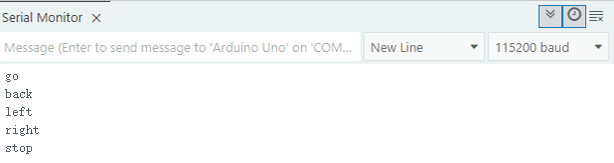


2. **程序简要分析**

(1) 导入了Wire、ASR_module相关功能库，用于与WonderLLM模块进行通讯。

```c
#include <Wire.h>
#include "ASR_module.h"
```

(2) 创建了WonderLLM模块对象，以及用于接收WonderLLM模块识别结果的result变量。将串口的波特率设置为115200。

```c
ASR_MOUDLE asr;

uint8_t result = 0;

void setup()
{
  Serial.begin(115200);
  Serial.println("Start");
}
```

(3) 在主函数中，通过调用`asr.rec_recognition()`函数获取WonderLLM模块返回的数据。

```c
void loop()
{
  result = asr.rec_recognition();  //返回识别结果，即识别到的词条编号
```

(4) 识别到“**前进**”词条，将会返回0x01，识别到“后退”，将会返回0x02。以此类推，识别到一个词条将会返回对应的词条ID号。
>[!note]
>**具体返回的数据列表，请查看“命令词播报词协议列表”。**

```c
  if(result != 0)
  {
    if(result == 0x01)
    {
      Serial.println("go");
    }else if(result == 0x02)
    {
      Serial.println("back");
```


### **4.11.2 Arduino语音播报例程**

* #### 准备工作

1. **接线说明**

(1) 接线时，WonderLLM的5V、GND、SCL和SDA引脚需与Arduino UNO开发板进行连接，接线方式如下图所示：


(2) Arduino UNO开发板可与我司任意一款Arduino扩展板搭配使用，与WonderLLM的接线方式如下图（以A板为例）：


>[!note]
>**通电前确保不要有金属物体接触到主板，否则可能会因主板底部的引脚导致电路短路从而烧毁主板。**


2. **Arduino程序下载**

(1) 将Arduino开发板通过数据线连接至电脑。

(2) 打开本文档同路径下的“**附录/06 Arduino程序文件/02 Arduino语音播报例程/ASRcontrol/ASRcontrol.ino**”程序文件。


(3) 开发板选择Arduino UNO，并选择正确的端口号。


(4) 点击，将程序下载至Arduino中，等待下载完成即可。


* #### 测试案例

本例程通过Arduino开发板让WonderLLM模块循环播放语音。

1. **实现效果**

Arduino开发板控制WonderLLM模块每隔5秒依次播报“**正在前进**”、“**正在左转**”、“**可回收物**”、“**有害垃圾**”。

2. **程序简要分析**

(1) 导入了Wire、ASR_module相关功能库，用于与WonderLLM模块进行通讯。

```c
#include <Wire.h>
#include "ASR_module.h"
```

(2) 创建了WonderLLM模块对象，以及用于接收WonderLLM模块识别结果的result变量。将串口的波特率设置为115200。

```c
ASR_MOUDLE asr;

uint8_t result = 0;

void setup()
{
  Serial.begin(115200);
  Serial.println("Start");
}
```

(3) 在主函数中，通过调用`asr.speak()`函数向WonderLLM模块写入数据，该函数有两个参数，参数1为命令词或播报词的寄存器地址，参数2为播报语所对应的值。

```c
void ASR_MOUDLE::speak(uint8_t cmd , uint8_t id)
{
    send[0] = cmd;
    send[1] = id;
    WireWriteDataArray(ASR_SPEAK_ADDR , send , 2);
}
```

(4) ASR_CMDMAND是一个宏定义，其值为0x00表示需要写入的功能类型为命令词。首先对寄存器地址ASR_CMDMAND写入0x01，对应数据列表中的播报语句“**正在前进**”，数据0x03所对应的是“**正在左转**”。

```c
void loop()
{
  asr.speak(ASR_CMDMAND , 0x01); // 命令词播报语 播报：正在前进
  delay(5000);
  asr.speak(ASR_CMDMAND , 0x03); // 命令词播报语 播报：正在左转
  delay(5000);
```

(5) ASR_ANNOUNCER值为0xFF表示需要写入的功能类型为播报语。对寄存器地址ANNOUNCER写入0x01，对应数据列表中的播报语句“**可回收物**”，数据0x03所对应的是“**有害垃圾**”。

```c
  asr.speak(ASR_ANNOUNCER , 0x01); // 播报语 播报：可回收物
  delay(5000);
  asr.speak(ASR_ANNOUNCER , 0x03); // 播报语 播报：有害垃圾
  delay(5000);
}
```

>[!note]
>**如需获取具体数据列表，请查看 “命令词播报词协议列表”** 。


### **4.11.3 Arduino模块地址修改例程**

* ### 准备工作

1. **接线说明**

(1) 接线时，WonderLLM的5V、GND、SCL和SDA引脚需与Arduino UNO开发板进行连接，接线方式如下图所示：


(2) Arduino UNO开发板可与我司任意一款Arduino扩展板搭配使用，与WonderLLM的接线方式如下图（以A板为例）：


>[!note]
>
>**通电前确保不要有金属物体接触到主板，否则可能会因主板底部的引脚导致电路短路从而烧毁主板。**


2. **Arduino程序下载**

(1) 将Arduino开发板通过数据线连接至电脑。

(2) 打开本文档同路径下的“**附录/06 Arduino程序文件/03 Arduino地址修改例程/asr_IICaddr_change/asr_IICaddr_change.ino**”程序文件。

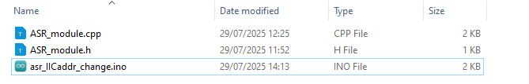

(3) 开发板选择Arduino UNO，并选择正确的端口号。


(4) 点击，将程序下载至Arduino中，等待下载完成即可。


* #### **测试案例**

本例程通过Arduino让WonderLLM模块循环切换自身IIC从机地址，并以新地址进行IIC通信控制模块播放语音。

1. **实现效果**

(1) Arduino控制WonderLLM模块切换从机地址为0x34，并以此IIC地址控制模块依次播报“**正在前进**”、“**可回收物**”；

(2) 再切换WonderLLM模块切换从机地址为0x33，并以此IIC地址控制模块依次播报“**正在前进**”、“**可回收物**”。

(3) 以上过程循环执行。

2. **程序简要分析**

(1) 导入了Wire、ASR_module相关功能库，用于与WonderLLM模块进行通讯。

```c
#include <Wire.h>
#include "ASR_module.h"
```

(2) 创建了WonderLLM模块对象，以及用于接收WonderLLM模块识别结果的result变量。将串口的波特率设置为115200。

```c
ASR_MOUDLE asr;

void setup()
{
  Serial.begin(115200);
  Serial.println("Start");
}
```

(3) 在主函数中，通过调用`asr.ChangeAddr()`函数向WonderLLM模块写入数据，该函数参数：WonderLLM模块新IIC从机地址。

(4) 函数首先判断传入的新地址new_addr是否合法，符合可用的有效值0x33、0x34。若不符合则返回0退出，反之则使用**当前模块IIC地址**module_addr与WonderLLM模块通信，并将新地址传入模块ASR_IIC_ADDR_CHANGE_ADDR寄存器。

(5) 模块收到数据后即开始切换地址，同时将记录当前模块IIC地址的module_addr成员更新为新地址，返回1退出。

```c
int ASR_MOUDLE::ChangeAddr(uint8_t new_addr)
{
  if(new_addr == 0x33 || new_addr == 0x34)
  {
    WireWriteDataArray(this->module_addr, ASR_IIC_ADDR_CHANGE_ADDR, &new_addr,1);
    this->module_addr = new_addr;
    return 1;
  }else{
    return 0;
  }
}
```

(6) 在`loop`函数中，向串口输出字符串，表明稍后模块从机地址的变动情况。随后调用`ChangeAddr`函数修改模块地址，将其返回值使用if进行判断，以确认写入操作是否正常。

```c
void loop()
{
  delay(1000);

  Serial.println("now,asr module's IIC Address is 0x34!");
  if(asr.ChangeAddr(0x34)){
```

(7) 若操作正常，则打印字符串提示，同时延时100ms等待模块内部IIC地址切换完成，随后调用speak函数，以**更新后的IIC地址成员**`module_addr`与模块通信，控制模块播报：“**正在前进**”，“**可回收物**”。

```c
    Serial.println("Success!");
    delay(100);
    asr.speak(ASR_CMDMAND , 0x01); // 命令词播报语 播报：正在前进
    delay(2000);
    asr.speak(ASR_ANNOUNCER , 0x01); // 播报语 播报：可回收物
    delay(2000);
  }else{
    Serial.println("Fail!");
  }
```

>[!note]
>**如需获取具体数据列表，请查看“命令词播报词协议列表”。**


## 4.12 与ESP32主机通讯

### 4.12.1 ESP32语音识别例程

* #### **接线说明**

>[!note]
>**MicroPython代码可在任意支持MicroPython编程的主控上运行，为讲解方便，此处以我司ESP32核心板为例讲解说明。**

1)  接线时，WonderLLM的5V、GND、SCL和SDA引脚需与ESP32核心板进行连接，接线方式如下图所示：


2)  ESP32核心板可与我司开源6路舵机控制器搭配使用，与WonderLLM的接线方式如下图：


>[!note]
>
>**通电前确保不要有金属物体接触到主板，否则可能会因主板底部的引脚导致电路短路从而烧毁主板。**


* #### 程序下载

1. **ESP32程序下载**

>[!note]
>
>* **Micropython支持多种IDE下载，如Thoony、VScode（需安装相关插件），相关操作请用户自行检索，此处以我司“幻尔python编辑器”下载程序为例，可实现免安装使用，开箱即用。**
>* **如使用ESP32，在下载Micropython前，需确保ESP32中已烧录Micropython固件，相关固件下载请见Micropython官网。如使用我司ESP32核心板，也可直接烧录我司提供固件文件（路径：/附录/13  ESP32核心板固件及烧录软件/02 ESP32固件烧录工具，烧录方式见同路径文档。**

1. 打开“**幻尔Python编辑器**”软件（路径：**附录/14  幻尔python编辑器**）；

2. 将本文档路径下的“**附录/07 ESP32程序文件/01 ESP32语音识别例程/main.py**”文件，拖到幻尔Python编辑器中（需要拖到红框内区域才有效）；

   

3. 点击菜单栏的连接按钮，连接成功后会变为绿色的图标；

4. 连接成功后点击菜单栏上的下载按钮，将程序下载至ESP32内，等待下方信息交互方框内提示下载完成。

   

>[!note]
>**完成以上4步后，请再将WonderLLM离线语音功能通信库(“附录/07 ESP32程序文件/01 ESP32语音识别例程/hw_esp32ASR_ctl.py”)拖入，按照上述步骤说明重复操作将该库文件导入ESP32，下载完成后点击界面的复位图标即可使ESP32复位工作，输出信息会同步显示在下方输出信息栏。**


* #### 测试案例

本例程使用ESP32开发板获取WonderLLM模块的识别结果，并通过软件终端打印出来。

1. **实现效果**

>[!note]
>
>**模块在识别前，需要先对模块说出“小幻小幻”将模块唤醒，才能进行识别。**

(1) 当WonderLLM模块识别到“**前进**”的词条后，会回应“**正在前进**”，同时终端将会打印“**go**”；

(2) 当WonderLLM模块识别到“**后退**”的词条后，会回应“**正在后退**”，同时终端将会打印“**back**”；

(3) 当WonderLLM模块识别到“**左转**”的词条后，会回应“**正在左转**”，同时终端将会打印“**left**”；

(4) 当WonderLLM模块识别到“**右转**”的词条后，会回应“**正在右转**”，同时终端将会打印“**right**”；

(5) 当WonderLLM模块识别到“**停止**”或“**停下**”的词条后，会回应“**收到**”，同时终端将会打印“**stop**”；


2. **程序简要分析**

(1) 导入了I2C总线协议库machine.I2C、时间处理函数库time，WonderLLM离线语音功能通讯库。

```python
#!/usr/bin/python3
# coding=utf8
import time 
from machine import Pin , I2C
from hw_esp32ASR_ctl import ASRModule,ASR_CMDMAND,ASR_ANNOUNCER
```

(2) 创建了WonderLLM模块类下的一个对象asr_module，初始化时需传入ESP32的IIC句柄供ESP32总线与模块建立通信连接。

```python
if __name__ == "__main__":
    iic = I2C(0, scl=Pin(23), sda=Pin(22), freq=100000)
    asr_module = ASRModule(iic)  
```

(3) ASRModule类的内部成员在初始化中（也就是将类实例化为一个对象时），会将传入的IIC句柄保存至内部的bus成员，同时进行指定模块I2C地址。

```python
class ASRModule:
    def __init__(self,iic_handle):
        # 初始化 I2C 总线和设备地址 
        self.bus = iic_handle  # 绑定 I2C 总线句柄 
        self.address = I2C_ADDR
        self.send = [0, 0]  # 初始化发送数据的数组
```

(4) 本小节我们需要读取模块寄存器存放的识别结果数据，我们首先需要构造一个`ASRModule`类下的通过IIC总线读取从机数据的处理函数`wire_read_data_array`，见下图，我们需要传入要读取的从机寄存器地址reg和读取数据的长度length。

(5) 我们调用`ASRModule`类下的成员bus，使用其自带的`readfrom_mem`函数即可读取从机各地址下寄存器的数据。

(6) 该函数的第三个参数为读取的字节数，返回值为一个列表，长度等于读取的字节数。

(7) 在总线通信失败，无法读取数据时系统会抛出异常，`read_i2c_block_data`函数无任何返回值，为了保持`wire_read_data_array`输出数据的统一，我们需要在异常处理中自行输出一个空列表。

```python
     def wire_read_data_array(self, reg, length):
        """
        从指定寄存器读取字节数组
        :param reg: 寄存器地址
        :param length: 要读取的字节数
        :return: 读取到的字节数组，失败时返回空数组
        """          
        try:
            result = self.bus.readfrom_mem(self.address, reg, length) # 从设备读取字节数组
            return result # 返回读取结果
        except Exception as e:		
            print(f"IIC_read_failed: {e}/r/n")
            return [] # 读取失败，返回空数组
```

(8) 进一步的，我们将使用`ASRModule`类下的`rec_recognition()`函数实现词条识别结果的获取。

(9) 在该函数中调用同类下的`wire_read_data_array`函数，接着在if语句中判断返回值是否为空列表，如果返回值是空列表，说明读取失败，程序返回0；反之返回读取结果。

```python
    def rec_recognition(self):
        """
        识别结果读取
        :return: 识别结果，如果读取失败返回 0
        """
        result = self.wire_read_data_array(ASR_RESULT_ADDR, 1) # 从结果寄存器读取一个字节
        if result:
            return result # 返回读取到的结果
        return 0  # 如果没有结果，返回 0
```

(10) 在主函数完成中WonderLLM模块类实例化后，循环调用`asr_module.rec_recognition()`函数获取WonderLLM模块返回的数据。

```python
    while True:
        recognition_result = asr_module.rec_recognition()
```

(11) 识别到“前进”词条，将会返回0x01，识别到**“后退”**，将会返回0x02。以此类推，识别到一个词条将会返回对应的词条ID号，树莓派根据返回的词条ID号向命令行终端打印对应语义的英文，随后进入下一轮循环。

(12) 如果识别不出用户的话语，将会返回0x00，此时程序不执行任何操作，直接进入下一轮循环。

```python
        if recognition_result[0] != 0:
            if recognition_result[0] == 1:
                print("go")
            elif recognition_result[0] == 2:
                print("back")
            elif recognition_result[0] == 3:
                print("left")
            elif recognition_result[0] == 4:
                print("right")
            elif recognition_result[0] == 9:
                print("stop")
```

>[!note]
>**具体返回的数据列表，请查看“命令词播报词协议列表”。**


### 4.12.2 ESP32语音播报例程

* #### **接线说明**

>[!note]
>
>**MicroPython代码可在任意支持MicroPython编程的主控上运行，为讲解方便，此处以我司ESP32核心板为例讲解说明。**

1)  接线时，WonderLLM的5V、GND、SCL和SDA引脚需与ESP32核心板进行连接，接线方式如下图所示：


2)  ESP32核心板可与我司开源6路舵机控制器搭配使用，与WonderLLM的接线方式如下图：


>[!note]
>
>**通电前确保不要有金属物体接触到主板，否则可能会因主板底部的引脚导致电路短路从而烧毁主板。**


* #### 程序下载

1. **ESP32程序下载**

>[!note]
>
>* **Micropython支持多种IDE下载，如Thoony、VScode（需安装相关插件），相关操作请用户自行检索，此处以我司“幻尔python编辑器”下载程序为例，可实现免安装使用，开箱即用。**
>* **如使用ESP32，在下载Micropython前，需确保ESP32中已烧录Micropython固件，相关固件下载请见Micropython官网。如使用我司ESP32核心板，也可直接烧录我司提供固件文件（路径：/附录/13  ESP32核心板固件及烧录软件/02 ESP32固件烧录工具，烧录方式见同路径文档。**

1. 打开“**幻尔Python编辑器**”软件（路径：**附录/14  幻尔python编辑器**）；

2. 将本文档路径下的“**附录/07 ESP32程序文件/01 ESP32语音识别例程/main.py**”文件，拖到幻尔Python编辑器中（需要拖到红框内区域才有效）；

   

3. 点击菜单栏的连接按钮，连接成功后会变为绿色的图标；

4. 连接成功后点击菜单栏上的下载按钮，将程序下载至ESP32内，等待下方信息交互方框内提示下载完成。

   

>[!note]
>**完成以上4步后，请再将WonderLLM离线语音功能通信库(“附录/07 ESP32程序文件/01 ESP32语音识别例程/hw_esp32ASR_ctl.py”)拖入，按照上述步骤说明重复操作将该库文件导入ESP32，下载完成后点击界面的复位图标即可使ESP32复位工作，输出信息会同步显示在下方输出信息栏。**


* #### **测试案例**

本例程通过树莓派开发板让WonderLLM模块循环播放语音（包括命令词条播报语和普通播报语）。

1. **实现效果**

树莓派开发板控制WonderLLM模块每隔5秒依次播报“**正在前进**”、“**正在左转**”、“**可回收物**”、“**有害垃圾**”。

2. **程序简要分析**

(1) 导入了I2C总线协议库machine.I2C、时间处理函数库time，WonderLLM离线语音功能通讯库。

```python
#!/usr/bin/python3
# coding=utf8
import time 
from machine import Pin , I2C
from hw_esp32ASR_ctl import ASRModule,ASR_CMDMAND,ASR_ANNOUNCER
```

(2) 创建了WonderLLM模块类下的一个对象`asr_module`，初始化时需传入ESP32的IIC句柄供ESP32总线与模块建立通信连接。

```python
if __name__ == "__main__":
    iic = I2C(0, scl=Pin(23), sda=Pin(22), freq=100000)
    asr_module = ASRModule(iic)  
```

(3) `ASRModule`类的内部成员在初始化中（也就是将类实例化为一个对象时），会将传入的IIC句柄保存至内部的bus成员，同时进行指定模块I2C地址。

```python
class ASRModule:
    def __init__(self,iic_handle):
        # 初始化 I2C 总线和设备地址 
        self.bus = iic_handle  # 绑定 I2C 总线句柄 
        self.address = I2C_ADDR
        self.send = [0, 0]  # 初始化发送数据的数组
```

(4) 我们需要向模块寄存器写入待播放的词条数据使模块开始播报，我们首先需要构造一个`ASRModule`类下的通过IIC总线向从机发送数据的处理函数`wire_write_data_array`，见下图，我们需要传入要写入（发送到）的从机寄存器地址reg、存放写入数据的列表val和写入数据的长度length。

(5) 我们调用`ASRModule`类下的成员bus，使用其自带的`writeto_mem`函数即可写数据到从机各地址下寄存器的数据。

```python
    def wire_write_data_array(self, reg, val, length):
        """
        向指定寄存器写入字节数组
        :param reg: 寄存器地址
        :param val: 要写入的字节数组
        :param length: 要写入的字节数
        :return: 如果成功写入返回 True，失败返回 False
        """
        try:            
            self.bus.writeto_mem(self.address, reg, bytes(val[:length])) # 发送字节数组到设备的指定寄存器
            return True # 写入成功
        except Exception :		
            return False # 写入失败，返回 False
```

(6) 进一步的，我们将使用`ASRModule`类下的speak()函数实现词条数据的写入。将词条类型cmd，词条id依次写入`ASRModule`类下的send列表，最后调用同类下的`wire_write_data_array`函数，将send列表作为存放写入数据的列表参数传入，即可实现数据的写入。

```python
    def speak(self, cmd, id):
        """
        向设备发送说话命令
        :param cmd: 命令字节
        :param id: 说话的 ID
        """
        self.send[0] = cmd # 设置发送数组的第一个元素为命令
        self.send[1] = id # 设置发送数组的第二个元素为 ID
        self.wire_write_data_array(ASR_SPEAK_ADDR, self.send, 2) # 发送命令和 ID 到指定寄存器
```

(7) 在主函数完成中WonderLLM模块类实例化后，定义一个存放将要播放的词条数据列表。列表的每个元素为均为元组，每个元组内部存放播放词条的类型及ID数据。

(8) ASR_ANNOUNCER值为0xFF表示需要写入的功能类型为普通播报语。对寄存器地址ANNOUNCER写入0x01，对应数据列表中的播报语句“**可回收物**”，数据0x03所对应的是“**有害垃圾**”；

(9) ASR_ANNOUNCER值为0x00表示需要写入的功能类型为普通播报语。对寄存器地址ANNOUNCER写入0x01，对应数据列表中的播报语句“**可回收物**”，数据0x03所对应的是“**有害垃圾**”；

```python
    # 定义播报内容及其对应的ID
    announcements = [
        (ASR_CMDMAND, 1),  # 正在前进
        (ASR_CMDMAND, 3),  # 正在左转
        (ASR_ANNOUNCER, 1),  # 可回收物
        (ASR_ANNOUNCER, 3)   # 有害垃圾
    ]
```

(10) 随后，主函数进入到`while`循环中不断执行内部代码，在`while`循环内部嵌套for循环，不断的遍历`announcements`列表内各个元组，依次读取各个元组元素，并将元组内包含的信息解包到cmd，id变量中。

(11) 最后，调用对象`asr_module`自带的`speak`函数，并将cmd，id作为待播报词条的类型，id号传入函数，即可实现模块播报对应词条。随后程序休眠5s，之后读取列表下一个元组内的词条信息。列表遍历完成后，回到while循环，再次从头遍历列表，循环往复。

```python
    while True:
        for cmd, id in announcements:
            asr_module.speak(cmd, id)
            time.sleep(5) 
```

>[!note]
>
>**如需获取具体数据列表，请查看“命令词播报词协议列表”。**


### 4.12.3 ESP32模块地址修改例程

* #### **接线说明**

>[!note]
>**MicroPython代码可在任意支持MicroPython编程的主控上运行，为讲解方便，此处以我司ESP32核心板为例讲解说明。**

1)  接线时，WonderLLM的5V、GND、SCL和SDA引脚需与ESP32核心板进行连接，接线方式如下图所示：


2)  ESP32核心板可与我司开源6路舵机控制器搭配使用，与WonderLLM的接线方式如下图：


>[!note]
>**通电前确保不要有金属物体接触到主板，否则可能会因主板底部的引脚导致电路短路从而烧毁主板。**


* #### 程序下载

1. **ESP32程序下载**

>[!note]
>
>* **Micropython支持多种IDE下载，如Thoony、VScode（需安装相关插件），相关操作请用户自行检索，此处以我司“幻尔python编辑器”下载程序为例，可实现免安装使用，开箱即用。**
>* **如使用ESP32，在下载Micropython前，需确保ESP32中已烧录Micropython固件，相关固件下载请见Micropython官网。如使用我司ESP32核心板，也可直接烧录我司提供固件文件（路径：/附录/13  ESP32核心板固件及烧录软件/02 ESP32固件烧录工具，烧录方式见同路径文档。**

1. 打开“**幻尔Python编辑器**”软件（路径：**附录/14  幻尔python编辑器**）；

2. 将本文档路径下的“**附录/07 ESP32程序文件/01 ESP32语音识别例程/main.py**”文件，拖到幻尔Python编辑器中（需要拖到红框内区域才有效）；

   

3. 点击菜单栏的连接按钮，连接成功后会变为绿色的图标；

4. 连接成功后点击菜单栏上的下载按钮，将程序下载至ESP32内，等待下方信息交互方框内提示下载完成。

   

>[!note]
>**完成以上4步后，请再将WonderLLM离线语音功能通信库(“附录/07 ESP32程序文件/01 ESP32语音识别例程/hw_esp32ASR_ctl.py”)拖入，按照上述步骤说明重复操作将该库文件导入ESP32，下载完成后点击界面的复位图标即可使ESP32复位工作，输出信息会同步显示在下方输出信息栏。**


* #### 测试案例

本例程通过ESP32开发板让WonderLLM模块循环切换自身IIC从机地址，并以新地址进行IIC通信控制模块播放语音。

1. **实现效果**

(1) ESP32开发板控制WonderLLM模块切换从机地址为0x34，并以此IIC地址控制模块依次播报“**正在前进**”、“**可回收物**”；

(2) 再切换WonderLLM模块切换从机地址为0x33，并以此IIC地址控制模块依次播报“**正在前进**”、“**可回收物**”。

(3) 以上过程循环执行。


2. **程序简要分析**

(1) 导入了I2C总线协议库machine.I2C、时间处理函数库time，WonderLLM离线语音功能通讯库。

```python
#!/usr/bin/python3
# coding=utf8
import time 
from machine import Pin , I2C
from hw_esp32ASR_ctl import ASRModule,ASR_CMDMAND,ASR_ANNOUNCER
```

(2) 创建了WonderLLM模块类下的一个对象`asr_module`，初始化时需传入ESP32的IIC句柄供ESP32总线与模块建立通信连接。

```python
if __name__ == "__main__":
    iic = I2C(0, scl=Pin(23), sda=Pin(22), freq=100000)
    asr_module = ASRModule(iic)  
```

(3) `ASRModule`类的内部成员在初始化中（也就是将类实例化为一个对象时），会将传入的IIC句柄保存至内部的bus成员，同时进行指定模块I2C地址。

```python
class ASRModule:
    def __init__(self,iic_handle):
        # 初始化 I2C 总线和设备地址 
        self.bus = iic_handle  # 绑定 I2C 总线句柄 
        self.address = I2C_ADDR
        self.send = [0, 0]  # 初始化发送数据的数组
```

(4) 我们需要向模块寄存器写入待播放的词条数据使模块开始播报，我们首先需要构造一个`ASRModule`类下的通过IIC总线向从机发送数据的处理函数`wire_write_data_array`，见下图，我们需要传入要写入（发送到）的从机寄存器地址reg、存放写入数据的列表val和写入数据的长度length。

(5) 我们调用`ASRModule`类下的成员bus，使用其自带的`writeto_mem`函数即可写数据到从机各地址下寄存器的数据。

```python
    def wire_write_data_array(self, reg, val, length):
        """
        向指定寄存器写入字节数组
        :param reg: 寄存器地址
        :param val: 要写入的字节数组
        :param length: 要写入的字节数
        :return: 如果成功写入返回 True，失败返回 False
        """
        try:            
            self.bus.writeto_mem(self.address, reg, bytes(val[:length])) # 发送字节数组到设备的指定寄存器
            return True # 写入成功
        except Exception :		
            return False # 写入失败，返回 False
```

(6)  进一步的，我们将使用`ASRModule`类下的`ChangeAddr()`函数实现地址数据的写入。程序首先会判定传入参数的合法性，即传入的新地址`new_addr`是否属于规定好的两种类型。

(7) 确认无误后，将新地址数据`new_addr`放入列表，最后调用同类下的`wire_write_data_array`函数。

(8) 将该列表作为存放写入数据的列表参数传入、将`ASR_IIC_ADDR_CHANGE_ADDR(0x03)`作为待写入的从机寄存器地址参数传入，将1作为写入数据字节长度传入，即可实现数据的写入。

(9) `ASRModule`类下的从机IIC地址成员`address`此时还是模块更新前的IIC从机地址，因此主板此时会以**更新前的地址，**与模块建立通信并将更新后的地址写入。

(10) 数据写入模块，实现了IIC从机地址在模块上的更新。随后，`ASRModule`类下的从机IIC地址成员`address`同步设置为新地址，实现了IIC从机地址在主板程序中的更新。

```python
    def ChangeAddr(self, new_addr):
        """
        向设备发送IIC地址修改命令
        :new_addr: 新IIC地址，可选值0x33、0x34
        """
        if new_addr == 0x33 or new_addr == 0x34:
            self.wire_write_data_array(ASR_IIC_ADDR_CHANGE_ADDR, [new_addr],1)
            self.address = new_addr
            return 1
        else:
            return 0
```

(11) 在主函数完成中WonderLLM模块类实例化后，定义一个存放将要播放的词条数据列表。列表的每个元素为均为元组，每个元组内部存放播放词条的类型及ID数据。

(12) `ASR_ANNOUNCER`值为0x00表示需要写入的功能类型为命令词播报语。对寄存器地址`ANNOUNCER`写入0x01，对应数据列表中的播报语句“**正在前进**”。

(13) `ASR_ANNOUNCER`值为0xFF表示需要写入的功能类型为普通播报语。对寄存器地址`ANNOUNCER`写入0x01，对应数据列表中的播报语句“**可回收物**”。

```python
    # 定义播报内容及其对应的ID
    announcements = [
        (ASR_CMDMAND, 1),  # 正在前进
        (ASR_ANNOUNCER, 1),  # 可回收物
    ]
```

(14) 随后，主函数进入到`while`循环中不断执行内部代码，首先调用`sleep`函数延时1s，再打印字符串，向用户提示稍后模块IIC将要变化的新地址。调用`asr`对象的`ChangeAddr`函数，将新IIC从机地址0x34传入。

(15) `ChangeAddr`函数会检测传入的新地址参数合法性，是否为指定值0x33、0x34，若是则返回1，并开始通信发送数据。

(16) 使用if语句判断`ChangeAddr`函数是否执行成功，若执行成功，延时100ms等待模块新IIC地址配置生效，随后以新IIC地址向WonderLLM模块通信，控制其播报词条。

```python
        time.sleep(1)
		
        print("now,asr module's IIC Address is 0x34!")
        if(asr_module.ChangeAddr(0x34)):
            print("Success!")
            time.sleep(0.1)

            for cmd, id in announcements:
                asr_module.speak(cmd, id)
                time.sleep(2)	
				
        else:
            print("Fail!")
```

(17) 后续，程序又继续将WonderLLM模块地址修改为0x33并以该地址控制模块播报词条，具体过程与上文高度相似，此处不再展开。

>[!note]
>
>**如需获取具体数据列表，请查看“命令词播报词协议列表”。**


## 4.13 与STM32主机通讯

### **4.13.1 STM32F407语音识别例程**

* #### 准备工作

1. **接线说明**

接线时，WonderLLM的5V、GND、SCL和SDA引脚需与STM32开发板(此处以我司开发板Ros Robot Controller v1.2为例)进行连接，接线方式如下图所示：


>[!note]
>**通电前确保不要有金属物体接触到主板，否则可能会因主板底部的引脚导致电路短路从而烧毁主板。**


* **程序下载**

1. **STM32程序烧录**

(1) 使用Type-C线插入stm32主控板的type-c口(只能插在UART1接口，如下图所示)，并且与电脑的USB口连接：


(2) 打开电脑设备管理器，在端口中查看串口号：


(3) 打开**ATX-XISP**软件，选择对应串口号，并且选择波特率为115200：


(4) 按照下图进行配置：


(5) 在软件界面点击“**文件**”按钮，选择“**附录/08 STM32程序文件/01 STM32语音识别例程/STM32F407_ASR_recognition/MDK-ARM/RosRobotControllerM4/RosRobotControllerM4.hex**”文件进行烧录:


(6) 在页面中点击**“开始编程”**按钮，将生成好的hex文件烧录到stm32主控板上，等待烧录成功即可。

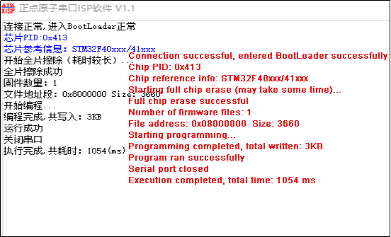


* #### 测试案例

本例程使用STM32F407开发板获取WonderLLM模块的识别结果，并通过uart1打印出来。

1. **实现效果**
>[!note]
>**注意：模块在识别前，需要先对模块说出“小幻小幻”将模块唤醒，才能进行识别。**

(1) 当WonderLLM模块识别到“**前进**”的词条后，会播报“**正在前进**”，同时串口将会打印“**go**”；

(2) 当WonderLLM模块识别到“**后退**”的词条后，会播报“**正在后退**”，同时串口将会打印“**back**”；

(3) 当WonderLLM模块识别到“**左转**”的词条后，会播报“**正在左转**”，同时串口将会打印“**left**”；

(4) 当WonderLLM模块识别到“**右转**”的词条后，会播报“**正在右转**”，同时串口将会打印“**right**”；

(5) 当WonderLLM模块识别到“**停止**”或“**停下**”的词条后，会播报“**收到**”，同时串口将会打印“**stop**”；


2. **程序简要分析**

>[!note]
>
>**WonderLLM模块STM32例程运行FreeRTOS系统，开放app_task任务供用户执行自定义逻辑，main.c仅用于初始化系统外设及开启RTOS系统，我们将调用WonderLLM模块有关的逻辑放置于app_task任务回调函数app_task_entry（位于app.c）内。**

(1) 导入了控制器通信相关功能库，用于与WonderLLM模块进行通讯。

```c
#include "cmsis_os2.h"
#include "global.h"
```

(2) 对WonderLLM模块的IIC地址进行了宏定义，同时对寄存器及命令词、播报词进行了宏定义。

```c
#define ASR_ADDR  0x34

//识别结果存放处，通过不断读取此地址的值判断是否识别到语音，不同的值对应不同的语音
#define ASR_RESULT_ADDR   100
#define ASR_SPEAK_ADDR    110

#define ASR_CMDMAND    0x00
#define ASR_ANNOUNCER  0xFF

```

(3) 在主函数中，创建了一个用于返回识别结果的result变量，通过`HAL_I2C_Mem_Read()`函数获取识别结果。

```c
        uint8_t result = 0;
        HAL_I2C_Mem_Read(&hi2c2, ASR_ADDR << 1, ASR_RESULT_ADDR, I2C_MEMADD_SIZE_8BIT, &result, 1, 0xFF);
```

(4) 识别到“前进”词条，将会返回0x01，识别到“后退”，将会返回0x02。以此类推，识别到一个词条将会返回对应的词条ID号。
>[!note]
>**具体返回的数据列表，请查看“命令词播报词协议列表”。**

```c
        if(result != 0)
        {
            if(result == 0x01)
            {
              printf("go");
            }else if(result == 0x02)
            {
              printf("back");
```


### **4.13.2 STM32F407语音播报例程**

* #### 准备工作

1. **接线说明**

接线时，WonderLLM的5V、GND、SCL和SDA引脚需与STM32开发板(此处以我司开发板Ros Robot Controller v1.2为例)进行连接，接线方式如下图所示：


>[!note]
>
>**通电前确保不要有金属物体接触到主板，否则可能会因主板底部的引脚导致电路短路从而烧毁主板。**


* **程序下载**

1. **STM32程序烧录**

(1) 使用Type-C线插入stm32主控板的type-c口(只能插在UART1接口，如下图所示)，并且与电脑的USB口连接：


(2) 打开电脑设备管理器，在端口中查看串口号：


(3) 打开**ATX-XISP**软件，选择对应串口号，并且选择波特率为115200：


(4) 按照下图进行配置：


(5) 在软件界面点击“**文件**”按钮，选择“**附录/08 STM32程序文件/02 STM32语音播报例程/STM32F407_ASR_announce/MDK-ARM/RosRobotControllerM4/RosRobotControllerM4.hex**”文件进行烧录:


(6) 在页面中点击**“开始编程”**按钮，将生成好的hex文件烧录到stm32主控板上，等待烧录成功即可。


* #### 测试案例

本例程通过STM32F407开发板控制WonderLLM模块循环播放语音。

1. **实现效果**

STM32F407开发板控制WonderLLM模块每隔5秒依次播报“**正在前进**”、“**正在左转**”、“**可回收物**”、“**有害垃圾**”。


2. **程序简要分析**

>[!note]
>
>**WonderLLM模块STM32例程运行FreeRTOS系统，开放app_task任务供用户执行自定义逻辑，main.c仅用于初始化系统外设及开启RTOS系统，我们将调用WonderLLM模块有关的逻辑放置于app_task任务回调函数app_task_entry（位于app.c）内。**

(1) 导入了控制器通信相关功能库，用于与WonderLLM模块进行通讯。

```c
#include "cmsis_os2.h"
#include "global.h"
```

(2) 对WonderLLM模块的IIC地址进行了宏定义，同时对寄存器及命令词、播报词进行了宏定义。

```c
#define ASR_ADDR  0x34

//识别结果存放处，通过不断读取此地址的值判断是否识别到语音，不同的值对应不同的语音
#define ASR_RESULT_ADDR   100
#define ASR_SPEAK_ADDR    110

#define ASR_CMDMAND    0x00
#define ASR_ANNOUNCER  0xFF
```

(3) 在主函数中，通过调用`HAL_I2C_Mem_Write()`函数向WonderLLM模块写入数据，该函数有两个参数，`speak_cmd`数组内元素1为命令词的寄存器地址，元素2为播报语所对应的值。`ASR_CMDMAND`是一个宏定义，其值为0x00表示需要写入的功能类型为命令词。首先对寄存器地址`ASR_CMDMAND`写入0x01，对应数据列表中的播报语句“**正在前进**”，数据0x03所对应的是“**正在左转**”。

```c
        uint8_t speak_cmd[2] = {ASR_CMDMAND , 0x01};
        HAL_I2C_Mem_Write(&hi2c2, ASR_ADDR << 1, ASR_SPEAK_ADDR, I2C_MEMADD_SIZE_8BIT, speak_cmd, 2, 0xFF); 
		// 命令词播报语 播报：正在前进
        osDelay(5000);
        
        speak_cmd[1] = 0x03;
        HAL_I2C_Mem_Write(&hi2c2, ASR_ADDR << 1, ASR_SPEAK_ADDR, I2C_MEMADD_SIZE_8BIT, speak_cmd, 2, 0xFF); 
		// 命令词播报语 播报：正在左转
        osDelay(5000);
```

(4) `speak_ann`数组内元素1为播报词的寄存器地址，元素2为播报语所对应的值。`ASR_ANNOUNCER`值为0xFF表示需要写入的功能类型为播报语。对寄存器地址`ANNOUNCER`写入0x01，对应数据列表中的播报语句“**可回收物**”，数据0x03所对应的是“**有害垃圾**”。

```c
        uint8_t speak_ann[2] = {ASR_ANNOUNCER , 0x01};
        HAL_I2C_Mem_Write(&hi2c2, ASR_ADDR << 1, ASR_SPEAK_ADDR, I2C_MEMADD_SIZE_8BIT, speak_ann, 2, 0xFF); 
		// 播报语 播报：可回收物
        osDelay(5000);
        
        speak_ann[1] = 0x03;
        HAL_I2C_Mem_Write(&hi2c2, ASR_ADDR << 1, ASR_SPEAK_ADDR, I2C_MEMADD_SIZE_8BIT, speak_ann, 2, 0xFF); 
		// 播报语 播报：有害垃圾
        osDelay(5000);
```

>[!note]
>**如需获取具体数据列表，请查看“命令词播报词协议列表”。**


### **4.13.3 STM32F407模块地址修改例程**

* #### 准备工作

1. **接线说明**

接线时，WonderLLM的5V、GND、SCL和SDA引脚需与STM32开发板(此处以我司开发板Ros Robot Controller v1.2为例)进行连接，接线方式如下图所示：


>[!note]
>**通电前确保不要有金属物体接触到主板，否则可能会因主板底部的引脚导致电路短路从而烧毁主板。**


* **程序下载**

1. **STM32程序烧录**

(1) 使用Type-C线插入stm32主控板的type-c口(只能插在UART1接口，如下图所示)，并且与电脑的USB口连接：


(2) 打开电脑设备管理器，在端口中查看串口号：


(3) 打开**ATX-XISP**软件，选择对应串口号，并且选择波特率为115200：


(4) 按照下图进行配置：


(5) 在软件界面点击“**文件**”按钮，选择“**附录/08 STM32程序文件/03 STM32模块地址修改例程/STM32F407_ASR_IICaddr_change/MDK-ARM/RosRobotControllerM4/RosRobotControllerM4.hex**”文件进行烧录:


(6) 在页面中点击**“开始编程”**按钮，将生成好的hex文件烧录到stm32主控板上，等待烧录成功即可。


* #### 测试案例

本例程通过STM32让WonderLLM模块循环切换自身IIC从机地址，并以新地址进行IIC通信控制模块播放语音。

1. **实现效果**

(1) STM32F407开发板控制WonderLLM模块切换从机地址为0x34，并以此IIC地址控制模块依次播报“**正在前进**”、“**可回收物**”；

(2) 再切换WonderLLM模块切换从机地址为0x33，并以此IIC地址控制模块依次播报“**正在前进**”、“**可回收物**”。

(3) 以上过程循环执行。


2. **程序简要分析**

>[!note]
>
>**WonderLLM模块STM32例程运行FreeRTOS系统，开放app_task任务供用户执行自定义逻辑，main.c仅用于初始化系统外设及开启RTOS系统，我们将调用WonderLLM模块有关的逻辑放置于app_task任务回调函数app_task_entry（位于app.c）内。**

(1) 导入了控制器通信相关功能库，用于与WonderLLM模块进行通讯。

```c
#include "cmsis_os2.h"
#include "global.h"
```

(2) 对WonderLLM模块的IIC地址进行了宏定义，同时对寄存器及命令词、播报词进行了宏定义。

```c
//识别结果存放处，通过不断读取此地址的值判断是否识别到语音，不同的值对应不同的语音
#define ASR_RESULT_ADDR            100
#define ASR_SPEAK_ADDR             110
#define ASR_IIC_ADDR_CHANGE_ADDR   3

#define ASR_CMDMAND    0x00
#define ASR_ANNOUNCER  0xFF
```

(3) 在主函数中，初始化用于播报功能的两个数组`speak_cmd`、`speak_ann`，其中`speak_ann`数组内元素1为播报词的类型值，元素2为播报语词条所对应的值；`speak_cmd`数组内元素1为命令词的类型值，元素2为命令词播报语词条所对应的值。

(4) `IIC_Addr_now`表示程序记录的当前WonderLLM模块的IIC地址、`IIC_Addr_new`表示预计更新后的WonderLLM模块从机地址。

```c
/* 用户入口函数 */
void app_task_entry(void *argument)
{
    /* 声明外部句柄 */
    uint8_t speak_cmd[2] = {ASR_CMDMAND , 0x01};  
    uint8_t speak_ann[2] = {ASR_ANNOUNCER , 0x01};
    uint8_t IIC_Addr_now; 
    uint8_t IIC_Addr_new; 		
		osDelay(500);
    printf("start");
```

(5) 进入循环，首先打印字符串，表明稍后模块从机地址的变动情况。调用HAL_I2C_Mem_Write()函数，以当前的模块IIC地址`IIC_Addr_now`，向WonderLLM模块的`ASR_IIC_ADDR_CHANGE_ADDR`地址寄存器写入1字节长的新地址`IIC_Addr_new`数据。

(6) 模块收到数据后即开始切换地址，同时将记录当前模块IIC地址的`IIC_Addr_now`更新为新地址`IIC_Addr_new`。同时延时100ms等待模块内部IIC地址切换完成。

```c
    for(;;) {
		printf("now,asr module's IIC Address is 0x34!");
		IIC_Addr_now = 0x34;
		IIC_Addr_new = 0x33;
		//向模块寄存器IIC地址寄存器内写入新地址
        HAL_I2C_Mem_Write(&hi2c2, IIC_Addr_now << 1, ASR_IIC_ADDR_CHANGE_ADDR, I2C_MEMADD_SIZE_8BIT, &IIC_Addr_new, 1, 0xFF); 
        IIC_Addr_now = IIC_Addr_new;
		osDelay(100);
```

(7) 调用`HAL_I2C_Mem_Write()`函数，以更新过后的当前模块IIC地址`IIC_Addr_now`，向WonderLLM模块的`ASR_SPEAK_ADDR`播报寄存器写入2字节长的播报数据。可以看到，模块会以新的IIC地址正常接收指令并执行对应播报操作。

```c
        HAL_I2C_Mem_Write(&hi2c2, IIC_Addr_now << 1, ASR_SPEAK_ADDR, I2C_MEMADD_SIZE_8BIT, speak_cmd, 2, 0xFF); 
		// 命令词播报语 播报：正在前进
        osDelay(2000);
        HAL_I2C_Mem_Write(&hi2c2, IIC_Addr_now << 1, ASR_SPEAK_ADDR, I2C_MEMADD_SIZE_8BIT, speak_ann, 2, 0xFF); 
		// 播报语 播报：可回收物
        osDelay(2000); 
```

(8) 随后，程序又开始将模块IIC地址切换为0x33，操作过程与上文高度相似，此处不再展开。
>[!note]
>**如需获取具体数据列表，请查看“命令词播报词协议列表”。**


## 4.14 与树莓派主机通讯

### **4.14.1 树莓派语音识别例程**

* #### 准备工作

1. **接线说明**

WonderLLM模块与树莓派主控板的连接如下图所示：


* #### 程序下载

1. **树莓派程序导入**

(1) 首先打开树莓派，并使用您的PC主机通过VNC等方式连接到树莓派。

(2) 将该文档同路径下**“附录/09 树莓派程序文件/01 树莓派语音识别例程”**的示例文件通过SSH等方式上传到树莓派任意路径。


(3) 菜单栏点击：**"TOOLS"--"Open Current Folder in Terminal"**，在当前路径打开命令行。


(4) 命令行输入如下指令即可运行程序：

```bash
python main.py
```


* #### 测试案例

本例程使用树莓派开发板获取WonderLLM模块的识别结果，并通过命令行终端打印出来。

1. **实现效果**
>[!note]
>**注意：模块在识别前，需要先对模块说出“小幻小幻”将模块唤醒，才能进行识别。**

(1) 当WonderLLM模块识别到“**前进**”的词条后，会回应“**正在前进**”，同时命令行终端将会打印“**go**”；

(2) 当WonderLLM模块识别到“**后退**”的词条后，会回应“**正在后退**”，同时命令行终端将会打印“**back**”；

(3) 当WonderLLM模块识别到“**左转**”的词条后，会回应“**正在左转**”，同时命令行终端将会打印“**left**”；

(4) 当WonderLLM模块识别到“**右转**”的词条后，会回应“**正在右转**”，同时命令行终端将会打印“**right**”；

(5) 当WonderLLM模块识别到“**停止**”或“**停下**”的词条后，会回应“**收到**”，同时命令行终端将会打印“**stop**”；


2. **程序简要分析**

(1) 导入了I2C总线协议库`smbus`、时间处理函数库`time`，用于与WonderLLM模块进行通讯。

```python
#!/usr/bin/python3
# coding=utf8
import smbus
import time
```

(2) 创建了WonderLLM模块类下的一个对象`asr_module`，以及用于接收WonderLLM模块识别结果`recognition_result`，初始化时需传入WonderLLM模块的IIC地址供树莓派总线与模块建立通信连接。

```python
if __name__ == "__main__":
    asr_module = ASRModule(I2C_ADDR) 
```

(3) `ASRModule`类的内部成员在初始化中（也就是将类实例化为一个对象时），会默认通过实例化`smbus`库中`SMBus`类的一个对象bus作为成员，实现调用树莓派的1号I2C总线建立通信，同时将初始化时传入的从机I2C地址进行指定。

```python
class ASRModule:
    def __init__(self,address, bus=1):
        # 初始化 I2C 总线和设备地址
        self.bus = smbus.SMBus(bus)  # 使用 I2C 总线 1
        self.address = address  # 设备的 I2C 地址
        self.send = [0, 0]  # 初始化发送数据的列表
```

(4) 本小节我们需要读取模块寄存器存放的识别结果数据，我们首先需要构造一个`ASRModule`类下的通过IIC总线读取从机数据的处理函数`wire_read_data_array`，见下图，我们需要传入要读取的从机寄存器地址reg和读取数据的长度length。

(5) 我们调用`ASRModule`类下的成员`bus`（SMBus类对象），使用其自带的`read_i2c_block_data`函数即可读取从机各地址下寄存器的数据。

(6) 该函数的第三个参数为读取的字节数，返回值为一个列表，长度等于读取的字节数。该列表无需任何处理，即可作为wire_read_data_array函数的输出。

(7) 在总线通信失败，无法读取数据时系统会抛出IOError异常，`read_i2c_block_data`函数无任何返回值，为了保持`wire_read_data_array`输出数据的统一，我们需要在异常处理中自行输出一个空列表。

```python
    def wire_read_data_array(self, reg, length):
        """
        从指定寄存器读取字节列表
        :param reg: 寄存器地址
        :param length: 要读取的字节数
        :return: 读取到的字节列表，失败时返回空列表
        """          
        try:
            result = self.bus.read_i2c_block_data(self.address, reg, length) # 从设备读取字节列表
            return result # 返回读取结果
        except IOError:
            return [] # 读取失败，返回空列表
```

(8) 进一步的，我们将使用`ASRModule`类下的`rec_recognition()`函数实现词条识别结果的获取。

(9) 在该函数中调用同类下的`wire_read_data_array`函数，接着在if语句中判断返回值是否为空列表，如果返回值是空列表，说明读取失败，程序返回0；反之返回读取结果。

```python
    def rec_recognition(self):
        """
        识别结果读取
        :return: 识别结果，如果读取失败返回 0
        """
        result = self.wire_read_data_array(ASR_RESULT_ADDR, 1) # 从结果寄存器读取一个字节
        if result:
            return result # 返回读取到的结果
        return 0  # 如果没有结果，返回 0
```

(10) 在主函数完成中WonderLLM模块类实例化后，循环调用`asr_module.rec_recognition()`函数获取WonderLLM模块返回的数据。

```python
    while True:
        recognition_result = asr_module.rec_recognition()
```

(11) 识别到“前进”词条，将会返回0x01，识别到**“后退”**，将会返回0x02。以此类推，识别到一个词条将会返回对应的词条ID号，树莓派根据返回的词条ID号向命令行终端打印对应语义的英文，随后进入下一轮循环。

(12) 如果识别不出用户的话语，将会返回0x00，此时程序不执行任何操作，直接进入下一轮循环。

```python
        if recognition_result[0] != 0:
            if recognition_result[0] == 1:
                print("go")
            elif recognition_result[0] == 2:
                print("back")
            elif recognition_result[0] == 3:
                print("left")
            elif recognition_result[0] == 4:
                print("right")
            elif recognition_result[0] == 9:
                print("stop")
```

>[!note]
>**具体返回的数据列表，请查看“命令词播报词协议列表”。**


### **4.14.2 树莓派语音播报例程**

* #### 准备工作

1. **接线说明**

WonderLLM模块与树莓派主控板的连接如下图所示：


* #### 程序下载

1. **树莓派程序导入**

(1) 首先打开树莓派，并使用您的PC主机通过VNC等方式连接到树莓派。

(2) 将该文档同路径下**“附录/09 树莓派程序文件/02 树莓派语音播报例程”**的示例文件通过SSH等方式上传到树莓派任意路径。


(3) 菜单栏点击：**"TOOLS"--"Open Current Folder in Terminal"**，在当前路径打开命令行。


(4) 命令行输入如下指令即可运行程序：

```bash
python main.py
```


* #### **测试案例**

本例程通过树莓派开发板让WonderLLM模块循环播放语音（包括命令词条播报语和普通播报语）。

1. **实现效果**

树莓派开发板控制WonderLLM模块每隔5秒依次播报“**正在前进**”、“**正在左转**”、“**可回收物**”、“**有害垃圾**”。


2. **程序简要分析**

(1) 导入了I2C总线协议库`smbus`、时间处理函数库`time`，用于与WonderLLM模块进行通讯。

```python
#!/usr/bin/python3
# coding=utf8
import smbus
import time
```

(2) 创建了WonderLLM模块类下的一个对象`asr_module`，初始化时需传入WonderLLM模块的IIC地址供树莓派总线与模块建立通信连接。

```python
if __name__ == "__main__":
    asr_module = ASRModule(I2C_ADDR) 
```

(3) `ASRModule`类的内部成员在初始化中（也就是将类实例化为一个对象时），会默认通过实例化`smbus`库中`SMBus`类的一个对象`bus`作为成员，实现调用树莓派的1号I2C总线建立通信，同时将初始化时传入的从机I2C地址进行指定。

```python
class ASRModule:
    def __init__(self,address, bus=1):
        # 初始化 I2C 总线和设备地址
        self.bus = smbus.SMBus(bus)  # 使用 I2C 总线 1
        self.address = address  # 设备的 I2C 地址
        self.send = [0, 0]  # 初始化发送数据的数组
```

(4) 本小节我们需要向模块寄存器写入待播放的词条数据使模块开始播报，我们首先需要构造一个`ASRModule`类下的通过IIC总线向从机发送数据的处理函数`wire_write_data_array`，见下图，我们需要传入要写入（发送到）的从机寄存器地址reg、存放写入数据的列表val和写入数据的长度length。

(5) 我们调用`ASRModule`类下的成员`bus`（SMBus类对象），使用其自带的`write_i2c_block_data`函数即可写数据到从机各地址下寄存器的数据。

```python
    def wire_write_data_array(self, reg, val, length):
        """
        向指定寄存器写入字节数组
        :param reg: 寄存器地址
        :param val: 要写入的字节数组
        :param length: 要写入的字节数
        :return: 如果成功写入返回 True，失败返回 False
        """
        try:            
            self.bus.write_i2c_block_data(self.address, reg, val[:length]) # 发送字节数组到设备的指定寄存器
            return True # 写入成功
        except IOError:
            return False # 写入失败，返回 False
```

(6) 进一步的，我们将使用`ASRModule`类下的`speak()`函数实现词条数据的写入。程序将词条类型`cmd`，词条id依次写入`ASRModule`类下的`send`列表，最后调用同类下的`wire_write_data_array`函数，将`send`列表作为存放写入数据的列表参数传入，即可实现数据的写入。

```python
    def speak(self, cmd, id):
        """
        向设备发送说话命令
        :param cmd: 命令字节
        :param id: 说话的 ID
        """
        self.send[0] = cmd # 设置发送数组的第一个元素为命令
        self.send[1] = id # 设置发送数组的第二个元素为 ID
        self.wire_write_data_array(ASR_SPEAK_ADDR, self.send, 2) # 发送命令和 ID 到指定寄存器
```

(7) 在主函数完成中WonderLLM模块类实例化后，定义一个存放将要播放的词条数据列表。列表的每个元素为均为元组，每个元组内部存放播放词条的类型及ID数据。

(8) `ASR_ANNOUNCER`值为0xFF表示需要写入的功能类型为普通播报语。对寄存器地址`ANNOUNCER`写入0x01，对应数据列表中的播报语句“**可回收物**”，数据0x03所对应的是“**有害垃圾**”；

(9) `ASR_ANNOUNCER`值为0x00表示需要写入的功能类型为普通播报语。对寄存器地址`ANNOUNCER`写入0x01，对应数据列表中的播报语句“**可回收物**”，数据0x03所对应的是“**有害垃圾**”；

```python
    # 定义播报内容及其对应的ID
    announcements = [
        (ASR_CMDMAND, 1),  # 正在前进
        (ASR_CMDMAND, 3),  # 正在左转
        (ASR_ANNOUNCER, 1),  # 可回收物
        (ASR_ANNOUNCER, 3)   # 有害垃圾
    ]
```

(10) 随后，主函数进入到`while`循环中不断执行内部代码，在`while`循环内部嵌套for循环，不断的遍历`announcements`列表内各个元组，依次读取各个元组元素，并将元组内包含的信息解包到`cmd`，`id`变量中。

(11) 最后，调用对象`asr_module`自带的`speak`函数，并将`cmd`，`id`作为待播报词条的类型，`id`号传入函数，即可实现模块播报对应词条。随后程序休眠5s，之后读取列表下一个元组内的词条信息。列表遍历完成后，回到`while`循环，再次从头遍历列表，循环往复。

```python
    while True:
        for cmd, id in announcements:
            asr_module.speak(cmd, id)
            time.sleep(5) 
```

>[!note]
>**如需获取具体数据列表，请查看“命令词播报词协议列表”。**


### **4.14.3 树莓派模块地址修改例程**

* #### 准备工作

1. **接线说明**

WonderLLM模块与树莓派主控板的连接如下图所示：


* #### 程序下载

1. **树莓派程序导入**

(1) 首先打开树莓派，并使用您的PC主机通过VNC等方式连接到树莓派。

(2) 将该文档同路径下**“附录/09 树莓派程序文件/03 树莓派模块地址修改例程”**的示例文件通过SSH等方式上传到树莓派任意路径。


(3) 菜单栏点击：**"TOOLS"--"Open Current Folder in Terminal"**，在当前路径打开命令行。


(4) 命令行输入如下指令即可运行程序：

```bash
python main.py
```


* #### 测试案例

本例程通过树莓派开发板让WonderLLM模块循环切换自身IIC从机地址，并以新地址进行IIC通信控制模块播放语音。

1. **实现效果**

(1) 树莓派开发板控制WonderLLM模块切换从机地址为0x34，并以此IIC地址控制模块依次播报“**正在前进**”、“**可回收物**”；

(2) 再切换WonderLLM模块切换从机地址为0x33，并以此IIC地址控制模块依次播报“**正在前进**”、“**可回收物**”。

(3) 以上过程循环执行。


2. **程序简要分析**

(1) 导入了I2C总线协议库`smbus`、时间处理函数库`time`，用于与WonderLLM模块进行通讯。

```python
#!/usr/bin/python3
# coding=utf8
import smbus
import time
```

(2) 创建了WonderLLM模块类下的一个对象`asr_module`，初始化时需传入WonderLLM模块默认的IIC地址供树莓派总线与模块建立通信连接。

```python
if __name__ == "__main__":
    asr_module = ASRModule(I2C_ADDR) 
```

(3) `ASRModule`类的内部成员在初始化中（也就是将类实例化为一个对象时），会默认通过实例化`smbus`库中`SMBus`类的一个对象bus作为成员，实现调用树莓派的1号I2C总线建立通信，同时将初始化时传入的从机I2C地址进行指定。

```python
class ASRModule:
    def __init__(self,address, bus=1):
        # 初始化 I2C 总线和设备地址
        self.bus = smbus.SMBus(bus)  # 使用 I2C 总线 1
        self.address = address  # 设备的 I2C 地址
        self.send = [0, 0]  # 初始化发送数据的数组
```

(4) 本小节我们需要向IIC地址寄存器写入新IIC从机地址，使模块以该地址挂载在IIC总线上，我们首先需要构造一个`ASRModule`类下的通过IIC总线向从机发送数据的处理函数`wire_write_data_array`，见下图，我们需要传入要写入（发送到）的从机寄存器地址`reg`、存放写入数据的列表`val`和写入数据的长度`length`。

(5) 我们调用`ASRModule`类下的成员`bus`（SMBus类对象），使用其自带的`write_i2c_block_data`函数即可写数据到从机各地址下寄存器的数据。

```python
    def wire_write_data_array(self, reg, val, length):
        """
        向指定寄存器写入字节数组
        :param reg: 寄存器地址
        :param val: 要写入的字节数组
        :param length: 要写入的字节数
        :return: 如果成功写入返回 True，失败返回 False
        """
        try:            
            self.bus.write_i2c_block_data(self.address, reg, val[:length]) # 发送字节数组到设备的指定寄存器
            return True # 写入成功
        except IOError:
            return False # 写入失败，返回 False
```

(6) 进一步的，我们将使用`ASRModule`类下的`ChangeAddr()`函数实现地址数据的写入。程序首先会判定传入参数的合法性，即传入的新地址`new_addr`是否属于规定好的两种类型。

(7) 确认无误后，将新地址数据`new_addr`放入列表，最后调用同类下的`wire_write_data_array`函数。

(8) 将该列表作为存放写入数据的列表参数传入、将`ASR_IIC_ADDR_CHANGE_ADDR(0x03)`作为待写入的从机寄存器地址参数传入，将1作为写入数据字节长度传入，即可实现数据的写入。

(9) `ASRModule`类下的从机IIC地址成员`address`此时还是模块更新前的IIC从机地址，因此主板此时会以**更新前的地址，**与模块建立通信并将更新后的地址写入。

(10) 数据写入模块，实现了IIC从机地址在模块上的更新。随后，`ASRModule`类下的从机IIC地址成员`address`同步设置为新地址，实现了IIC从机地址在主板程序中的更新。

```python
    def ChangeAddr(self, new_addr):
        """
        向设备发送IIC地址修改命令
        :new_addr: 新IIC地址，可选值0x33、0x34
        """
        if new_addr == 0x33 or new_addr == 0x34:
            self.wire_write_data_array(ASR_IIC_ADDR_CHANGE_ADDR, [new_addr],1)
            self.address = new_addr
            return 1
        else:
            return 0
```

(11) 在主函数完成中WonderLLM模块类实例化后，定义一个存放将要播放的词条数据列表。列表的每个元素为均为元组，每个元组内部存放播放词条的类型及ID数据。

(12) `ASR_ANNOUNCER`值为0x00表示需要写入的功能类型为命令词播报语。对寄存器地址`ANNOUNCER`写入0x01，对应数据列表中的播报语句“**正在前进**”。

(13) `ASR_ANNOUNCER`值为0xFF表示需要写入的功能类型为普通播报语。对寄存器地址`ANNOUNCER`写入0x01，对应数据列表中的播报语句“**可回收物**”。

```python
    # 定义播报内容及其对应的ID
    announcements = [
        (ASR_CMDMAND, 1),  # 正在前进
        (ASR_ANNOUNCER, 1),  # 可回收物
    ]
```

(14) 随后，主函数进入到`while`循环中不断执行内部代码，首先调用`sleep`函数延时1s，再打印字符串，向用户提示稍后模块IIC将要变化的新地址。调用`asr`对象的`ChangeAddr`函数，将新IIC从机地址0x34传入。

(15) `ChangeAddr`函数会检测传入的新地址参数合法性，是否为指定值0x33、0x34，若是则返回1，并开始通信发送数据。

(16) 使用`if`语句判断`ChangeAddr`函数是否执行成功，若执行成功，延时100ms等待模块新IIC地址配置生效，随后以新IIC地址向WonderLLM模块通信，控制其播报词条。

```python
        time.sleep(1)
		
        print("now,asr module's IIC Address is 0x34!")
        if(asr_module.ChangeAddr(0x34)):
            print("Success!")
            time.sleep(0.1)

            for cmd, id in announcements:
                asr_module.speak(cmd, id)
                time.sleep(2)	
				
        else:
            print("Fail!")
```

(17) 后续，程序又继续将WonderLLM模块地址修改为0x33并以该地址控制模块播报词条，具体过程与上文高度相似，此处不再展开。
>[!note]
>**如需获取具体数据列表，请查看“命令词播报词协议列表”。**


## 4.15 与micro:bit主机通讯

>[!note]
>**micro:bit主控暂不支持WonderLLM的IIC地址修改功能。**

### 4.15.1 WonderLLM 扩展包导入

1) 在编程页面点击标签选择区的**“扩展”**。

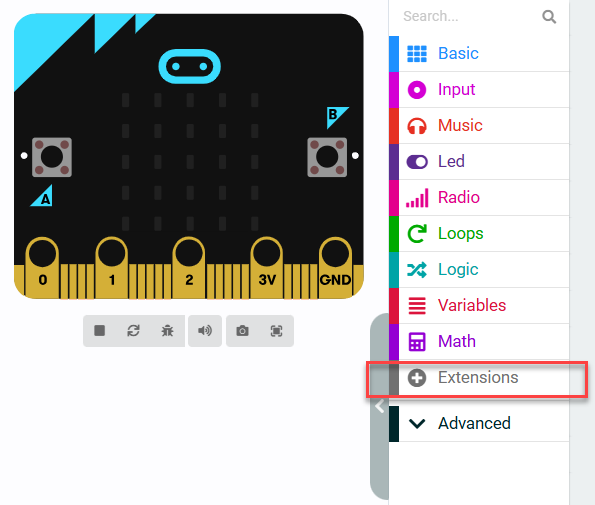) 

2) 在弹出界面中输入拓展包地址：**https://github.com/Hiwonder/WonderEcho**

3. 输入链接再单击搜索图标或按“**Enter**”键，最后单击“**wonderecho**”即可成功添加。

 

4. 添加完成后将自动返回编程界面。等待加载完毕，我们可以看到程序栏已经加载了新添加的拓展包。单击“**wonderecho**”标签，即可展开：

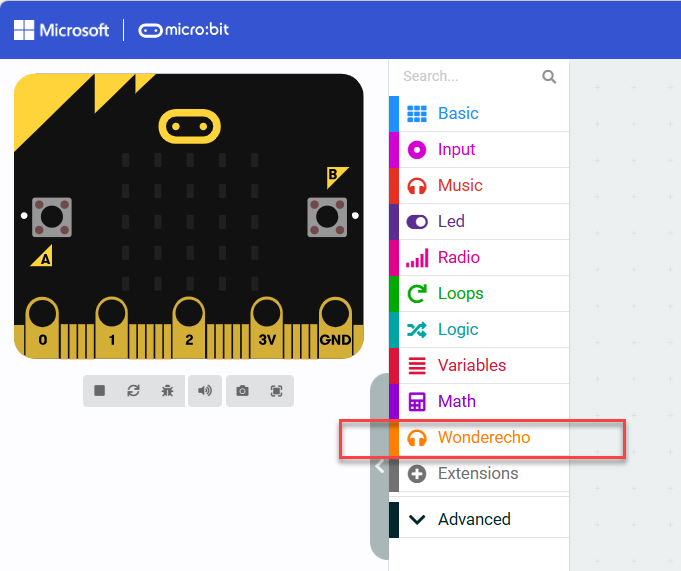

 

### **4.15.2 micro:bit语音识别例程**

* #### 准备工作

1. **接线说明**

接线时，WonderLLM模块需与micro:bit扩展板，如下图所示：


>[!note]
>**通电前确保不要有金属物体接触到主板，否则可能会因主板底部的引脚导致电路短路从而烧毁主板。**


2. **micro:bit程序下载**

(1) 点击界面左下角的图标，再点击“**Connect Device**”，按照画面提示进行连接micro:bit主板。


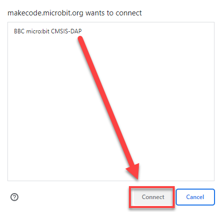

(2) 点击左下角“**下载**”按钮进行程序烧录。


(3) 下载完成指示灯将停止快闪并保持常亮，同时编程主界面会出现下载完成提示。


* #### 测试案例

1. **实现效果**
>[!note]
>**注意：模块在识别前，需要先对模块说出“小幻小幻”将模块唤醒，才能进行识别。**

(1) 当WonderLLM模块识别到“**前进**”的词条后，会回应“**正在前进**”，同时串口将会打印“**go**”；

(2) 当WonderLLM模块识别到“**后退**”的词条后，会回应“**正在后退**”，同时串口将会打印“**back**”；

(3) 当WonderLLM模块识别到“**左转**”的词条后，会回应“**正在左转**”，同时串口将会打印“**left**”；

(4) 当WonderLLM模块识别到“**右转**”的词条后，会回应“**正在右转**”，同时串口将会打印“**right**”；

(5) 当WonderLLM模块识别到“**停止**”或“**停下**”的词条后，会回应“**收到**”，同时串口将会打印“**stop**”；


2. **程序简要分析**

(1) 初始化，将串口重定向到USB，以便通过USB与电脑通信。


(2) 创建一个无限循环，在循环中不断读取语音识别结果ID，根据不同的ID值通过串口发送不同的字符串指令。

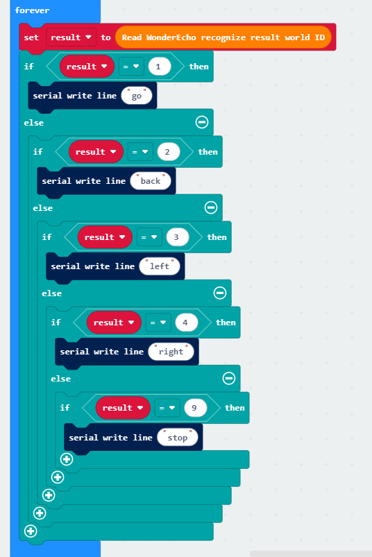


### **4.15.3 microbit语音播报例程**

* #### 准备工作

1. **接线说明**

接线时，WonderLLM模块需与micro:bit扩展板，如下图所示：


>[!note]
>
>**通电前确保不要有金属物体接触到主板，否则可能会因主板底部的引脚导致电路短路从而烧毁主板。**


2. **micro:bit程序下载**

(1) 点击界面左下角的图标，再点击“**Connect Device**”，按照画面提示进行连接micro:bit主板。


(2) 点击左下角“**下载**”按钮进行程序烧录。


(3) 下载完成指示灯将停止快闪并保持常亮，同时编程主界面会出现下载完成提示。


* #### **测试案例**

本例程通过microbit开发板让WonderLLM模块循环播放语音。

1. **实现效果**

WonderLLM模块每隔5秒依次播报“**正在前进**”、“**正在左转**”、“**可回收物**”、“**有害垃圾**”。

2. **程序简要分析**

在循环函数中，设置播放预录制的词条。

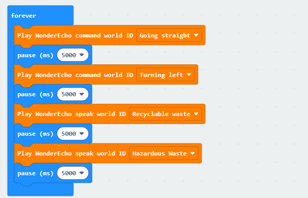
